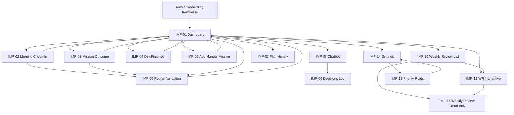
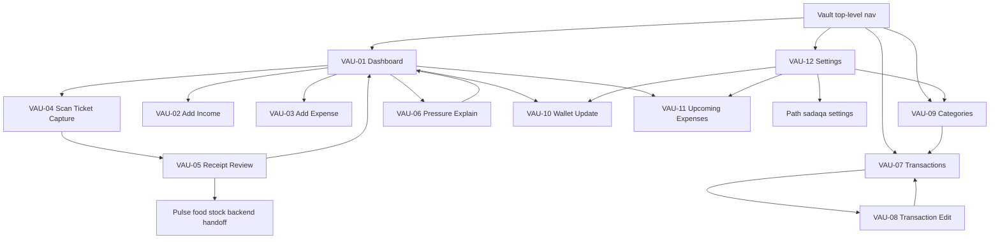
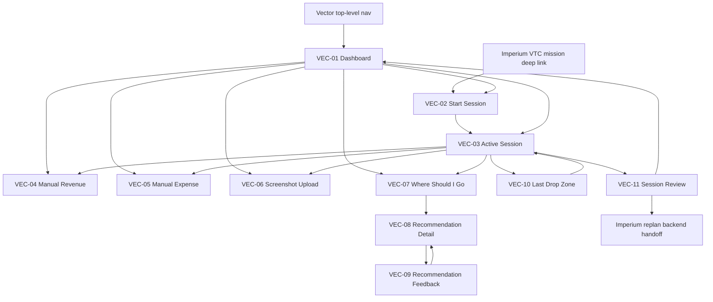
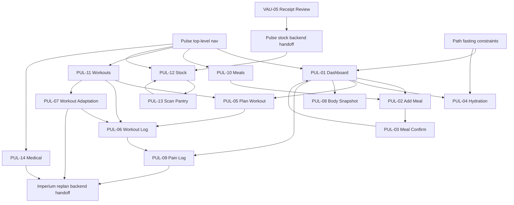

# 59 — Design System V1 (IMPERIUM Ecosystem)

**Version :** 1.0
**Cible technique :** Android natif Kotlin + Jetpack Compose (Material 3)
**Device principal :** Samsung Galaxy Tab S10 Ultra (14.6", 2960×1848, ~239 ppi, landscape primaire)
**Périmètre :** 5 apps (Imperium, Vault, Vector, Pulse, Path), 62 écrans V1
**Statut :** DRAFT V1 — toute déviation doit être justifiée par PR contre ce document.

> **Note DRAFT :** Ce document est un draft de fondation. Les palettes HEX et règles visuelles devront être revalidées lorsque les Style Masters et assets_registry seront versionnés dans le repo.

---

## 0. Principe fondateur

```text
clarity + speed + reliability
not beautiful complexity
```
(doc 07 §UI Principle)

Toute décision design qui contredit ce principe est invalide V1.

Corollaires :
- Density per surface : driving = minimal, planning = rich, dashboard = balanced.
- No fake success : tout état dérivé d'un backend doit refléter l'état réel (`pending|syncing|synced|failed|conflict|cached|stale`).
- One brain, five faces : les 5 apps partagent foundation tokens (spacing, typography, radius, elevation, states) mais divergent sur la palette pour ancrer l'identité.

---

## 1. COLOR SYSTEM

### 1.1 Système global (cross-app)

| Token sémantique | HEX | Usage | Règle |
|---|---|---|---|
| Success | `#34C759` | confirmation backend, sync OK, halo Vector vert | Réservé aux états positifs **confirmés**. Jamais pour un draft. |
| Warning | `#F5A524` | dérive légère, low confidence, sync lent | Pas pour un blocage. |
| Error | `#E5484D` | échec sync, mission failed, halo Vector rouge | Toujours accompagné d'un texte explicatif. |
| Info | `#0091FF` | recommandation, conseil AI non urgent | Jamais en remplacement de Success. |
| Halo Analyzing (Vector) | `#FFFFFF` opacité 80% | overlay en analyse | Halo blanc = "analyse en cours, ne pas décider" |

Contraste cible : **WCAG AA (4.5:1)** sur surface primaire de chaque app en dark mode (mode par défaut).

### 1.2 IMPERIUM — Command Center (deep navy + gold)

> Identité : autorité, décision, vue d'ensemble. L'or est *rare* (max 1 accent gold visible par écran).

| Token | HEX | Usage | Règle |
|---|---|---|---|
| Primary | `#1A2B4A` | barre supérieure, surfaces de commande, bouton primary | La couleur signature d'Imperium. |
| Secondary | `#2E4370` | surfaces secondaires, cartes de mission | Variante claire de Primary. |
| Accent | `#C9A24B` | bouton "Reprogrammer ma journée", emblèmes, badge "current mission" | Max 1 accent gold visible à la fois. Pas sur du texte courant. |
| Background | `#0E1626` | fond d'écran global | Dark mode par défaut. |
| Surface | `#16213A` | cards, panneaux | Au-dessus du background. |
| Surface Variant | `#1F2D4D` | cards imbriquées, listes alternées | 1 niveau de profondeur visuelle. |
| Border | `#2A3A5C` | bordures de cartes interactives | 1dp. |
| Divider | `#1F2D4D` | séparateurs liste, sections | Opacité 60%. |
| Success | `#34C759` | mission completed, plan synced | Cf. §1.1. |
| Warning | `#F5A524` | mission expiring soon | Cf. §1.1. |
| Error | `#E5484D` | replan failure, mission failed | Cf. §1.1. |
| Info | `#0091FF` | AI advice banner | Cf. §1.1. |
| Text Primary | `#F5F7FA` | titres, valeurs | Contraste 13.5:1 sur Background. |
| Text Secondary | `#B8C2D6` | sous-titres, labels secondaires | Contraste 8.4:1. |
| Text Muted | `#7886A0` | metadata, timestamps, captions | Contraste 4.6:1. Jamais en dessous de Caption. |

### 1.3 VAULT — Financial Reality (deep green + bronze)

> Identité : terre, stabilité, vérité financière. Pas de rouge agressif sauf pour overdue / failure réel.

| Token | HEX | Usage |
|---|---|---|
| Primary | `#163C2F` | top bar, header "balance" |
| Secondary | `#28604E` | cards transaction |
| Accent | `#B58A4C` | badge "obligation", chip "upcoming expense" |
| Background | `#0B1A14` | fond global |
| Surface | `#142A22` | cards |
| Surface Variant | `#1B392E` | cards imbriquées |
| Border | `#264636` | bordures |
| Divider | `#1B392E` | séparateurs |
| Success | `#34C759` | gain confirmé, transaction synced |
| Warning | `#F5A524` | pressure score élevé |
| Error | `#E5484D` | expense overdue, balance négative |
| Info | `#0091FF` | suggestion sadaqa |
| Text Primary | `#F2F7F4` | montants principaux |
| Text Secondary | `#B6C7BE` | labels |
| Text Muted | `#7A8D83` | metadata |

Règle Vault : **les montants sont toujours en JetBrains Mono** (cf. §2) pour aligner les chiffres en colonnes.

### 1.4 VECTOR — Strategic VTC Copilot (deep teal + electric cyan, halo trichromique)

> Identité : kinétique, instantanée, lisible en conduite. Le halo (white/green/red) est sacré.

| Token | HEX | Usage |
|---|---|---|
| Primary | `#0E2A33` | fond HUD standby (doc 55 §5.1) |
| Secondary | `#1C4753` | cards info, side panel |
| Accent | `#00D9E0` | actions kinétiques (start session, where should I go) |
| Background | `#06181E` | fond global (Tab et phone) |
| Surface | `#0F2730` | cards |
| Surface Variant | `#173744` | cards imbriquées, popup lane |
| Border | `#214756` | bordures HUD |
| Divider | `#173744` | séparateurs |
| **Halo Success (green)** | `#22D673` | recommandation positive (course OK) — **HEX figé, WCAG AA validé sur Background driving** |
| **Halo Warning (yellow)** | `#F5C842` | hésitation, low confidence |
| **Halo Error (red)** | `#FF4A4A` | refuser la course |
| **Halo Analyzing (white)** | `#FFFFFF` @ 80% | analyse en cours |
| Info | `#0091FF` | conseils non urgents |
| Text Primary | `#EEFAFD` | titres |
| Text Secondary | `#B6CCD2` | labels |
| Text Muted | `#778C92` | metadata |

Règle Vector : **en mode NAVIGATION (doc 55 §5.2), le halo prend précédence visuelle sur tout autre accent**. Les overlays se réduisent automatiquement.

### 1.5 PULSE — Biological Layer (deep crimson + warm coral)

> Identité : vital, organique, chaud. Évite la saturation excessive (cible : éviter la fatigue oculaire en soirée).

| Token | HEX | Usage |
|---|---|---|
| Primary | `#3D1418` | header |
| Secondary | `#682430` | cards workout, meal |
| Accent | `#FF8C7A` | badge "today's workout", call-to-action |
| Background | `#1A0A0D` | fond global |
| Surface | `#2A1015` | cards |
| Surface Variant | `#3A1A20` | cards imbriquées |
| Border | `#4A222B` | bordures |
| Divider | `#3A1A20` | séparateurs |
| Success | `#34C759` | meal logged, workout completed |
| Warning | `#F5A524` | low recovery |
| Error | `#E5484D` | pain logged (high severity) |
| Info | `#0091FF` | recommandation pulse |
| Text Primary | `#FAEFEF` | titres |
| Text Secondary | `#D6BABC` | labels |
| Text Muted | `#967A7E` | metadata |

### 1.6 PATH — Operational Islamic Discipline (deep emerald + warm gold)

> Identité : paix, ancrage spirituel, gold-as-light. L'or de Path est plus chaud que celui d'Imperium.

| Token | HEX | Usage |
|---|---|---|
| Primary | `#0E3A2C` | header, top bar |
| Secondary | `#1F5C46` | cards prière, fasting |
| Accent | `#D9B265` | sadaqa target, badge "ghusl required" |
| Background | `#071A14` | fond global |
| Surface | `#0F2A20` | cards |
| Surface Variant | `#173A2C` | cards imbriquées |
| Border | `#214936` | bordures |
| Divider | `#173A2C` | séparateurs |
| Success | `#34C759` | prière confirmée, fast complete |
| Warning | `#F5A524` | prière proche, ghusl required |
| Error | `#E5484D` | prière manquée (rare, jamais auto-déclenché) |
| Info | `#0091FF` | rappel adhkar |
| Text Primary | `#EEF7F2` | titres |
| Text Secondary | `#B6CFC2` | labels |
| Text Muted | `#7A938A` | metadata |

### 1.7 Règles transverses d'application des couleurs

- **Dark mode = défaut V1.** Light mode = V2.
- **Une seule couleur d'accent visible par écran.** Si un écran cross-app affiche du contenu de Vault + Vector simultanément, l'app *hôte* impose son accent ; les autres descendent en `Surface Variant`.
- **Halo states (Success/Warning/Error/Info)** ont la même HEX dans les 5 apps : sémantique > marque.
- **L'or (`#C9A24B` Imperium / `#B58A4C` Vault / `#D9B265` Path)** : max 1 élément doré visible par écran. Sinon dilution.
- **Accessibilité daltonisme** : les halo states ne sont JAMAIS utilisés seuls — toujours couplés à une icône (✓ ⚠ ✕ ⓘ) ou un libellé textuel. Cf. §6.

---

## 2. TYPOGRAPHY SYSTEM

### 2.1 Stratégie Android Compose

- **Police primaire :** **Inter** (variable font) — neutralité, lisibilité tablette, vaste support langues + arabe partiel pour Path.
- **Police secondaire (numérique) :** **JetBrains Mono** (variable) — montants Vault, IDs mission, heures de prière, KPI Vector (€ / km / h).
- **Police arabe (Path uniquement) :** **Noto Naskh Arabic** — calligraphie standardisée Quran/adhkar.
- **Stratégie Compose :**
  - Bundling `assets/fonts/` (Inter, JetBrains Mono, Noto Naskh Arabic).
  - `Typography` exposée par `ImperiumTheme.typography` (override `MaterialTheme.typography`).
  - Variable fonts → un seul fichier par famille, instances de poids dynamiques.
  - Unité : **sp** (scale-independent pixels) pour respecter accessibilité système. Jamais `dp` ni `px`.

### 2.2 Échelle (optimisée Tab S10 Ultra landscape)

| Style | Taille (sp) | Poids | Line height (sp) | Usage |
|---|---|---|---|---|
| **Display** | 56 | 700 (Bold) | 64 | Splash IMPERIUM, "Bonjour" du Morning Check-In, gros KPI dashboard (€ jour Vault) |
| **H1** | 40 | 700 | 48 | Titre d'écran principal (Dashboard, Weekly Review, HUD standby) |
| **H2** | 32 | 600 (SemiBold) | 40 | Titre de section (Missions, Aujourd'hui, Cette semaine) |
| **H3** | 24 | 600 | 32 | Card title (mission card, transaction card) |
| **H4** | 20 | 600 | 28 | Sub-section, dialog title, bottom sheet title |
| **Body Large** | 18 | 400 (Regular) | 28 | Contenu principal cards, AI advice, chat assistant |
| **Body Medium** | 16 | 400 | 24 | Listes, descriptions, formulaires standards |
| **Body Small** | 14 | 400 | 20 | Metadata, timestamps secondaires, descriptions courtes |
| **Caption** | 12 | 500 (Medium) | 16 | Status labels (`pending`, `synced`), tags, captions image |
| **Label** | 11 | 600 | 14 | Chips, badges, micro-labels, axis values |

### 2.3 Règles d'application

- **Tab S10 Ultra landscape :** échelle ci-dessus inchangée. La marge gagnée se déverse en spacing/whitespace, pas en agrandissement.
- **Phone portrait :** réduire Display→40, H1→32, H2→24, H3→20 (cf. §9 responsive). Le reste inchangé.
- **Numériques (€, km/h, h, score) :** **toujours JetBrains Mono Regular ou Medium**, taille = celle du contexte. Permet alignement colonnes dans Vault et Vector.
- **Arabe (Path) :** **Noto Naskh Arabic Regular**, +2 sp par rapport à Body équivalent pour compensation densité.
- **Letter-spacing :** par défaut Compose `0.sp`. Exception : `Label` et `Caption` en `0.2.sp` pour majuscules de chips.
- **Texte en majuscules :** réservé aux Labels (chips). Jamais sur Body ou titres.

---

## 3. SPACING SYSTEM

### 3.1 Base 8dp (avec sous-grille 4dp pour XXS/XS)

| Token | Valeur (dp) | Usage canonique |
|---|---|---|
| **XXS** | 2 | sous-pixel borders, indicateurs très fins |
| **XS** | 4 | espacement intra-chip, icône↔texte d'un même chip |
| **SM** | 8 | espacement compact (badge ↔ label, items de liste denses) |
| **MD** | 16 | unité de base (padding card interne, gap entre items de liste standard) |
| **LG** | 24 | espacement entre sections d'une même card |
| **XL** | 32 | padding global écran (Tab landscape), gap entre cards de section différente |
| **XXL** | 48 | gap entre zones sémantiquement distinctes (header ↔ body) |
| **XXXL** | 64 | top-padding hero, espace réservé aux ancrages de scroll |

### 3.2 Règles d'application par surface

| Surface | Padding | Spacing inter-items | Notes |
|---|---|---|---|
| **Card standard** | `MD` (16) | `SM` (8) | Coin radius `Card` (cf. §4). |
| **Card dense (mission list)** | `SM` (8) horizontal, `MD` (16) vertical | `XS` (4) | Pour listes haute densité. |
| **Screen (Tab landscape)** | `XL` (32) | `LG` (24) entre cards | Côté gauche + droit. Top safe area + `LG`. |
| **Screen (Phone portrait)** | `MD` (16) | `MD` (16) entre cards | |
| **Section dashboard** | `XL` (32) top, `LG` (24) entre cards | — | Section = ensemble cohérent (ex: "Aujourd'hui"). |
| **Widget (home screen)** | `MD` (16) interne | `SM` (8) | Pas plus de 3 niveaux d'info dans un widget. |
| **Bottom sheet** | `LG` (24) latéral, `LG` (24) top après drag handle | `MD` (16) entre groupes | Drag handle 32×4dp centré. |
| **Dialog** | `LG` (24) latéral, `LG` (24) top/bottom | `MD` (16) entre titre/body/actions | |
| **Top bar** | `MD` (16) latéral | `SM` (8) entre icônes | Hauteur 56dp standard, 64dp si tab. |
| **Bottom nav / bottom action bar** | `SM` (8) vertical, `MD` (16) latéral | flex egal | Hauteur 80dp tab, 64dp phone. |

### 3.3 Anti-règles

- Jamais de valeur intermédiaire (10dp, 14dp, 20dp interdits sauf radius cf. §4).
- Jamais de marges négatives.
- Le whitespace au-delà de `XXXL` est interdit V1 (vide perçu comme bug).

---

## 4. RADIUS SYSTEM

| Composant | Radius (dp) | Règle |
|---|---|---|
| **Chips** | 8 | Pill modéré ; chips de filtre, status. |
| **Buttons** | 12 | Tous les buttons (Primary/Secondary/Ghost/Destructive). Pas de variation par taille. |
| **Inputs** | 12 | Aligné sur Buttons pour cohérence verticale dans les formulaires. |
| **Cards** | 16 | Surface principale. |
| **Bottom Sheets** | 24 (top-left + top-right uniquement) | Sentiment "lift from below". Bas plat. |
| **Dialogs** | 20 | Plus arrondi que Card pour signaler la modalité. |
| **Modals fullscreen** | 0 | Pleine surface. |
| **Avatar / Emblème** | 50% (circulaire) | Photos profil, halos profil. |
| **Image cards (assets premium)** | 16 (image) imbriquée dans Card 16 | Imbrication directe (pas de bordure entre eux). |

Règle de cohérence : **la radius croît avec l'élévation perçue** — un Bottom Sheet (élévation 3, voir §5) a 24dp ; une Card simple (élévation 1) a 16dp ; un Chip (élévation 0) a 8dp.

---

## 5. ELEVATION SYSTEM

Compose `Surface(tonalElevation = …)`. Tonalité dark : l'élévation se traduit par **éclaircissement subtil** du surface (Material 3 dark elevation overlay), pas par une ombre forte.

| Level | Tonal elevation (dp) | Shadow | Usage |
|---|---|---|---|
| **L0** | 0 | none | Background plein écran, fond de section. |
| **L1** | 1 | none / 1dp à 8% noir | Card statique standard. |
| **L2** | 3 | 2dp à 12% noir | Card interactive en survol/press, raised card. |
| **L3** | 6 | 4dp à 16% noir | Modal, Dialog, Bottom Sheet, AlertDialog. |
| **L4** | 12 | 6dp à 24% noir | Top App Bar flottant, FAB, halo Vector overlay. |

Règles :
- **Max 2 niveaux d'élévation visibles simultanément** dans un même viewport.
- En mode driving (Vector navigation), l'élévation se réduit à L0/L1 pour limiter la pollution visuelle.
- Les ombres ne sont jamais colorées (toujours noir, opacité variable).

---

## 6. ICONOGRAPHY SYSTEM

### 6.1 Tailles

| Contexte | Taille (dp) | Usage |
|---|---|---|
| **Inline (dans texte Body)** | 16 | Icône inline d'une phrase. |
| **Input adornment** | 20 | Icône à gauche/droite d'un TextField. |
| **Action (toolbar, chip)** | 24 | Action standard, icône de chip. |
| **Navigation (bottom nav)** | 28 | Onglets de navigation. |
| **Top bar action** | 24 | Boutons en top bar. |
| **Avatar / status circle** | 40 | Avatar utilisateur, ronds d'état Vector. |
| **Emblème app (header)** | 48 | Identité d'écran (logo Vault, Pulse…). |
| **Widget hero** | 64 | Widget home screen — l'image hero. |
| **Asset premium / illustration** | 96 ou 128 | Illustrations Morning Check-In, Weekly Review hero, empty states "delight". |
| **Badge numérique** | 18 (cercle), texte 11sp Label | Badge sur icône nav (ex: "3 missions"). |

### 6.2 Stratégie 3-tier (assets premium / icônes système / illustrations)

| Type | Quand utiliser | Format |
|---|---|---|
| **Asset premium V1** (généré) | Emblèmes app, badges de succès rares, hero d'écrans clés (Morning Check-In, Weekly Review intro, end-of-day Bilan, milestones). Réservés aux moments à charge émotionnelle. | SVG vectoriel ou WebP @1x/2x/3x. Lottie autorisé uniquement pour milestones (≤2 par écran). |
| **Material Symbols** (système) | Toutes actions courantes, navigation, états (`check`, `error`, `close`, `more_vert`, `play_arrow`…). Le set "Outlined" est canonique V1. | Material Symbols Outlined, weight 400, grade 0, optical size auto. |
| **Illustrations** | Empty states sémantiquement riches (ex: "Pas encore de check-in du matin"), error states bloquants. | SVG ou WebP, dimension fixe 240×240dp. Pas plus de 1 illustration visible à la fois. |

### 6.3 Règles d'usage

- **Un emoji n'est jamais une icône.** Les emojis présents dans les docs (📊 🔥 🕌…) sont remplacés par leur équivalent Material Symbols ou un asset premium.
- **Asset premium = max 2 par écran.** Au-delà : c'est un mockup, pas un produit.
- **Toute icône d'état (Success/Warning/Error/Info)** est **toujours couplée à un libellé textuel** (cf. §1.7 daltonisme).
- **Halo Vector** : icône fixe (cercle plein) ; seule la couleur change. Jamais d'icône différente par état.

---

## 7. COMPOSE FOUNDATION COMPONENTS

> Description fonctionnelle uniquement (mode read-only). Le code Compose sera produit ultérieurement.

### 7.1 Buttons

| Variant | Surface | Texte | Usage | Anti-usage |
|---|---|---|---|---|
| **Primary** | Fond Accent app, radius 12, height 48dp (tab) / 44dp (phone), padding horizontal `LG` | Text Primary sur Accent, Label SemiBold 14sp | Action principale de l'écran. **Une seule par écran.** | Ne jamais utiliser pour des actions de navigation. |
| **Secondary** | Bordure 1dp `Border`, surface transparente, radius 12, mêmes dimensions | Text Primary, Label Medium 14sp | Actions secondaires (Annuler, Voir plus). | Pas pour Destructive. |
| **Ghost** | Pas de bordure, pas de fond, radius 12 | Text Secondary, Label Medium 14sp | Actions tertiaires, "skip", "later". | Pas pour Primary. |
| **Destructive** | Surface `Error` (#E5484D), texte `Text Primary` | Bold | Suppression, abandon mission, reset patterns. | Toujours derrière un confirm dialog. |

Tous les buttons exposent : `enabled`, `loading` (spinner remplace texte), `leadingIcon`, `trailingIcon`. Touch target minimal 48dp (WCAG).

### 7.2 Inputs

| Variant | Description | Notes |
|---|---|---|
| **Text** | TextField outlined, radius 12, height 56dp, label flottant | Erreur en `Error` sous le champ. |
| **Number** | Idem Text, clavier numérique, **font JetBrains Mono** pour le contenu | Montants Vault. |
| **Search** | TextField outlined avec icône `search` à gauche, "clear" à droite si content | Hauteur 48dp (légèrement plus compact). |
| **Voice** | Button circulaire 64dp, accent app, icône `mic` ; états : idle / recording (anneau pulsé) / uploading / processed | Le pipeline upload suit doc 07 §Voice Input Flow. |

Tous les inputs : `error` (string), `supportingText`, `enabled`, `readOnly`, `clearable`.

### 7.3 Selection

| Variant | Description |
|---|---|
| **Toggle (Switch)** | Standard Material 3, accent app sur l'état "on". |
| **Checkbox** | Radius 4dp, accent app, taille 24×24dp. |
| **Radio** | Standard Material 3, accent app. |
| **Segmented Control** | Container surface `Surface Variant`, radius 12, indicator surface `Accent`, items height 36dp ; 2-4 items max. |

### 7.4 Navigation

| Variant | Description |
|---|---|
| **Bottom Navigation** | Phone uniquement. Height 80dp, 3-5 items, icônes 28dp, label 11sp Caption. Active = couleur Accent app. |
| **Top Bar** | Hauteur 64dp tab / 56dp phone. Title H4. Action icons 24dp. Surface `Primary` (couleur app) sur fond `Background`. |
| **Sidebar (Rail)** | Tab landscape uniquement. Largeur 80dp (rail compact) ou 240dp (rail étendu). 5-7 items. Active = bar verticale Accent + icône colorée. |
| **Tab Bar** | Inline, height 48dp, indicator 2dp en bas sur tab actif, couleur Accent. |

**Tab S10 Ultra landscape : Sidebar (rail étendu 240dp) est la navigation primaire**, pas Bottom Nav.

### 7.5 Feedback

| Composant | Position | Durée | Usage |
|---|---|---|---|
| **Snackbar** | Bottom centre, slide-up | 4-7s | Confirmation backend (`Mission completed (synced)`), avec action optionnelle (`Undo`). |
| **Toast** | Top centre, slide-down | 2-3s | Acknowledgment local, **jamais pour confirmer un backend**. |
| **Banner** | En tête d'écran, sticky, surface `Warning`/`Error`/`Info` | persistant jusqu'à dismiss explicite | WR disponible, Ghusl required, critical alert. |
| **Alert (Dialog)** | Centré, élévation L3 | jusqu'à action | Décisions irréversibles (abandon mission, reset patterns). |

Règle no-fake-success : Snackbar "synced" n'apparaît que sur 200 backend confirmé. Sinon Toast "pending sync".

### 7.6 Containers

| Composant | Description | Élévation |
|---|---|---|
| **Card** | Surface `Surface`, radius 16, padding `MD`, élévation L1 ou L2 si interactive. | L1 (statique) / L2 (interactive) |
| **Bottom Sheet** | Slide-up depuis le bas, drag handle 32×4dp top center, radius 24 top, hauteur min 30% / max 90% du viewport. | L3 |
| **Dialog** | Modal centré, max width 480dp, radius 20, padding `LG`. | L3 |
| **Drawer** | Slide-in latéral (gauche), largeur 320dp phone / 360dp tab. Pour menus secondaires uniquement (cf. §7.4 sidebar pour nav primaire). | L3 |

### 7.7 States (Empty / Loading / Error / Sync)

Chaque écran expose obligatoirement les 7 états :

| État | Layout | Contenu |
|---|---|---|
| **Loading** | Skeleton (placeholders animés) ou spinner centré. Skeleton préféré pour cards prédictibles. | Spinner accent app, taille 32dp si centré. |
| **Empty** | Illustration 240×240, titre H3, body Body Medium, optional CTA Secondary. | "Pas encore de check-in du matin / Commencer". |
| **Error** | Illustration 240×240 (variante "error" en tons Warning), titre H3, body Body Medium, CTA Primary "Réessayer". | Toujours expliquer la raison technique. |
| **Offline** | Banner Warning persistant haut d'écran + état Empty/Cached selon. | "Hors ligne — données du HH:MM affichées". |
| **Syncing** | Indicateur ligne 2dp animée sous Top Bar, label "Synchronisation…". | Non bloquant. |
| **Synced** | Confirmation transitoire (Snackbar `Success`) puis disparition. | "Mission complétée — synced". |
| **Conflict** | Banner `Error`, Dialog au tap : "Conflit côté serveur" + diff visible + 2 actions (Garder local / Garder serveur). | Doc 07 §Sync Flow. |

### 7.8 Vault-specific composed patterns

Ces patterns assemblent les composants foundation pour Vault. Ils ne créent pas de cerveau local : ils affichent la vérité financière, collectent une validation utilisateur, puis appellent le backend.

| Pattern | Composition V1 | Ecrans |
|---|---|---|
| **Camera Capture Surface** | Fullscreen surface L0 avec preview caméra, permission inline, frame guide, shutter icon button 64dp, action secondaire "Saisie manuelle". Etats permission denied / camera unavailable redirigent vers VAU-03. | VAU-04 |
| **Draft Transaction Card** | Card L2, badge Warning "Draft", montant JetBrains Mono, merchant/ligne, category dropdown, confidence chip, checkbox inclure/exclure, inline edit. Jamais Success avant validation backend. | VAU-05 |
| **Pressure Gauge** | Score JetBrains Mono H3/H1 selon surface, label doc 11 (`safe|stable|attention|pressure|critical`), icon state + couleur sémantique. Financial pressure UI renders doc 11 raw 0-100. | VAU-01, VAU-06 |
| **Money Display Hierarchy** | Un seul montant Display par écran. Dashboard: wallet total Display, week/month H3, row amounts Body Medium. Lists: Body Medium JetBrains Mono aligné à droite. Inputs: Body Large JetBrains Mono. | VAU-01, VAU-07, VAU-10 |
| **Money Input** | Number input avec clavier numérique, devise EUR fixe V1, cents visibles, validation `amount > 0`, supporting text pour wallet source. | VAU-02, VAU-03, VAU-08, VAU-10 |
| **Filter Chip Bar** | Segmented `business|personal|all`, date range picker, category chip, clear filter icon. | VAU-07, VAU-09 |
| **Category Dropdown** | Defaults read-only par book, customs éditables, option "Autre" ouvrant TextField, suggestion Qwen en chip Warning jusqu'à validation. | VAU-02, VAU-03, VAU-05, VAU-09 |
| **Wallet Allocation Display** | Stack bar cash/bank/crypto + total dérivé. Ne stocke pas un solde indépendant. | VAU-01, VAU-10 |
| **Upcoming Expense Row** | Title, amount JetBrains Mono, due date, countdown, recurrence chip, status `pending|paid|overdue`; overdue utilise Error + icon. | VAU-01, VAU-11 |
| **Sync Pending Banner** | Banner Warning haut d'écran si mutation locale non confirmée ; snackbar Success uniquement après 200 backend. | tous VAU-* |
| **Date Picker** | Picker Material 3, date locale par défaut aujourd'hui, timezone conservée dans payload. | VAU-02, VAU-03, VAU-07, VAU-11 |
| **Stats Sparkline** | 64dp height max, tendance catégorie/semaine, jamais seul pour une décision. | VAU-09 |
| **Confirm Destructive Dialog** | Dialog L3 pour reversal/suppression apparente ; libellé explicite "Annuler par écriture inverse". | VAU-08, VAU-11 |

---

## 8. IMPERIUM SCREEN ARCHITECTURE MAPPING V1

Mapping écran ↔ composants foundation ↔ assets ↔ états ↔ navigation ↔ dépendances backend. Cette section couvre les 14 écrans Imperium V1 issus de l'audit `2026-06-02_0519_audit.md` et des docs sources locales `07`, `24`, `26`, `29`, `32`, `43`.

Règle d'architecture : un écran Imperium n'invente pas la stratégie. Il affiche, collecte ou déclenche une action backend. Les endpoints marqués `TBD` doivent être créés dans un patch backend séparé avant implémentation UI.

### 8.0 Canonical Routing Typology

| Type | Définition Compose V1 | Usage Imperium |
|---|---|---|
| `route` | Destination routée plein écran dans le graphe Compose. | Dashboard, Chatbot, Settings, vues read-only. |
| `tab` | Destination top-level exposée par Sidebar/Bottom Nav ; ce n'est pas un enfant visuel du Dashboard. | Plan History, Decisions Log, Weekly Review List. |
| `dialog` | Overlay modal centré ou fullscreen qui bloque le flux jusqu'à action user. | Morning Check-In, Replan, WR Interactive sur Tab. |
| `bottom_sheet` | Overlay bas lié à un contexte existant. | Mission Outcome depuis une mission. |
| `deep_link` | Route directe vers une ressource identifiée. | Mission detail read, Weekly Review final report. |

### 8.1 IMP-01 Imperium Dashboard (`IMP-01`)

- **Screen name:** IMP-01 Imperium Dashboard.
- **Type / slug :** `route`, `imperium/dashboard`, stable ID `IMP.DASH.MAIN`.
- **Composants :** Top Bar, Sidebar/Bottom Nav, card Current Focus Mission L2 avec bord Accent, Quick Stats cards, WR/Ghusl/Critical banners, Today's Plan mission list, primary action "Reprogrammer ma journée", chatbot input docked.
- **Données affichées :** current focus mission, daily plan snapshot, quick stats, active banners, latest sync status.
- **Widgets :** Next prayer countdown, Pressure score, Discipline streak.
- **Assets :** Imperium emblem 48dp, Material Symbols status icons, no hero image.
- **Etats :** Loading=skeleton mission/cards ; Empty=no active mission with CTA "Ajouter une mission" ; Error=dashboard read-model failure with retry ; Offline=cached dashboard banner ; Syncing=top sync line ; Synced=snackbar after confirmed mutation ; Conflict=server conflict banner and diff dialog.
- **Backend deps :** `GET /api/imperium/dashboard`, `GET /api/imperium/weekly-review/state`, `GET /api/imperium/missions/active`.
- **Navigation :** entry after auth/onboarding/morning check-in ; exits to IMP-02, IMP-03, IMP-05, IMP-06, IMP-07, IMP-08, IMP-09, IMP-10, IMP-14.
- **Tab S10 Ultra :** 3 columns: Sidebar 240dp, main dashboard max 1280dp, chatbot/context panel 320dp.

### 8.2 IMP-02 Morning Check-In Popup (`IMP-02`)

- **Screen name:** IMP-02 Morning Check-In Popup.
- **Type / slug :** `dialog`, `imperium/morning-check-in`, stable ID `IMP.CHECKIN.MORNING`.
- **Composants :** fullscreen Dialog on phone or 720dp centered Dialog on Tab, Display greeting, energy slider, sleep slider, pain selector, mood segmented control, notes TextField, Primary "Continuer", Ghost "Plus tard".
- **Données affichées :** existing morning check-in status, local date, current popup setting.
- **Widgets :** none.
- **Assets :** dawn/day hero 240x240, Imperium emblem 48dp.
- **Etats :** Loading=submit spinner ; Empty=input form untouched ; Error=validation/backend failure under fields and retry ; Offline=allow local pending draft banner ; Syncing=top line while sending ; Synced=close then route to IMP-05 or IMP-01 ; Conflict=existing check-in conflict dialog.
- **Backend deps :** `TBD POST /api/imperium/morning-checkins`, current source doc table `imperium_morning_checkins`, replan task `imperium.day_replan`.
- **Navigation :** opened by morning trigger before Dashboard ; continue can open IMP-05 when replan proposal exists, otherwise IMP-01 ; later closes to IMP-01.
- **Tab S10 Ultra :** centered Dialog max 720dp, no right panel.

### 8.3 IMP-03 Mission Outcome Form (`IMP-03`)

- **Screen name:** IMP-03 Mission Outcome Form.
- **Type / slug :** `bottom_sheet`, `imperium/mission/{mission_id}/outcome`, stable ID `IMP.MISSION.OUTCOME`.
- **Composants :** Bottom Sheet L3, compact mission header, action state selector "Faite/Ratée/Annulée", reason TextField, Voice input, user-reported signal segmented control, Primary "Envoyer".
- **Données affichées :** selected mission title/status/deadline, allowed transition, reason draft.
- **Widgets :** none.
- **Assets :** Material Symbols only.
- **Etats :** Loading=transition submit spinner ; Empty=reason optional for done, required for failed/cancelled ; Error=invalid transition or backend failure ; Offline=pending local mutation banner ; Syncing=sheet action spinner ; Synced=sheet closes and Dashboard refreshes ; Conflict=mission already changed on server.
- **Backend deps :** `POST /api/imperium/missions/{mission_id}/complete`, `POST /api/imperium/missions/{mission_id}/fail`, `TBD POST /api/imperium/missions/{mission_id}/cancel`.
- **Navigation :** opened from IMP-01 mission card or IMP.MISSION.DETAIL ; failed/cancelled can trigger IMP-05 ; done returns to IMP-01.
- **Tab S10 Ultra :** right-side sheet 480dp or bottom sheet max 640dp anchored to mission context.

### 8.4 IMP-04 Day Finished Form (`IMP-04`)

- **Screen name:** IMP-04 Day Finished Form.
- **Type / slug :** `dialog`, `imperium/day-finished`, stable ID `IMP.DAY.FINISH`.
- **Composants :** fullscreen Dialog, H1 "Bilan du jour", sliders energy/fatigue/sleep/stress, mood segmented control, TextFields main win/problem, Primary "Terminer la journée", Ghost "Plus tard".
- **Données affichées :** current local date, latest plan completion summary, existing day review if already submitted.
- **Widgets :** day completion counter, discipline today mini KPI.
- **Assets :** end-of-day hero 240x240 only when first empty state is shown.
- **Etats :** Loading=submit spinner ; Empty=form ready for today's review ; Error=day already finished or validation failure ; Offline=pending local review banner ; Syncing=sync line ; Synced=snackbar then IMP-01 ; Conflict=existing review conflict with server timestamp.
- **Backend deps :** `POST /api/imperium/day/finish`, `GET /api/imperium/day/review/latest`.
- **Navigation :** opened by Finish Day action on IMP-01 or notification ; closes to IMP-01.
- **Tab S10 Ultra :** centered Dialog max 760dp, two-column sliders/text on landscape.

### 8.5 IMP-05 Replan Validation Screen (`IMP-05`)

- **Screen name:** IMP-05 Replan Validation Screen.
- **Type / slug :** `dialog`, `imperium/replan/validation`, stable ID `IMP.REPLAN.VALIDATE`.
- **Composants :** fullscreen modal, minimal Top Bar, Before/After plan columns, mission cards with delta badges, Info banner with model reason, Primary "Accepter", Secondary "Modifier", Ghost "Annuler".
- **Données affichées :** previous plan, proposed plan, replan reason, replan source hook, confidence/status.
- **Widgets :** none.
- **Assets :** none.
- **Etats :** Loading=replan in progress with spinner ; Empty=no proposal yet ; Error=replan failed dialog ; Offline=cannot validate new AI plan offline banner ; Syncing=acceptance pending line ; Synced=accepted plan snackbar ; Conflict=proposal stale against current plan.
- **Backend deps :** `TBD GET /api/imperium/replans/{replan_event_id}`, `TBD POST /api/imperium/replans/{replan_event_id}/accept`, `POST /api/imperium/daily-plans/{plan_id}/activate` when proposal is materialized.
- **Navigation :** from IMP-02, IMP-03, explicit Dashboard replan action, or hook banner ; accept goes IMP-01 ; cancel returns source screen.
- **Tab S10 Ultra :** true two-column Before/After in main content, optional 320dp reason panel.

### 8.6 IMP-06 Add Manual Mission Form (`IMP-06`)

- **Screen name:** IMP-06 Add Manual Mission Form.
- **Type / slug :** `dialog`, `imperium/missions/new`, stable ID `IMP.MISSION.ADD_MANUAL`.
- **Composants :** Dialog or fullscreen form, title TextField, description TextField, domain selector, priority_level stepper, deadline picker, category TextField, Primary "Ajouter", Ghost "Annuler".
- **Données affichées :** empty mission draft, decision-score preview when available.
- **Widgets :** priority preview score mini-card.
- **Assets :** Material Symbols only.
- **Etats :** Loading=create spinner ; Empty=blank draft ; Error=validation/backend failure ; Offline=local draft pending banner ; Syncing=submit line ; Synced=created snackbar ; Conflict=idempotency conflict or duplicate draft warning.
- **Backend deps :** `POST /api/imperium/missions/backlog`, `GET /api/imperium/missions/backlog/decision-preview`, optional `POST /api/imperium/missions/backlog/{mission_id}/promote`.
- **Navigation :** opened from IMP-01 "+ Mission manuelle" ; save returns to IMP-01 or IMP-07 depending source.
- **Tab S10 Ultra :** centered Dialog max 720dp; preview score can use right contextual panel.

### 8.7 IMP-07 Plan History Tab (`IMP-07`)

- **Screen name:** IMP-07 Plan History Tab.
- **Type / slug :** `tab`, `imperium/plan-history`, stable ID `IMP.PLAN.HISTORY`.
- **Composants :** Top Bar, filter chips by date/status, read-only timeline list, daily plan cards, optional deep link to mission detail.
- **Données affichées :** past daily plans, mission counts, plan state, created/activated/completed timestamps.
- **Widgets :** weekly completion mini trend.
- **Assets :** empty-state illustration 240x240 only when no history exists.
- **Etats :** Loading=skeleton timeline ; Empty=no past plan with CTA Dashboard ; Error=history fetch failure ; Offline=cached history banner ; Syncing=refresh line ; Synced=refresh snackbar ; Conflict=not applicable for read-only, show conflict banner only if backend reports stale cache.
- **Backend deps :** `GET /api/imperium/daily-plans/today`, `TBD GET /api/imperium/daily-plans/history`, fallback `GET /api/imperium/missions/history`.
- **Navigation :** top-level Sidebar/Bottom Nav tab ; deep links to IMP.MISSION.DETAIL ; back returns previous top-level tab.
- **Tab S10 Ultra :** main timeline max 1280dp, no right panel by default.

### 8.8 IMP-08 Chatbot Conversation View (`IMP-08`)

- **Screen name:** IMP-08 Chatbot Conversation View.
- **Type / slug :** `route`, `imperium/chat`, stable ID `IMP.CHAT.CONVERSATION`.
- **Composants :** Top Bar "Assistant", read-only provider chip, message list, timestamp captions, Text input, Voice button, Send button, Decisions Log banner.
- **Données affichées :** messages, active route/model metadata, pending decisions, safe timestamps.
- **Widgets :** none.
- **Assets :** Imperium AI emblem 24dp, user avatar 40dp.
- **Etats :** Loading=typing indicator ; Empty=no conversation yet prompt ; Error=error bubble with retry ; Offline=input disabled except draft ; Syncing=send line ; Synced=message stored state ; Conflict=duplicate/idempotency conflict banner.
- **Backend deps :** `TBD POST /api/imperium/chat/messages`, `TBD GET /api/imperium/chat/conversation`, AI task types `imperium.chat.routing`, `imperium.chat.sonnet_response`, `imperium.chat.opus_response`, `imperium.chat.web_response`.
- **Navigation :** opened from Dashboard dock or direct route ; decisions link to IMP-09.
- **Tab S10 Ultra :** full route when opened directly; docked 320dp right panel on IMP-01.

### 8.9 IMP-09 Decisions Log Tab (`IMP-09`)

- **Screen name:** IMP-09 Decisions Log Tab.
- **Type / slug :** `tab`, `imperium/decisions-log`, stable ID `IMP.DECISIONS.LOG`.
- **Composants :** Top Bar, filters by source/status, decision cards, source conversation link, optional mission-created chip.
- **Données affichées :** decision title, rationale summary, source chat result id, created_at, resulting action.
- **Widgets :** decisions this week counter.
- **Assets :** empty-state illustration 240x240 when no decisions exist.
- **Etats :** Loading=skeleton cards ; Empty=no decisions logged ; Error=fetch failure ; Offline=cached log banner ; Syncing=refresh line ; Synced=refresh snackbar ; Conflict=read-only stale cache banner.
- **Backend deps :** `TBD GET /api/imperium/decisions-log`, source table/result type `imperium.chat.*_response`.
- **Navigation :** top-level Sidebar/Bottom Nav tab ; can deep link back to IMP-08 conversation context.
- **Tab S10 Ultra :** list/detail split: decisions list main, selected rationale in optional 320dp panel.

### 8.10 IMP-10 Weekly Review List (`IMP-10`)

- **Screen name:** IMP-10 Weekly Review List.
- **Type / slug :** `tab`, `imperium/weekly-reviews`, stable ID `IMP.WR.LIST`.
- **Composants :** Top Bar, WR readiness banner, stored report list cards, status chips, pagination controls.
- **Données affichées :** stored/approved weekly reviews, week range, title, summary, status, stored_at.
- **Widgets :** weekly streak count, latest WR status chip.
- **Assets :** WR list empty-state illustration 240x240.
- **Etats :** Loading=skeleton list ; Empty=no stored weekly review ; Error=history fetch failure ; Offline=cached list banner ; Syncing=refresh line ; Synced=refresh snackbar ; Conflict=read-only stale cache banner.
- **Backend deps :** `GET /api/imperium/weekly-review/history`, `GET /api/imperium/weekly-review/final-reports/stored`, `GET /api/imperium/weekly-review/state`.
- **Navigation :** top-level Sidebar/Bottom Nav tab ; item tap opens IMP-11 ; active banner opens IMP-12.
- **Tab S10 Ultra :** list/detail split allowed; detail preview in 320dp panel only after selection.

### 8.11 IMP-11 Weekly Review Read-only View (`IMP-11`)

- **Screen name:** IMP-11 Weekly Review Read-only View.
- **Type / slug :** `deep_link`, `imperium/weekly-reviews/{session_id}`, stable ID `IMP.WR.READ_ONLY`.
- **Composants :** Top Bar, title/summary card, deterministic sections, metrics cards, decisions/memory candidate preview links, Markdown export action.
- **Données affichées :** sanitized final report read model, sections, questions answered, week range, report status.
- **Widgets :** sparkline trends 64dp height when report payload contains trend data.
- **Assets :** Imperium emblem, no hero after report is stored.
- **Etats :** Loading=report skeleton ; Empty=report missing for session ; Error=404/403/fetch failure ; Offline=cached final report banner ; Syncing=export/read refresh line ; Synced=export snackbar ; Conflict=not mutable, show stale final-report warning only.
- **Backend deps :** `GET /api/imperium/weekly-review/{session_id}/final-report`, `GET /api/imperium/weekly-review/{session_id}/final-report/markdown`, `GET /api/imperium/weekly-review/final-reports/{report_id}`.
- **Navigation :** from IMP-10 list or IMP-12 after validation/storage ; back returns IMP-10.
- **Tab S10 Ultra :** report content max 960dp, optional right panel for memory candidate preview.

### 8.12 IMP-12 Weekly Review Interactive Popup (`IMP-12`)

- **Screen name:** IMP-12 Weekly Review Interactive Popup.
- **Type / slug :** `dialog`, `imperium/weekly-review/current/interactive`, stable ID `IMP.WR.INTERACTIVE`.
- **Composants :** fullscreen Dialog on phone, large modal on Tab, conversation timeline, latest assistant prompt card, answer Text/Voice input, allowed action buttons rendered from backend, draft/final bottom sheet.
- **Données affichées :** current WR session, conversation snapshot, allowed_actions, `can_answer`, `is_waiting_for_ai`, draft_review_state.
- **Widgets :** WR progress step indicator.
- **Assets :** WR intro hero 240x240, Imperium emblem.
- **Etats :** Loading=conversation fetch ; Empty=ready session not launched ; Error=failed/closed session or endpoint failure ; Offline=read cached only, mutations disabled ; Syncing=polling/waiting line ; Synced=answer/action stored snackbar ; Conflict=409 duplicate/stale draft dialog.
- **Backend deps :** `GET /api/imperium/weekly-review/current`, `POST /api/imperium/weekly-review/launch`, `GET /api/imperium/weekly-review/{session_id}/conversation`, `POST /api/imperium/weekly-review/{session_id}/chat/messages`, `POST /api/imperium/weekly-review/{session_id}/chat/confirm-no-more-input`, `POST /api/imperium/weekly-review/{session_id}/draft/approve`, `POST /api/imperium/weekly-review/{session_id}/draft/store`.
- **Navigation :** from IMP-01/IMP-10 WR banner ; after stored final report route to IMP-11 ; cancel returns source.
- **Tab S10 Ultra :** modal max 1040dp with timeline left and draft/action panel right; not a bottom sheet on Tab.

### 8.13 IMP-13 Priority Rules Settings (`IMP-13`)

- **Screen name:** IMP-13 Priority Rules Settings.
- **Type / slug :** `route`, `imperium/settings/priorities`, stable ID `IMP.SETTINGS.PRIORITIES`.
- **Composants :** Top Bar, draggable priority list, rank labels, read-only Decision Framework schema help, Primary "Enregistrer", Secondary "Réinitialiser".
- **Données affichées :** canonical priority order, rank_order, priority keys/labels, deprecated legacy warning.
- **Widgets :** priority count and last updated status chip.
- **Assets :** Material Symbols only.
- **Etats :** Loading=priorities skeleton ; Empty=initialize defaults CTA ; Error=duplicate rank/key or fetch failure ; Offline=editing disabled with cached values ; Syncing=save line ; Synced=saved snackbar ; Conflict=idempotency or concurrent update diff dialog.
- **Backend deps :** `GET /api/imperium/decision-framework/priorities`, `POST /api/imperium/decision-framework/priorities`, legacy read `GET /api/imperium/priority-rules`.
- **Navigation :** from IMP-14 Settings ; save/back returns IMP-14.
- **Tab S10 Ultra :** two columns: draggable list left, explanation/audit panel right.

### 8.14 IMP-14 Imperium Settings Core (`IMP-14`)

- **Screen name:** IMP-14 Imperium Settings (core).
- **Type / slug :** `route`, `imperium/settings`, stable ID `IMP.SETTINGS.CORE`.
- **Composants :** Top Bar, sections Morning popup, Replan policy, Chat retention, Discipline weights, links to Priority Rules, toggles, number steppers, safe reset confirmation dialogs.
- **Données affichées :** morning_popup_time/enabled, debounce_minutes, replan_on_mission_failure, chat retention days, composite_weights.
- **Widgets :** settings completion badge, sync status chip.
- **Assets :** Material Symbols only.
- **Etats :** Loading=settings skeleton ; Empty=defaults not initialized CTA ; Error=validation/fetch failure ; Offline=cached settings read-only banner ; Syncing=save line ; Synced=saved snackbar ; Conflict=server settings changed diff dialog.
- **Backend deps :** `TBD GET /api/imperium/settings`, `TBD PATCH /api/imperium/settings`, `GET /api/imperium/frontend/app-manifest` for static frontend metadata.
- **Navigation :** top-level Sidebar/Bottom Nav item ; Priority Rules row opens IMP-13.
- **Tab S10 Ultra :** settings sections in two-column grid, no nested card inside card.

### 8.15 Imperium Navigation Graph V1



Transitions conditionnelles canoniques V1 :

| Transition | Condition |
|---|---|
| IMP-02 --> IMP-05 | Morning Check-In validé et proposition de replan disponible. |
| IMP-03 --> IMP-05 | Mission ratée/annulée et hook replan accepté par le backend. |
| IMP-12 --> IMP-11 | Weekly Review approuvée puis stockée/affichable en read-only. |

Top-level Sidebar/Bottom Nav V1: Dashboard (`IMP-01`), Plan History (`IMP-07`), Decisions Log (`IMP-09`), Weekly Reviews (`IMP-10`), Settings (`IMP-14`). `Mon OS personnel` is excluded from V1 navigation because doc 54 marks System Health Dashboard as V3.

Mission detail is not IMP-15 in V1. `IMP.MISSION.DETAIL` is a deep_link read surface backed by `GET /api/imperium/missions/{mission_id}` and may reuse the Mission card components; it is not counted as one of the 14 Imperium V1 screens until product explicitly promotes it.

---

## 13. VAULT SCREEN ARCHITECTURE MAPPING V1

Mapping écran Vault ↔ composants foundation ↔ assets ↔ états ↔ navigation ↔ dépendances backend. Sources canoniques locales : docs `01`, `07`, `11`, `27`, `37`, `42`. Vault observe et rapporte ; il ne prend pas de décision financière autonome.

### 13.0 Vault Product Decisions V1

| Décision | Règle V1 |
|---|---|
| Pressure score | Financial pressure UI renders doc 11 raw 0-100, avec label canonique `safe|stable|attention|pressure|critical`. Le résumé doc 42 `0-10` est non canonique pour l'UI V1. |
| Quick actions VAU-01 | Une seule Primary visible : `+ Dépense` car c'est la capture la plus urgente. `+ Gain` et `Scan ticket` sont Secondary icon buttons dans l'action bar Vault. |
| Scan ticket Vault/Pulse | VAU-05 est l'unique écran de validation receipt. Les food items validés créent un handoff Pulse backend non bloquant ; pas de deuxième validation Pulse en V1. |
| Sadaqa percentage | sadaqa percentage is owned by Path. VAU-12 affiche la valeur read-only et deep link vers Path settings. |
| Sadaqa donation | PAT-03 reste l'écran unique de donation ; Vault reçoit ensuite une transaction personnelle confirmée. |
| Wallet refresh / Upcoming | VAU-10 et VAU-11 sont routes dédiées, accessibles depuis VAU-12 et depuis les banners VAU-01. |
| Transaction removal | transaction removal uses reversal : VAU-08 n'exécute pas de hard delete ; il appelle l'écriture inverse. |
| Weekly profit | `vault.weekly_profit.computed` est surfacé par une banner/card VAU-01 et consommé par Path pour la cible sadaqa. |

Top-level Vault V1 : Dashboard (`VAU-01`), Transactions (`VAU-07`), Categories (`VAU-09`), Settings (`VAU-12`). Les autres écrans sont des overlays, routes dédiées ou deep links.

### 13.1 VAU-01 Vault Dashboard (`VAU-01`)

- **Screen name:** VAU-01 Vault Dashboard.
- **Type / slug :** `route`, `vault/dashboard`, stable ID `VAU.DASH.MAIN`.
- **Composants :** Top Bar Vault, Sidebar/Bottom Nav, wallet total card, Wallet Allocation Display, week/month balance cards, Pressure Gauge with "Voir pourquoi", upcoming banner/list, weekly profit banner, action bar with Primary `+ Dépense`, Secondary `+ Gain`, Secondary `Scan ticket`.
- **Données affichées :** derived wallet total cash/bank/crypto, business/personal week and month balances, financial_pressure_score raw 0-100, label doc 11, upcoming expenses next 7 days, latest weekly_business_profit and sadaqa target availability.
- **Widgets :** Pressure Gauge, wallet stack bar, week/month comparator, upcoming countdown rows.
- **Assets :** Vault emblem 48dp, Material Symbols `payments`, `receipt_long`, `warning`, `account_balance`; no hero.
- **Etats :** Loading=skeleton wallet/balance/pressure cards ; Empty=first run with wallet snapshot CTA and transaction CTA ; Error=summary/pressure fetch failure with retry ; Offline=cached values banner with timestamp ; Syncing=top sync line for pending transaction ; Synced=snackbar only after backend confirmation ; Conflict=server ledger conflict banner opens diff dialog.
- **Backend deps :** `GET /api/imperium/vault/summary`, `GET /api/imperium/vault/summary/monthly`, `TBD GET /api/vault/pressure/current`, event `vault.weekly_profit.computed`.
- **Navigation :** entry from app nav `/vault` ; exits to VAU-02, VAU-03, VAU-04, VAU-06, VAU-07, VAU-10, VAU-11, VAU-12.
- **Tab S10 Ultra :** 3 columns: Sidebar 240dp, dashboard max 1280dp, right panel 320dp for upcoming + pressure details.

### 13.2 VAU-02 Add Income Bottom Sheet (`VAU-02`)

- **Screen name:** VAU-02 Add Income Bottom Sheet.
- **Type / slug :** `bottom_sheet`, `vault/transactions/new-income`, stable ID `VAU.TX.ADD_INCOME`.
- **Composants :** Bottom Sheet L3, Money Input, business/personal segmented control, Category Dropdown, description TextField with optional Voice button, Date Picker, wallet source segmented control cash/bank/crypto, Primary "Ajouter", Ghost "Annuler".
- **Données affichées :** empty income draft, defaults Business `VTC|Autre pro`, Personal `Side income|RSA|Gift|Salaire|Autre`, date default today, idempotency pending state.
- **Widgets :** none.
- **Assets :** Material Symbols only (`add`, `payments`, `mic`).
- **Etats :** Loading=submit spinner ; Empty=form untouched ; Error=validation amount/category/idempotency error under fields ; Offline=local draft pending banner ; Syncing=submit line and disabled fields ; Synced=sheet closes and VAU-01 refreshes ; Conflict=409 Idempotency-Key different payload dialog.
- **Backend deps :** `POST /api/vault/transactions` with `Idempotency-Key`, optional `POST /api/imperium/vault/transactions` for Imperium ledger V1, ai_task `vault.categorization_suggestion`.
- **Navigation :** opened from VAU-01 `+ Gain`; success returns to source and may refresh VAU-07.
- **Tab S10 Ultra :** right side-sheet 480dp anchored to dashboard, not centered dialog.

### 13.3 VAU-03 Add Expense Bottom Sheet (`VAU-03`)

- **Screen name:** VAU-03 Add Expense Bottom Sheet.
- **Type / slug :** `bottom_sheet`, `vault/transactions/new-expense`, stable ID `VAU.TX.ADD_EXPENSE`.
- **Composants :** Bottom Sheet L3, Money Input, business/personal segmented control, Category Dropdown with "Autre" inline TextField, description TextField with optional Voice button, Date Picker, wallet source segmented control, Primary "Ajouter", Ghost "Annuler".
- **Données affichées :** empty expense draft, Business defaults `Carburant|Plateformes|Entretien|Assurance pro|Outils VTC|Charges|Provision impôt|Autre`, Personal defaults `Courses|Loyer|Restaurant|Loisirs|Vêtements|Téléphone|Santé|Abonnements|Autre`.
- **Widgets :** none.
- **Assets :** Material Symbols only (`remove`, `receipt`, `mic`).
- **Etats :** Loading=submit spinner ; Empty=form untouched ; Error=amount/category/custom collision validation ; Offline=local draft pending banner ; Syncing=submit line ; Synced=sheet closes and dashboard/list refresh ; Conflict=409 Idempotency-Key or duplicate pending draft dialog.
- **Backend deps :** `POST /api/vault/transactions` with `Idempotency-Key`, `POST /api/imperium/vault/transactions`, ai_task `vault.categorization_suggestion`.
- **Navigation :** opened from VAU-01 Primary `+ Dépense`, camera denied fallback from VAU-04, or VAU-08 duplicate correction.
- **Tab S10 Ultra :** right side-sheet 480dp anchored to dashboard/list.

### 13.4 VAU-04 Scan Ticket Capture (`VAU-04`)

- **Screen name:** VAU-04 Scan Ticket Capture.
- **Type / slug :** `route`, `vault/receipts/capture`, stable ID `VAU.TX.SCAN_CAPTURE`.
- **Composants :** Camera Capture Surface, Top Bar minimal, shutter icon button, manual expense fallback, permission inline, blur/lighting helper banner.
- **Données affichées :** camera permission state, live preview, capture status, privacy note that receipt image is sent to Gemini and redacted from logs.
- **Widgets :** viewfinder frame, image quality helper.
- **Assets :** Vault receipt scan asset, Material Symbols `photo_camera`, `flash_on`, `close`.
- **Etats :** Loading=camera initializing ; Empty=permission not requested with CTA ; Error=camera unavailable/OCR upload failure with retry/manual entry ; Offline=camera can capture local draft but OCR disabled banner ; Syncing=photo upload/Gemini task creation line ; Synced=route to VAU-05 when draft ready ; Conflict=duplicate pending receipt task dialog.
- **Backend deps :** `TBD POST /api/vault/receipt-extractions`, ai_task `vault.receipt_extract`, Gemini prompt doc 37 §3.
- **Navigation :** opened from VAU-01 `Scan ticket`; VAU-04 --> VAU-05 after OCR draft; camera denied/manual exits to VAU-03.
- **Tab S10 Ultra :** fullscreen route, preview centered max 1280dp, right 320dp panel for capture guidance.

### 13.5 VAU-05 Receipt Review & Validate (`VAU-05`)

- **Screen name:** VAU-05 Receipt Review & Validate.
- **Type / slug :** `route`, `vault/receipts/{receipt_task_id}/review`, stable ID `VAU.TX.RECEIPT_REVIEW`.
- **Composants :** receipt thumbnail, Draft Transaction Card list, line include checkboxes, Category Dropdown, low-confidence Warning chips, Primary "Valider", Secondary "Re-scanner", Ghost "Annuler".
- **Données affichées :** merchant, date/time, total_eur, payment_method, OCR confidence, warnings, draft expense, line_items, Qwen category suggestions, food handoff preview.
- **Widgets :** OCR confidence badge, total comparator, Pulse handoff summary.
- **Assets :** receipt thumbnail image, Material Symbols `receipt_long`, `inventory_2`, `warning`.
- **Etats :** Loading=OCR pending skeleton and polling banner ; Empty=no line detected with manual entry CTA ; Error=Gemini fail/invalid JSON with retry or re-capture ; Offline=read cached draft only, validation disabled ; Syncing=validation write in progress ; Synced=snackbar "Transactions enregistrées" plus Pulse handoff toast ; Conflict=draft already validated or modified dialog.
- **Backend deps :** `TBD GET /api/vault/receipt-extractions/{receipt_task_id}`, `TBD POST /api/vault/receipt-extractions/{receipt_task_id}/validate`, `POST /api/vault/transactions`, `TBD POST /api/pulse/food-stock/drafts/confirm`.
- **Navigation :** from VAU-04; VAU-05 --> VAU-01 on validation; VAU-05 --> PULSE_HANDOFF as backend event only, no second screen V1; re-scan returns VAU-04.
- **Tab S10 Ultra :** two-column: receipt preview left 40%, draft cards right 60%, sticky validation bar bottom.

### 13.6 VAU-06 Pressure "Voir pourquoi" Popup (`VAU-06`)

- **Screen name:** VAU-06 Pressure Detail Popup.
- **Type / slug :** `dialog`, `vault/pressure/explain`, stable ID `VAU.PRESSURE.EXPLAIN`.
- **Composants :** Dialog L3, Pressure Gauge, deterministic input breakdown list, Haiku 3-sentence advice card, cooldown label, Primary "Compris".
- **Données affichées :** financial_pressure_score 0-100, label, available_liquidity, required_money_this_week, remaining_realistic_earning_capacity, overdue_expenses, critical_signals, AI explanation when requested.
- **Widgets :** pressure breakdown bar, critical signal chips.
- **Assets :** Vault pressure asset 96dp max, Material Symbols `insights`, `warning`.
- **Etats :** Loading=Haiku advice spinner while deterministic breakdown remains visible ; Empty=no pressure snapshot yet with wallet update CTA ; Error=advice failure falls back to deterministic explanation ; Offline=deterministic cached breakdown only ; Syncing=advice request line ; Synced=advice displayed no success toast ; Conflict=pressure snapshot stale warning with refresh action.
- **Backend deps :** `TBD GET /api/vault/pressure/current`, `POST /api/vault/advice/detail`, ai_task `vault.detailed_advice`.
- **Navigation :** opened from VAU-01 "Voir pourquoi"; dismiss returns VAU-01.
- **Tab S10 Ultra :** centered Dialog max 720dp; no side sheet.

### 13.7 VAU-07 Transactions Tab (`VAU-07`)

- **Screen name:** VAU-07 Transactions Tab.
- **Type / slug :** `tab`, `vault/transactions`, stable ID `VAU.TX.LIST`.
- **Composants :** Top Bar, Filter Chip Bar, transaction LazyColumn 12-20 rows, sync status chips, row trailing amount JetBrains Mono, FAB/toolbar add actions, pull refresh.
- **Données affichées :** date, label/description, category, transaction_type, wallet/source, book filter where available, amount, currency, sync/reversal state.
- **Widgets :** filtered total mini-card, category count chip.
- **Assets :** empty-state illustration only when no transaction exists; Material Symbols for income/expense/reversal.
- **Etats :** Loading=skeleton rows ; Empty=distinguish no ledger vs no filter results ; Error=list fetch failure ; Offline=cached list banner ; Syncing=pending row indicators ; Synced=refresh snackbar ; Conflict=row-level conflict opens VAU-08 diff.
- **Backend deps :** `GET /api/imperium/vault/transactions`, `GET /api/vault/transactions/recent`, `GET /api/imperium/vault/summary/categories`.
- **Navigation :** top-level Vault tab; row tap opens VAU-08; filter category can come from VAU-09.
- **Tab S10 Ultra :** list/detail split: list max 880dp, optional 320dp selected transaction preview.

### 13.8 VAU-08 Transaction Edit (`VAU-08`)

- **Screen name:** VAU-08 Transaction Edit.
- **Type / slug :** `deep_link`, `vault/transactions/{transaction_id}/edit`, stable ID `VAU.TX.EDIT`.
- **Composants :** route on phone / side sheet on Tab, read-only audit header, Money Input for correction draft, Category Dropdown, notes TextField, Secondary "Enregistrer correction" when PATCH exists, Destructive "Annuler par écriture inverse" with Confirm Destructive Dialog.
- **Données affichées :** canonical transaction detail, created_at/updated_at, reversal status, editable correction reason, current category/label.
- **Widgets :** reversal history row, audit log row.
- **Assets :** Material Symbols only (`edit`, `undo`, `history`, `delete`).
- **Etats :** Loading=detail skeleton ; Empty=transaction missing returns VAU-07 ; Error=404/validation/reversal failure ; Offline=read-only cached detail ; Syncing=reversal/correction submit line ; Synced=returns VAU-07 with snackbar ; Conflict=already reversed or changed server-side diff dialog.
- **Backend deps :** `GET /api/imperium/vault/transactions/{transaction_id}`, `POST /api/imperium/vault/transactions/{transaction_id}/reverse` with `Idempotency-Key`, `TBD PATCH /api/imperium/vault/transactions/{transaction_id}`.
- **Navigation :** opened from VAU-07 row; save/reverse returns VAU-07; no hard delete path.
- **Tab S10 Ultra :** right side-sheet 480dp over VAU-07 list/detail split.

### 13.9 VAU-09 Categories Tab (`VAU-09`)

- **Screen name:** VAU-09 Categories Tab.
- **Type / slug :** `tab`, `vault/categories`, stable ID `VAU.CATEGORIES.LIST`.
- **Composants :** Top Bar, Filter Chip Bar by book, default category read-only cards, custom category editable rows, stats sparkline, rename dialog for custom only.
- **Données affichées :** default categories by business/personal, custom categories, counts, income/expense/net by category, user_category_memory suggestion count.
- **Widgets :** category stats cards, 64dp sparkline, custom/default badges.
- **Assets :** Material Symbols only (`category`, `lock`, `edit`).
- **Etats :** Loading=skeleton category cards ; Empty=no custom categories yet while defaults remain visible ; Error=summary fetch failure ; Offline=cached stats read-only ; Syncing=rename/save line ; Synced=saved snackbar ; Conflict=rename collision or stale user_category_memory dialog.
- **Backend deps :** `GET /api/imperium/vault/summary/categories`, `TBD GET /api/vault/categories`, `TBD PATCH /api/vault/categories/{category_id}`.
- **Navigation :** top-level Vault tab; tapping category opens VAU-07 with category filter; settings link opens VAU-12.
- **Tab S10 Ultra :** two columns: defaults left, custom/stats right.

### 13.10 VAU-10 Wallet Update Form (`VAU-10`)

- **Screen name:** VAU-10 Wallet Update Form.
- **Type / slug :** `route`, `vault/wallet/update`, stable ID `VAU.WALLET.UPDATE`.
- **Composants :** Top Bar, Money Input fields cash/bank/crypto, Wallet Allocation Display, predicted vs actual delta banner, Primary "Enregistrer", Ghost "Annuler".
- **Données affichées :** last snapshot timestamp, cash_eur, bank_eur, crypto_eur, total_eur calculated, predicted_wallet, actual delta >5% prompt.
- **Widgets :** wallet stack bar, delta warning banner.
- **Assets :** Material Symbols only (`account_balance_wallet`, `account_balance`, `currency_bitcoin`).
- **Etats :** Loading=snapshot skeleton ; Empty=first snapshot form ; Error=negative/invalid total or endpoint failure ; Offline=editing disabled unless local draft explicitly allowed ; Syncing=save line ; Synced=return VAU-01/VAU-12 with snackbar ; Conflict=server snapshot changed diff dialog.
- **Backend deps :** `TBD GET /api/vault/wallet/snapshots/latest`, `TBD POST /api/vault/wallet/snapshots`.
- **Navigation :** opened from VAU-01 soft prompt or VAU-12 settings row; back returns source.
- **Tab S10 Ultra :** centered content max 720dp plus right 320dp explanation panel for predicted vs actual.

### 13.11 VAU-11 Upcoming Expenses Management (`VAU-11`)

- **Screen name:** VAU-11 Upcoming Expenses Management.
- **Type / slug :** `route`, `vault/upcoming-expenses`, stable ID `VAU.UPCOMING.MANAGE`.
- **Composants :** Top Bar, Upcoming Expense Row list, add/edit bottom sheet, Date Picker, recurrence segmented control, reminder stepper, mark-paid action, Confirm Destructive Dialog for removal/postpone.
- **Données affichées :** title, amount_eur, due_date, book, status `pending|paid|overdue`, recurrence, reminder_days_before, paid_at.
- **Widgets :** overdue count badge, nearest due countdown, recurring chips.
- **Assets :** empty-state illustration when no upcoming expense exists; Material Symbols `event`, `payments`, `error_outline`.
- **Etats :** Loading=skeleton rows ; Empty=no upcoming expenses with CTA add ; Error=CRUD/fetch failure ; Offline=cached read-only list ; Syncing=row mutation line ; Synced=saved/paid snackbar ; Conflict=expense edited elsewhere diff dialog.
- **Backend deps :** `TBD GET /api/vault/upcoming-expenses`, `TBD POST /api/vault/upcoming-expenses`, `TBD PATCH /api/vault/upcoming-expenses/{expense_id}`, `TBD POST /api/vault/upcoming-expenses/{expense_id}/mark-paid`.
- **Navigation :** opened from VAU-01 upcoming banner or VAU-12; overdue row may deep link from Imperium alert.
- **Tab S10 Ultra :** list/detail split: upcoming list left, edit/detail panel right 480dp.

### 13.12 VAU-12 Vault Settings (`VAU-12`)

- **Screen name:** VAU-12 Vault Settings.
- **Type / slug :** `route`, `vault/settings`, stable ID `VAU.SETTINGS.CORE`.
- **Composants :** Top Bar, settings rows, read-only sadaqa percentage row with Path deep link, default categories link, wallet refresh link, upcoming expenses link, sync status chip.
- **Données affichées :** sadaqa_percentage from Path read model, default categories access, wallet refresh action, upcoming management action, last sync status.
- **Widgets :** settings completion badge, sync status chip.
- **Assets :** Vault emblem 48dp, Material Symbols `settings`, `volunteer_activism`, `category`, `account_balance_wallet`, `event`.
- **Etats :** Loading=settings skeleton ; Empty=defaults not initialized CTA ; Error=settings fetch failure ; Offline=cached settings read-only ; Syncing=settings refresh line ; Synced=snackbar after confirmed setting refresh ; Conflict=Path/Vault setting mismatch banner with Path source winning.
- **Backend deps :** `TBD GET /api/vault/settings`, `TBD PATCH /api/vault/settings`, `TBD GET /api/path/settings/sadaqa`, `GET /api/imperium/frontend/app-manifest`.
- **Navigation :** top-level Vault settings; rows open VAU-09, VAU-10, VAU-11; VAU-12 --> PATH_SETTINGS for sadaqa percentage.
- **Tab S10 Ultra :** two-column settings grid, no nested card inside card.

### 13.13 Vault Navigation Graph V1



Transitions conditionnelles canoniques V1 :

| Transition | Condition |
|---|---|
| VAU-04 --> VAU-05 | Gemini OCR task returns a valid draft or pending draft is available for review. |
| VAU-05 --> PULSE_HANDOFF | User validates receipt lines containing food items; backend creates Pulse draft/stock updates without a second V1 screen. |
| VAU-12 --> PATH_SETTINGS | User wants to change sadaqa percentage; Path owns the setting. |
| VAU-08 --> VAU-07 | Reversal or correction is confirmed by backend. |
| VAU-01 --> VAU-10 | Predicted vs actual wallet delta >5% or user taps wallet update. |

### 13.14 Vault Endpoint Matrix V1

| Screen | Real endpoints | TBD endpoints |
|---|---|---|
| VAU-01 | `GET /api/imperium/vault/summary`, `GET /api/imperium/vault/summary/monthly` | `GET /api/vault/pressure/current` |
| VAU-02/03 | `POST /api/vault/transactions`, `POST /api/imperium/vault/transactions` | none |
| VAU-04/05 | none | `POST /api/vault/receipt-extractions`, `GET /api/vault/receipt-extractions/{receipt_task_id}`, `POST /api/vault/receipt-extractions/{receipt_task_id}/validate` |
| VAU-06 | none | `GET /api/vault/pressure/current`, `POST /api/vault/advice/detail` |
| VAU-07 | `GET /api/imperium/vault/transactions`, `GET /api/vault/transactions/recent` | none |
| VAU-08 | `GET /api/imperium/vault/transactions/{transaction_id}`, `POST /api/imperium/vault/transactions/{transaction_id}/reverse` | `PATCH /api/imperium/vault/transactions/{transaction_id}` |
| VAU-09 | `GET /api/imperium/vault/summary/categories` | `GET /api/vault/categories`, `PATCH /api/vault/categories/{category_id}` |
| VAU-10 | none | `GET /api/vault/wallet/snapshots/latest`, `POST /api/vault/wallet/snapshots` |
| VAU-11 | none | `GET|POST /api/vault/upcoming-expenses`, `PATCH /api/vault/upcoming-expenses/{expense_id}`, `POST /api/vault/upcoming-expenses/{expense_id}/mark-paid` |
| VAU-12 | `GET /api/imperium/frontend/app-manifest` | `GET|PATCH /api/vault/settings`, `GET /api/path/settings/sadaqa` |

---

## 14. VECTOR SCREEN ARCHITECTURE MAPPING V1

Mapping écran Vector ↔ composants foundation ↔ assets ↔ états ↔ navigation ↔ dépendances backend. Sources canoniques locales : docs `01`, `07`, `33`, `37`. Vector conseille et analyse l'activité VTC ; il ne clique pas Bolt, ne contourne pas les plateformes, et ne transforme jamais une recommandation cachée en vérité live.

### 14.0 Vector Product Decisions V1

| Décision | Règle V1 |
|---|---|
| Source canonique | `33_VECTOR_LOGIC_DETAIL.md` est importée dans `docs_master/` et définit l'objectif VTC, les inputs, le scoring, les recommandations de zone, la learning loop et la conformité. |
| Manual-first | Vector V1 ne dépend pas d'interception Bolt, de live screen capture forcé, d'accessibility abuse, d'auto-click ou de fake GPS. Le user confirme les actions. |
| VEC-06 screenshot | VEC-06 Screenshot Upload is V1 upload-only : upload manuel, preview, stockage/queue backend, état terminal `uploaded`. Bolt OCR remains V2 ; le prompt `vector.bolt_screenshot_parse` de doc 37 §4 reste documenté mais non consommé en V1. |
| Revenus/dépenses | Manual revenue and expense are Vector shortcuts to Vault transactions : VEC-04/05 réutilisent la sémantique Vault `POST /api/vault/transactions` avec `book=Business`, `transaction_source=vector_manual`, `vtc_session_id` optionnel, et event Vector pour learning. Pas de wallet Vector séparé. |
| Cache recommandation | Recommendation cache TTL is 15 minutes. Une reco `0-15 min` peut être affichée `cached` avec timestamp ; elle devient stale after 30 minutes ou après déplacement GPS > 2 km. Une reco stale ne peut pas être présentée comme `synced`. |
| Timestamp reco | Format V1 : relatif court dans les cartes (`il y a 8 min`) et heure absolue dans le détail (`17:23`). Le label `cached` ou `stale` est toujours visible. |
| Driving mode | Driving mode activates when GPS speed is > 5 km/h pendant une session active, ou via toggle user `Mode conduite`. Il se désactive sous 3 km/h pendant 60 s ou par toggle explicite. |
| Sécurité conduite | En driving mode, VEC-04/05/06/09 désactivent la saisie longue et proposent Voice Button ou report `pending`. VEC-03/07/08 gardent une action principale maximum. |
| Last drop | Last drop zone is user-triggered from VEC-03 par bouton `Dépose effectuée`; GPS peut préremplir la zone mais ne confirme jamais seul. |
| Smart fuel | smart fuel is V2 in UI. Le hook `vector.smart_fuel.requested` peut exister côté backend/futur, mais aucun écran/bouton V1 n'est ajouté. |
| Signaux externes | Rail/event/traffic banners are hosted by VEC-01 and VEC-03. VEC-07/08 les intègrent seulement comme raisons de recommandation. Les banners sont transitoires, non empilées, dismissibles, et timestampées. |
| Halo | Vector Halo Emblem supporte 40dp status, 64dp card, 96dp focus, 128dp hero. Etats : white=analyse, green=aller/accepter, yellow=hésitation/low confidence, red=éviter/refuser. |
| Handoff Imperium | VEC-11 peut déclencher un handoff backend vers Imperium replan. L'UI affiche un toast non bloquant `Imperium replanning...`; elle ne choisit pas la mission suivante. |
| Offline | Offline Vector crée des drafts locaux pour start/end session, revenus, dépenses, screenshots, drop zone et feedback avec `Idempotency-Key`. Les recommandations offline affichent uniquement le cache clairement marqué. |

Composants Vector V1 ajoutés au DS :

- **Vector Halo Emblem :** cercle plein, couleur seule variable, sizes 40/64/96/128dp, motion analyzing 1200ms `EaseInOutSine`.
- **Driving Mode Indicator :** chip compact en top bar 40dp, visible seulement en session active ou sur surface driving.
- **Cached Recommendation Card :** zone recommandée, halo, timestamp, state chip `cached|stale|synced`, raison courte.
- **Confidence Breakdown Component :** quatre lignes max : `return_probability`, `hourly_rate_estimate`, `airport_value`, `event_value`.
- **Screenshot Upload Surface :** zone fichier/preview/progress, sans OCR review V1.
- **Session Active KPI Card :** CA session, objectif, durée, progress, destination mode remaining.
- **Rail/Event/Traffic Banner :** banner Warning/Info avec source, timestamp, impact VTC, auto-remplacement par priorité.

Top-level Vector V1 : Dashboard (`VEC-01`) et Active Session (`VEC-03`). Les autres écrans sont bottom sheets, dialogs, routes dédiées ou deep links contextuels.

### 14.1 VEC-01 Vector Dashboard (`VEC-01`)

- **Screen name:** VEC-01 Vector Dashboard.
- **Type / slug :** `route`, `vector/dashboard`, stable ID `VEC.DASH.MAIN`.
- **Composants :** Top Bar Vector, Sidebar/Bottom Nav, Vector Halo Emblem 64dp, Session Active KPI Card compact, Cached Recommendation Card, Rail/Event/Traffic Banner host, action bar with Primary `Démarrer session`, Secondary icon buttons revenue/expense/screenshot/where.
- **Données affichées :** active `vtc_session_id` or none, `vtc_target_ca`, session revenue summary when active, latest recommendation zone, `recommendation_halo_state`, cache timestamp, `destination_mode_remaining`, `strategic_direction`, current rail/event/traffic signal if operational.
- **Widgets :** halo status, last recommendation card, destination mode counter, latest session mini KPI.
- **Assets :** Vector emblem 48dp, Vector Halo Emblem, Material Symbols `explore`, `payments`, `receipt_long`, `upload_file`, `route`; empty-state illustration only before first session.
- **Etats :** Loading=session/reco skeleton ; Empty=no active session with start CTA and no fake data ; Error=session or latest reco fetch failure with retry ; Offline=cached dashboard banner with timestamp ; Syncing=pending session/action line ; Synced=snackbar after backend-confirmed action ; Conflict=active session mismatch dialog.
- **Backend deps :** `TBD GET /api/vector/sessions/current`, `TBD GET /api/vector/recommendations/latest`, `TBD GET /api/vector/signals/operational`, events `vector.session.started`, `vector.zone.recommendation.requested`.
- **Navigation :** entry from Vector nav or Imperium VTC mission deep link ; exits to VEC-02, VEC-03 if active, VEC-04, VEC-05, VEC-06, VEC-07, VEC-08.
- **Tab S10 Ultra :** 3 columns: Sidebar 240dp, dashboard max 1280dp, right panel 320dp for operational banners and last recommendation details.

### 14.2 VEC-02 Start Session Action (`VEC-02`)

- **Screen name:** VEC-02 Start Session Action.
- **Type / slug :** `bottom_sheet`, `vector/sessions/start`, stable ID `VEC.SESSION.START`.
- **Composants :** Bottom Sheet L3, Money Input for target CA, optional duration/intention segmented control, strategic direction chip, permission inline for GPS/voice, Primary `Démarrer`, Ghost `Annuler`.
- **Données affichées :** empty session draft, suggested `vtc_target_ca`, linked Imperium mission reference when present, GPS permission status, offline draft/idempotency state.
- **Widgets :** target CA input, mission link chip, permission status chip.
- **Assets :** Material Symbols `play_arrow`, `flag`, `gps_fixed`, `mic`; no hero in V1.
- **Etats :** Loading=submit spinner ; Empty=form untouched ; Error=validation/session already active/GPS denied message ; Offline=local pending session allowed banner ; Syncing=start request line and disabled submit ; Synced=sheet closes and opens VEC-03 ; Conflict=server already has active session dialog.
- **Backend deps :** `TBD POST /api/vector/sessions` with `Idempotency-Key`, event `vector.session.started`, optional `GET /api/imperium/missions/active`.
- **Navigation :** opened from VEC-01 or Imperium VTC deep link; success VEC-02 --> VEC-03.
- **Tab S10 Ultra :** right side-sheet 480dp anchored to dashboard, not centered dialog.

### 14.3 VEC-03 Active Session View (`VEC-03`)

- **Screen name:** VEC-03 Active Session View.
- **Type / slug :** `route`, `vector/sessions/active`, stable ID `VEC.SESSION.ACTIVE`.
- **Composants :** driving-aware Top Bar 40dp/64dp, Driving Mode Indicator, Vector Halo Emblem 96dp in focus mode, Session Active KPI Card, one Primary `Où aller ?`, compact revenue/expense/drop/end icon buttons, Rail/Event/Traffic Banner host.
- **Données affichées :** `vtc_session_id`, elapsed duration, `vtc_target_ca`, current session revenue, progress to target, `vtc_objective_reached`, latest `recommendation_halo_state`, `strategic_direction`, `destination_mode_remaining`, active operational signal.
- **Widgets :** elapsed timer, revenue progress, halo overlay, destination quota chip, operational banner.
- **Assets :** Vector Halo Emblem, Material Symbols `explore`, `add`, `remove`, `location_on`, `stop_circle`; no decorative illustration.
- **Etats :** Loading=session hydration and first signal skeleton ; Empty=not possible, redirects VEC-01 with no active session notice ; Error=session fetch/GPS unavailable/backend disconnect banner ; Offline=session remains visible with live reco disabled and cache-only banner ; Syncing=pending revenue/drop/end line ; Synced=snackbar for confirmed manual action only ; Conflict=session ended elsewhere dialog opens VEC-11 or VEC-01.
- **Backend deps :** `TBD GET /api/vector/sessions/current`, `TBD GET /api/vector/recommendations/latest`, `TBD GET /api/vector/signals/operational`, `TBD PATCH /api/vector/sessions/{session_id}`, events `vector.manual.revenue.recorded`, `vector.manual.expense.recorded`, `vector.last_drop_zone.recorded`.
- **Navigation :** from VEC-02 or VEC-01 active card; exits VEC-03 --> VEC-07, VEC-04, VEC-05, VEC-10, VEC-11.
- **Tab S10 Ultra :** planning mode uses 2 columns when stationary; driving mode uses §9.4 one central card, 0 sidebar, top bar 40dp, halo overlay.

### 14.4 VEC-04 Manual Revenue Input (`VEC-04`)

- **Screen name:** VEC-04 Manual Revenue Input.
- **Type / slug :** `bottom_sheet`, `vector/revenue/manual`, stable ID `VEC.REVENUE.MANUAL`.
- **Composants :** Bottom Sheet L3, Money Input, Business category prefilled `VTC`, optional ride zone TextField, description TextField with Voice button, Date/Time Picker, Primary `Ajouter revenu`, Ghost `Annuler`.
- **Données affichées :** amount, session id if active, `book=Business`, `transaction_source=vector_manual`, category `VTC`, idempotency state, optional ride metadata.
- **Widgets :** mini session progress row, voice input button when driving.
- **Assets :** Material Symbols `payments`, `mic`, `add`.
- **Etats :** Loading=submit spinner ; Empty=form untouched ; Error=amount/category/session validation ; Offline=local Vault transaction draft pending banner ; Syncing=submit line ; Synced=sheet closes and VEC-03/VAU refreshes ; Conflict=409 Idempotency-Key or duplicate payload dialog.
- **Backend deps :** `POST /api/vault/transactions` with `Idempotency-Key`, `TBD POST /api/vector/sessions/{session_id}/manual-revenue`, event `vector.manual.revenue.recorded`.
- **Navigation :** opened from VEC-01 or VEC-03; success returns to source without opening Vault.
- **Tab S10 Ultra :** right side-sheet 480dp; if driving mode active, text fields collapse behind voice-first prompt.

### 14.5 VEC-05 Manual Expense Input (`VEC-05`)

- **Screen name:** VEC-05 Manual Expense Input.
- **Type / slug :** `bottom_sheet`, `vector/expense/manual`, stable ID `VEC.EXPENSE.MANUAL`.
- **Composants :** Bottom Sheet L3, Money Input, Business category dropdown `Carburant|Péage|Parking|Entretien|Plateformes|Autre`, description TextField with Voice button, Date/Time Picker, wallet source segmented control, Primary `Ajouter dépense`.
- **Données affichées :** amount, category, wallet source, session id if active, `book=Business`, `transaction_source=vector_manual`, idempotency state.
- **Widgets :** quick category chips, mini session expense warning row.
- **Assets :** Material Symbols `local_gas_station`, `receipt`, `mic`, `remove`.
- **Etats :** Loading=submit spinner ; Empty=form untouched ; Error=amount/category/custom category validation ; Offline=local Vault transaction draft pending banner ; Syncing=submit line ; Synced=sheet closes and VEC-03/VAU refreshes ; Conflict=409 Idempotency-Key or duplicate pending draft dialog.
- **Backend deps :** `POST /api/vault/transactions` with `Idempotency-Key`, `TBD POST /api/vector/sessions/{session_id}/manual-expense`, event `vector.manual.expense.recorded`.
- **Navigation :** opened from VEC-01 or VEC-03; success returns to source.
- **Tab S10 Ultra :** right side-sheet 480dp; driving mode uses voice-first and disables long free text.

### 14.6 VEC-06 Screenshot Upload (`VEC-06`)

- **Screen name:** VEC-06 Screenshot Upload.
- **Type / slug :** `route`, `vector/screenshots/upload`, stable ID `VEC.SCREENSHOT.UPLOAD`.
- **Composants :** Screenshot Upload Surface, file picker, thumbnail preview, upload progress, explicit V1 upload-only status, Primary `Envoyer`, Secondary `Remplacer`, Ghost `Annuler`.
- **Données affichées :** selected file name, preview, upload status `pending|uploading|uploaded|failed`, session id if active, media retention note, no OCR result in V1.
- **Widgets :** thumbnail preview, upload progress line, V2 OCR-disabled info chip.
- **Assets :** Material Symbols `upload_file`, `image`, `check_circle`, `error`; no OCR confidence asset in V1.
- **Etats :** Loading=file metadata/preview loading ; Empty=no file selected ; Error=invalid type/size/upload failure with retry ; Offline=local file queued for upload only ; Syncing=upload progress ; Synced=status `uploaded` and returns to source ; Conflict=duplicate screenshot idempotency dialog.
- **Backend deps :** `TBD POST /api/vector/screenshots` with `Idempotency-Key`, event `vector.screenshot.uploaded`; no V1 call to ai_task `vector.bolt_screenshot_parse`.
- **Navigation :** opened from VEC-01 or VEC-03; success returns to source. No VEC-06b review screen in V1.
- **Tab S10 Ultra :** fullscreen route with preview max 960dp and right 320dp panel for upload state; no drag-drop requirement on Android.

### 14.7 VEC-07 Where Should I Go? (`VEC-07`)

- **Screen name:** VEC-07 Where Should I Go.
- **Type / slug :** `route`, `vector/recommendations/request`, stable ID `VEC.RECO.REQUEST`.
- **Composants :** driving-aware route or bottom overlay, one Primary `Calculer`, Vector Halo Emblem analyzing/decision, Cached Recommendation Card, compact reason text, destination quota chip, retry icon button.
- **Données affichées :** request status, latest destination zone, short reason, `recommendation_halo_state`, cache state/timestamp, `destination_mode_remaining`, `hourly_rate_estimate`, `return_probability`, top operational signal reason.
- **Widgets :** halo pulsing loading indicator, cached recommendation card, destination quota chip.
- **Assets :** Vector Halo Emblem, Material Symbols `explore`, `refresh`, `schedule`, `warning`.
- **Etats :** Loading=white halo pulsing 1200ms plus "analyse" label ; Empty=no recommendation available with keep/wait fallback ; Error=backend timeout uses cached card if available ; Offline=cache-only card with timestamp ; Syncing=recommendation request in progress ; Synced=fresh recommendation displayed ; Conflict=simultaneous request result superseded dialog/banner.
- **Backend deps :** `TBD POST /api/vector/recommendations` with `Idempotency-Key`, `TBD GET /api/vector/recommendations/latest`, event `vector.zone.recommendation.requested`, ai_task `vector.zone_recommendation`.
- **Navigation :** opened from VEC-01 or VEC-03; VEC-07 --> VEC-08 on detail tap; back returns to source.
- **Tab S10 Ultra :** stationary mode can show result left and detail preview right; driving mode keeps one centered recommendation card.

### 14.8 VEC-08 Recommendation Detail / Explanation (`VEC-08`)

- **Screen name:** VEC-08 Recommendation Detail / Explanation.
- **Type / slug :** `route`, `vector/recommendations/{recommendation_id}`, stable ID `VEC.RECO.DETAIL`.
- **Composants :** Cached Recommendation Card expanded, Confidence Breakdown Component, reason sections, halo state header, timestamp/state chip, feedback CTA, Primary `J'ai compris`.
- **Données affichées :** destination zone, recommendation type, reason, `return_probability`, `hourly_rate_estimate`, `airport_value`, `event_value`, `strategic_direction`, `rail_status|event_signal|traffic_state` reasons when used, cache timestamp.
- **Widgets :** confidence breakdown, timestamp chip, stale warning banner.
- **Assets :** Vector Halo Emblem 64dp, Material Symbols `info`, `schedule`, `thumbs_up_down`.
- **Etats :** Loading=detail skeleton ; Empty=no previous recommendation with request CTA ; Error=detail fetch fail falls back to summary card ; Offline=cached read-only detail ; Syncing=feedback submit line if inline feedback used ; Synced=feedback saved snackbar ; Conflict=recommendation replaced by newer one banner.
- **Backend deps :** `TBD GET /api/vector/recommendations/{recommendation_id}`, `TBD GET /api/vector/recommendations/latest`, event `vector.recommendation.feedback.recorded`.
- **Navigation :** from VEC-07 or VEC-01 cached card; exits VEC-08 --> VEC-09, VEC-07, or source.
- **Tab S10 Ultra :** two-column: recommendation card left, explanation/confidence right 480dp; driving mode read-only compact with feedback deferred.

### 14.9 VEC-09 Recommendation Feedback (`VEC-09`)

- **Screen name:** VEC-09 Recommendation Feedback.
- **Type / slug :** `bottom_sheet`, `vector/recommendations/{recommendation_id}/feedback`, stable ID `VEC.RECO.FEEDBACK`.
- **Composants :** Bottom Sheet L3, thumbs up/down segmented control, ride user action chips `accepted|refused|missed|ignored`, optional reason TextField with Voice button, Primary `Enregistrer`.
- **Données affichées :** recommendation id, `bad_recommendation_flag`, `ride_user_action`, reason text/audio draft, idempotency state.
- **Widgets :** feedback chips, voice button, duplicate feedback warning.
- **Assets :** Material Symbols `thumb_up`, `thumb_down`, `feedback`, `mic`.
- **Etats :** Loading=submit spinner ; Empty=no selection yet ; Error=validation/backend failure ; Offline=local feedback draft pending banner ; Syncing=submit line ; Synced=sheet closes and VEC-08 updates ; Conflict=feedback already recorded dialog.
- **Backend deps :** `TBD POST /api/vector/recommendations/{recommendation_id}/feedback` with `Idempotency-Key`, event `vector.recommendation.feedback.recorded`.
- **Navigation :** opened from VEC-08; success returns VEC-08. In driving mode, feedback is deferred unless voice-only quick feedback is used.
- **Tab S10 Ultra :** right side-sheet 480dp over VEC-08.

### 14.10 VEC-10 Last Drop Zone Confirmation (`VEC-10`)

- **Screen name:** VEC-10 Last Drop Zone Confirmation.
- **Type / slug :** `bottom_sheet`, `vector/drop-zone/confirm`, stable ID `VEC.DROP.CONFIRM`.
- **Composants :** Bottom Sheet L3, detected zone chip, editable zone TextField, GPS confidence label, Primary `Confirmer la dépose`, Secondary `Modifier`, Ghost `Annuler`.
- **Données affichées :** current GPS-derived zone if available, manual zone value, `real_duration_minutes` if known, session id, idempotency state.
- **Widgets :** zone chip, GPS confidence chip, learning note one-liner.
- **Assets :** Material Symbols `location_on`, `edit`, `check`.
- **Etats :** Loading=zone detection pending ; Empty=no detected zone, manual entry required ; Error=GPS unavailable/invalid zone/backend failure ; Offline=local drop zone draft pending banner ; Syncing=submit line ; Synced=sheet closes and session learning refreshes ; Conflict=drop zone already confirmed dialog.
- **Backend deps :** `TBD POST /api/vector/sessions/{session_id}/drop-zone` with `Idempotency-Key`, event `vector.last_drop_zone.recorded`.
- **Navigation :** opened by user from VEC-03 button `Dépose effectuée`; success returns VEC-03.
- **Tab S10 Ultra :** right side-sheet 480dp; driving mode permits only confirm detected zone or voice/manual deferred.

### 14.11 VEC-11 Session Review (`VEC-11`)

- **Screen name:** VEC-11 Session Review.
- **Type / slug :** `route`, `vector/sessions/{session_id}/review`, stable ID `VEC.SESSION.REVIEW`.
- **Composants :** Top Bar Vector, KPI summary cards, Session Active KPI Card final, objective reached status, feedback TextField with Voice button, bad recommendation summary, Primary `Terminer`, Secondary `Retour session`.
- **Données affichées :** `vtc_final_ca`, elapsed duration, number of manual revenue/expense entries, net session estimate, `vtc_target_ca`, `vtc_objective_reached`, last recommendation outcome count, optional review note.
- **Widgets :** KPI cards, objective progress bar, learning feedback prompt, Imperium handoff toast.
- **Assets :** Vector emblem 48dp, Vector Halo Emblem final 64dp, Material Symbols `summarize`, `flag`, `check_circle`, `sync`.
- **Etats :** Loading=session final summary skeleton ; Empty=no session entries still allows close with zero revenue warning ; Error=completion submit/fetch failure ; Offline=local completion draft pending banner ; Syncing=end session line and disabled submit ; Synced=returns VEC-01 plus `Imperium replanning...` toast ; Conflict=session already completed or revenue mismatch dialog.
- **Backend deps :** `GET /api/vector/sessions/{session_id}/review`, `TBD POST /api/vector/sessions/{session_id}/complete` with `Idempotency-Key`, event `vector.session.completed`, optional backend handoff to `imperium.replan.requested`.
- **Navigation :** opened from VEC-03 `Terminer session`; success VEC-11 --> VEC-01 and VEC-11 --> IMPERIUM_REPLAN as backend/toast only.
- **Tab S10 Ultra :** two-column: KPI summary left, review/feedback right 480dp; no oversized celebration in pressure-critical contexts.

### 14.12 Vector Navigation Graph V1



Transitions conditionnelles canoniques V1 :

| Transition | Condition |
|---|---|
| VEC-02 --> VEC-03 | Backend confirms session start, or offline draft is clearly marked pending. |
| VEC-03 --> VEC-07 | User asks for a recommendation; never automatic while typing. |
| VEC-07 --> VEC-08 | User opens details or cached card explanation. |
| VEC-08 --> VEC-09 | User explicitly records recommendation feedback. |
| VEC-03 --> VEC-10 | User taps `Dépose effectuée`; GPS only prefills. |
| VEC-03 --> VEC-11 | User taps `Terminer session`. |
| VEC-11 --> IMPERIUM_REPLAN | Backend may request Imperium replan after completion; Vector only shows handoff state. |

### 14.13 Vector Endpoint Matrix V1

| Screen | Real endpoints | TBD endpoints |
|---|---|---|
| VEC-01 | none | `GET /api/vector/sessions/current`, `GET /api/vector/recommendations/latest`, `GET /api/vector/signals/operational` |
| VEC-02 | none | `POST /api/vector/sessions` |
| VEC-03 | none | `GET /api/vector/sessions/current`, `GET /api/vector/recommendations/latest`, `GET /api/vector/signals/operational`, `PATCH /api/vector/sessions/{session_id}` |
| VEC-04 | `POST /api/vault/transactions` | `POST /api/vector/sessions/{session_id}/manual-revenue` |
| VEC-05 | `POST /api/vault/transactions` | `POST /api/vector/sessions/{session_id}/manual-expense` |
| VEC-06 | none | `POST /api/vector/screenshots` |
| VEC-07 | none | `GET /api/vector/recommendations/latest`, `POST /api/vector/recommendations` |
| VEC-08 | none | `GET /api/vector/recommendations/latest`, `GET /api/vector/recommendations/{recommendation_id}` |
| VEC-09 | none | `POST /api/vector/recommendations/{recommendation_id}/feedback` |
| VEC-10 | none | `POST /api/vector/sessions/{session_id}/drop-zone` |
| VEC-11 | none | `GET /api/vector/sessions/{session_id}/review`, `POST /api/vector/sessions/{session_id}/complete` |

Event mapping V1 : `vector.session.started`, `vector.session.completed`, `vector.manual.revenue.recorded`, `vector.manual.expense.recorded`, `vector.screenshot.uploaded`, `vector.zone.recommendation.requested`, `vector.last_drop_zone.recorded`, `vector.recommendation.feedback.recorded`.

### 14.14 Vector Driving Mode Rules V1

Driving mode is a UI safety mode, not a strategy engine.

Activation:

- Auto-on when active session exists and GPS speed is > 5 km/h for 5 seconds.
- Auto-off when GPS speed is < 3 km/h for 60 seconds.
- User toggle can force `Mode conduite` while session is active.
- If GPS permission is missing, Vector stays in planning mode and shows a permission banner; it does not infer driving from Bolt or screen capture.

Allowed in driving mode:

- VEC-03 one main CTA `Où aller ?`.
- VEC-07 one recommendation card with halo and timestamp.
- VEC-08 read-only compact explanation.
- Voice-first quick feedback if already opened by the user.

Restricted in driving mode:

- Long text input in VEC-04/05/09.
- Screenshot upload file selection in VEC-06.
- Multi-card dashboards, sidebars, and dense lists.
- Any UI that could imply Bolt automation.

Fallback behavior:

- Mutations remain allowed only through explicit user confirmation.
- Disabled actions show a short `Mode conduite` reason and optional Voice Button.
- Offline/stale recommendation state is more visually important than halo color.
- Cached or stale data never uses the same visual treatment as `synced`.

---

## 15. PULSE SCREEN ARCHITECTURE MAPPING V1

Mapping écran Pulse ↔ composants foundation ↔ assets ↔ états ↔ navigation ↔ dépendances backend. Sources canoniques locales : docs `01`, `07`, `34`, `37`, `40`, `43`. Pulse collecte et explique ; il ne pose pas de diagnostic et ne remplace pas Imperium.

### 15.0 Pulse Product Decisions V1

| Décision | Règle V1 |
|---|---|
| Receipt scan | VAU-05 reste l'unique écran de validation receipt. Les lignes food créent un handoff Pulse backend non bloquant. |
| PUL-03 scope | PUL-03 is independent from VAU-05 : c'est la confirmation post PUL-02 Add Meal, avec macros et décrément stock optionnel. |
| Macros source | Meal macros V1 source is backend AI estimation : texte/voix/photo créent un draft via backend ; photo utilise Gemini `pulse.meal_photo_macros`; validation user obligatoire. |
| Stock decrement | Stock decrement is user-confirmed and idempotent. Aucune ligne proposée par AI ne décrémente le stock avant validation utilisateur. |
| Workout adaptation | Adaptation suggérée si énergie <= 3/10, fatigue high, pain >= 7, fasting actif avec intensité haute, ou équipement manquant. Elle n'est jamais forcée. |
| Body photo | Body photo upload is disabled in V1. PUL-08 peut référencer une photo locale Android, mais aucune image corporelle n'est envoyée au backend. |
| Medical consent | Medical documents require explicit consent before upload, extraction GPT-5.5 static override, and user validation before activation. |
| Medical authority | Pulse ne pose pas de diagnostic ; les règles médicales actives sont des contraintes validées par l'utilisateur. |
| Health score | Health score must never render without explanation, confidence, and positive/negative factors. |
| Fasting hydration | Si `hydration_limits.daytime=false`, PUL-04 désactive les quick buttons pendant la fenêtre de jeûne et affiche la raison Path. |
| Offline hydration | Hydration logs merge by idempotency key : même clé = déduplication ; clés distinctes = somme. |
| Pain replan | Pain severity 8-10 opens an Imperium replan prompt. Replan seulement après confirmation utilisateur/backend. |
| Cross-app handoffs | Pulse affiche toasts/banners de handoff ; Imperium, Vault et Path restent propriétaires de leurs décisions. |
| Sub-screens | PUL-10b/11b/12b/14b-14e sont des états/detail panes internes V1, pas des écrans supplémentaires comptés. |

Top-level Pulse V1 : Dashboard (`PUL-01`), Meals (`PUL-10`), Workouts (`PUL-11`), Stock (`PUL-12`), Medical (`PUL-14`). Les autres écrans sont bottom sheets, dialogs, routes dédiées ou deep links contextuels.

### 15.1 PUL-01 Pulse Dashboard (`PUL-01`)

- **Screen name:** PUL-01 Pulse Dashboard.
- **Type / slug :** `route`, `pulse/dashboard`, stable ID `PUL.DASH.MAIN`.
- **Composants :** Top Bar Pulse, Sidebar/Bottom Nav, Health Score Display, Macros Estimation Card compact, Hydration Progress Ring, Workout Card, Expiring Soon Banner, Active Medical Rule Banner, action bar with Primary `Ajouter repas`, Secondary icon buttons hydration/workout/stock.
- **Données affichées :** meals today, calories/protein/carbs/fat totals, hydration ml/target, workout_title/duration/intensity, recovery_state, health_score with confidence and factors, stock expiring soon, fasting banner, active medical rule summary, unresolved high pain banner.
- **Widgets :** hydration ring, macros stack, workout du jour, health score factors, expiring stock count.
- **Assets :** Pulse emblem 48dp, Material Symbols `restaurant`, `water_drop`, `fitness_center`, `monitor_heart`, `inventory_2`; no decorative hero.
- **Etats :** Loading=dashboard skeleton cards ; Empty=0 meal/workout/hydration with quick action CTAs ; Error=read-model failure with retry ; Offline=cached dashboard timestamp banner ; Syncing=pending Pulse mutation line ; Synced=snackbar after backend-confirmed log ; Conflict=dashboard stale after mutation conflict opens source screen.
- **Backend deps :** `TBD GET /api/pulse/dashboard`, `TBD GET /api/pulse/medical-rules/active`, optional event `pulse.medical_rule.activated`.
- **Navigation :** entry from app nav `/pulse`; exits to PUL-02, PUL-04, PUL-05, PUL-07, PUL-08, PUL-09, PUL-10, PUL-11, PUL-12, PUL-14.
- **Tab S10 Ultra :** 3 columns: Sidebar 240dp, dashboard max 1280dp, right panel 320dp for workout du jour + expiring stock + medical banner.

### 15.2 PUL-02 Add Meal Bottom Sheet (`PUL-02`)

- **Screen name:** PUL-02 Add Meal Bottom Sheet.
- **Type / slug :** `bottom_sheet`, `pulse/meals/add`, stable ID `PUL.MEAL.ADD`.
- **Composants :** Bottom Sheet L3, text input, Voice button, photo picker/camera action, meal time picker, Primary `Estimer`, Ghost `Annuler`, confidence placeholder.
- **Données affichées :** meal description draft, transcript status, selected photo thumbnail, source `text|voice|photo`, fasting warning if outside eating window.
- **Widgets :** voice recording chip, photo preview, AI estimating progress line.
- **Assets :** Material Symbols `restaurant`, `mic`, `photo_camera`, `schedule`.
- **Etats :** Loading=Whisper/Gemini/backend estimation spinner ; Empty=form untouched ; Error=transcription/photo/estimation failure with retry/manual macros option ; Offline=local meal draft allowed but estimation disabled unless cached ; Syncing=estimate request line ; Synced=opens PUL-03 with meal draft ; Conflict=duplicate draft idempotency dialog.
- **Backend deps :** `TBD POST /api/pulse/meals/estimate` with `Idempotency-Key`, ai_task `pulse.meal_photo_macros`, Whisper/faster-whisper transcription.
- **Navigation :** opened from PUL-01 or PUL-10; success PUL-02 --> PUL-03; cancel returns source.
- **Tab S10 Ultra :** right side-sheet 480dp anchored to dashboard/meals tab.

### 15.3 PUL-03 Meal Confirm & Stock Decrement (`PUL-03`)

- **Screen name:** PUL-03 Meal Confirm & Stock Decrement.
- **Type / slug :** `route`, `pulse/meals/{meal_draft_id}/confirm`, stable ID `PUL.MEAL.CONFIRM`.
- **Composants :** Macros Estimation Card editable, Stock Decrement Draft Card list, confidence chips, low-confidence Warning banner, Primary `Valider le repas`, Secondary `Modifier`, Ghost `Annuler`.
- **Données affichées :** meal draft, calories/protein/carbs/fat, confidence, warnings, proposed stock item matches, quantities/units, `stock_decrement_applied` state.
- **Widgets :** macro numeric inputs, stock match checkboxes, insufficient-stock warning.
- **Assets :** Material Symbols `restaurant`, `inventory_2`, `edit`, `warning`.
- **Etats :** Loading=draft fetch skeleton ; Empty=draft missing redirects PUL-02 ; Error=invalid draft/stock validation failure ; Offline=read cached draft, confirmation queued with clear pending label ; Syncing=confirm write line ; Synced=returns source with meal logged snackbar and stock update toast ; Conflict=409 Idempotency-Key or stock version diff dialog.
- **Backend deps :** `TBD GET /api/pulse/meals/{meal_draft_id}`, `TBD POST /api/pulse/meals/{meal_draft_id}/confirm` with `Idempotency-Key`, event `pulse.meal.logged`, event `pulse.food_stock.updated`.
- **Navigation :** from PUL-02; success returns PUL-01 or PUL-10; stock item tap opens PUL-12 detail pane.
- **Tab S10 Ultra :** two-column: macros/card editor left, stock decrement review right 480dp, sticky validation bar.

### 15.4 PUL-04 Hydration Quick Log (`PUL-04`)

- **Screen name:** PUL-04 Hydration Quick Log.
- **Type / slug :** `bottom_sheet`, `pulse/hydration/quick-log`, stable ID `PUL.HYDRATION.QUICK_LOG`.
- **Composants :** Bottom Sheet L3, Hydration Progress Ring, quick buttons `+250ml|+500ml|+1L`, timestamp row, fasting constraint banner.
- **Données affichées :** hydration ml today, target, latest logs, fasting_active, hydration_limits, suhoor_time, iftar_time.
- **Widgets :** hydration ring, quick amount buttons, Path fasting banner.
- **Assets :** Material Symbols `water_drop`, `local_drink`, `schedule`, `mosque`.
- **Etats :** Loading=hydration summary skeleton ; Empty=0ml today with quick buttons ; Error=write failure or fasting blocked reason ; Offline=local hydration draft banner ; Syncing=quick log line ; Synced=snackbar `Hydratation synced` ; Conflict=duplicate idempotency or impossible timestamp dialog.
- **Backend deps :** `TBD GET /api/pulse/hydration-logs/today`, `TBD POST /api/pulse/hydration-logs` with `Idempotency-Key`, Path read model for fasting constraints.
- **Navigation :** opened from PUL-01 or PUL-10/11 compact widgets; success returns source.
- **Tab S10 Ultra :** right side-sheet 360-480dp; ring remains stable size 160dp.

### 15.5 PUL-05 Add / Plan Workout (`PUL-05`)

- **Screen name:** PUL-05 Add / Plan Workout.
- **Type / slug :** `bottom_sheet`, `pulse/workouts/plan`, stable ID `PUL.WORKOUT.PLAN`.
- **Composants :** Bottom Sheet L3, title input, duration stepper, intensity segmented control, exercise rows, equipment chips, schedule picker, Primary `Planifier`.
- **Données affichées :** workout_title, workout_duration, workout_intensity, workout_exercises, available_equipment, recovery_state, fasting context.
- **Widgets :** exercise picker, equipment chip group, intensity selector.
- **Assets :** Material Symbols `fitness_center`, `schedule`, `timer`, `add`.
- **Etats :** Loading=defaults/proposal loading ; Empty=form untouched ; Error=validation/equipment mismatch ; Offline=local workout draft pending ; Syncing=plan submit line ; Synced=returns PUL-11 with planned workout snackbar ; Conflict=duplicate planned workout dialog.
- **Backend deps :** `TBD POST /api/pulse/workouts` with `Idempotency-Key`, `TBD POST /api/pulse/recommendations`.
- **Navigation :** opened from PUL-01 or PUL-11; start-now success may open PUL-06.
- **Tab S10 Ultra :** right side-sheet 480dp anchored to workouts tab.

### 15.6 PUL-06 Workout Logging (`PUL-06`)

- **Screen name:** PUL-06 Workout Logging.
- **Type / slug :** `route`, `pulse/workouts/{workout_id}/log`, stable ID `PUL.WORKOUT.LOG`.
- **Composants :** Workout Live Tracker, exercise cards, set/reps counters, rest timer, perceived intensity selector, skip reason bottom sheet, Primary `Terminer`.
- **Données affichées :** workout plan, exercise progress, elapsed time, skipped sets, perceived intensity, offline pending state.
- **Widgets :** rest timer, exercise progress, completion counter, skip reason chips.
- **Assets :** Material Symbols `timer`, `check_circle`, `skip_next`, `fitness_center`.
- **Etats :** Loading=workout hydration skeleton ; Empty=missing workout returns PUL-11 ; Error=log write failure keeps local workout active ; Offline=local workout continues with pending banner ; Syncing=completion submit line ; Synced=returns PUL-11/PUL-01 with completion snackbar ; Conflict=server completed/cancelled diff dialog.
- **Backend deps :** `TBD GET /api/pulse/workouts/{workout_id}`, `TBD POST /api/pulse/workouts/{workout_id}/complete` with `Idempotency-Key`, event `pulse.workout.completed`, event `pulse.workout.skipped`.
- **Navigation :** from PUL-05 or PUL-11; high pain opens PUL-09; finish may show Imperium handoff toast.
- **Tab S10 Ultra :** central live tracker max 960dp, right 320dp for next exercise/rest timer; no dense dashboard.

### 15.7 PUL-07 Workout Adaptation Proposal (`PUL-07`)

- **Screen name:** PUL-07 Workout Adaptation Proposal.
- **Type / slug :** `dialog`, `pulse/workouts/{workout_id}/adaptation`, stable ID `PUL.WORKOUT.ADAPT`.
- **Composants :** Adaptation Proposal Card, before/after Workout Cards, reason banner, Primary `Accepter`, Secondary `Garder l'original`, Ghost `Plus tard`.
- **Données affichées :** original workout, proposed workout, workout_adaptation_reason, fatigue_state, known_pain, fasting_active, confidence, Imperium replan handoff hint.
- **Widgets :** before/after diff, reason chips, safety warning.
- **Assets :** Material Symbols `change_circle`, `fitness_center`, `warning`, `sync`.
- **Etats :** Loading=proposal generation spinner ; Empty=no proposal returns source ; Error=AI/backend failure keeps original workout ; Offline=proposal read-only, accept disabled ; Syncing=accept/reject submit line ; Synced=opens PUL-06 or returns PUL-11 with `Imperium replanning...` toast ; Conflict=stale proposal dialog.
- **Backend deps :** `TBD POST /api/pulse/workouts/{workout_id}/adaptation/accept` with `Idempotency-Key`, `TBD POST /api/pulse/workouts/{workout_id}/adaptation/reject` with `Idempotency-Key`, event `pulse.workout.adaptation.accepted`.
- **Navigation :** opened from PUL-01/PUL-06/PUL-11 or Imperium morning context; accept PUL-07 --> PUL-06 or PUL-11; backend may handoff to IMPERIUM_REPLAN.
- **Tab S10 Ultra :** centered Dialog max 720dp; before/after cards side-by-side.

### 15.8 PUL-08 Body Snapshot Entry (`PUL-08`)

- **Screen name:** PUL-08 Body Snapshot Entry.
- **Type / slug :** `route`, `pulse/body-snapshots/new`, stable ID `PUL.BODY.SNAPSHOT`.
- **Composants :** number inputs, measurement grid, local photo picker disabled-for-upload notice, Body Snapshot Comparison, Date Picker, Primary `Enregistrer`.
- **Données affichées :** biological_profile_current_weight, target weight context, measurements, previous snapshot delta, local-only photo reference state.
- **Widgets :** weight delta display, measurement rows, local privacy banner.
- **Assets :** Material Symbols `monitor_weight`, `straighten`, `photo_camera`, `lock`.
- **Etats :** Loading=previous snapshot skeleton ; Empty=form untouched ; Error=invalid numeric/photo policy violation ; Offline=local numeric draft pending, no remote photo upload ; Syncing=snapshot submit line ; Synced=returns PUL-01 with snapshot snackbar ; Conflict=same-date snapshot diff dialog.
- **Backend deps :** `TBD POST /api/pulse/body-snapshots` with `Idempotency-Key`, event `pulse.body_snapshot.created`; no Gemini body photo task in V1.
- **Navigation :** from PUL-01 or PUL-10/11 progress links; success returns source.
- **Tab S10 Ultra :** two-column form + comparison panel; local photo never occupies a decorative hero.

### 15.9 PUL-09 Pain Log Entry (`PUL-09`)

- **Screen name:** PUL-09 Pain Log Entry.
- **Type / slug :** `bottom_sheet`, `pulse/pain-logs/new`, stable ID `PUL.PAIN.LOG`.
- **Composants :** Pain Body Diagram, severity slider 0-10, limitation TextField with Voice button, workout impact toggle, Primary `Enregistrer`, high-severity replan prompt.
- **Données affichées :** known_pain, injuries, mobility_limitations, selected body zone, severity, notes, linked workout/mission when present.
- **Widgets :** body zone selector, severity slider, voice transcript chip, Imperium replan prompt.
- **Assets :** Material Symbols `healing`, `personal_injury`, `mic`, `sync_problem`.
- **Etats :** Loading=known constraints loading ; Empty=form untouched ; Error=severity/body zone validation or transcription failure ; Offline=local pain draft pending, replan deferred ; Syncing=pain log submit line ; Synced=snackbar and severity 8-10 prompt ; Conflict=duplicate/stale linked workout dialog.
- **Backend deps :** `TBD POST /api/pulse/pain-logs` with `Idempotency-Key`, optional `TBD POST /api/imperium/replan-requests`, event `pulse.pain.logged`.
- **Navigation :** from PUL-01, PUL-06, PUL-11, or Imperium morning check-in deep link; severity 8-10 may open IMPERIUM_REPLAN prompt after sync.
- **Tab S10 Ultra :** right side-sheet 480dp with body diagram left and form right when space allows.

### 15.10 PUL-10 Meals Tab (`PUL-10`)

- **Screen name:** PUL-10 Meals Tab.
- **Type / slug :** `tab`, `pulse/meals`, stable ID `PUL.MEALS.LIST`.
- **Composants :** Top Bar, Filter Chip Bar, meal history list, Macros Estimation Card aggregate, Health Score Display nutrition factors, suggestion CTA, inline Meal Detail pane.
- **Données affichées :** meals list, daily/weekly macros, confidence, corrections, source, nutrition-related health score factors, recommendation status.
- **Widgets :** weekly macros chart, meal row confidence chips, suggestion AI card.
- **Assets :** empty-state illustration when no meal exists, Material Symbols `restaurant`, `insights`, `add`.
- **Etats :** Loading=list skeleton ; Empty=no meals with add meal CTA, distinct from no filter results ; Error=list/recommendation fetch failure ; Offline=cached meals banner ; Syncing=pending meal row indicators ; Synced=refresh snackbar ; Conflict=row conflict opens PUL-03/detail diff.
- **Backend deps :** `TBD GET /api/pulse/meals`, `TBD POST /api/pulse/recommendations` with `Idempotency-Key`, event `pulse.recommendation.requested`.
- **Navigation :** top-level Pulse tab; add opens PUL-02; row opens inline detail/edit; suggestion request stays in tab.
- **Tab S10 Ultra :** list/detail split: list max 880dp, right 320dp detail or nutrition factors.

### 15.11 PUL-11 Workouts Tab (`PUL-11`)

- **Screen name:** PUL-11 Workouts Tab.
- **Type / slug :** `tab`, `pulse/workouts`, stable ID `PUL.WORKOUTS.LIST`.
- **Composants :** Top Bar, Workout Card for today, history list, recovery widget, adaptation banner, add/plan action, inline Workout Detail pane.
- **Données affichées :** today's workout, workout history, recovery_state, fatigue_state, adaptation eligibility, completed/skipped status.
- **Widgets :** workout du jour, recovery display, history streak, adaptation proposal entry.
- **Assets :** empty-state illustration, Material Symbols `fitness_center`, `health_and_safety`, `add`, `change_circle`.
- **Etats :** Loading=workout/recovery skeleton ; Empty=no planned workout with plan CTA ; Error=workout fetch/adaptation failure ; Offline=cached workouts read-only except queued completion ; Syncing=pending workout row indicators ; Synced=refresh snackbar ; Conflict=completed/cancelled server diff.
- **Backend deps :** `TBD GET /api/pulse/workouts`, `TBD GET /api/pulse/recovery-state`, `TBD POST /api/pulse/recommendations`.
- **Navigation :** top-level Pulse tab; plan opens PUL-05; start opens PUL-06; adaptation opens PUL-07; pain opens PUL-09.
- **Tab S10 Ultra :** list/detail split with right 320dp recovery and selected workout detail.

### 15.12 PUL-12 Stock Tab (`PUL-12`)

- **Screen name:** PUL-12 Stock Tab.
- **Type / slug :** `tab`, `pulse/stock`, stable ID `PUL.STOCK.LIST`.
- **Composants :** Top Bar, Stock Item Row list, Expiring Soon Banner, category filters, Vault handoff badge, add manual side-sheet, scan CTA.
- **Données affichées :** stock_item_name, stock_quantity/unit, stock_expiry_type/date, category, confidence, source, pending Vault handoff count, expiring soon list.
- **Widgets :** category stats, expiring soon banner, handoff badge, stock item detail pane.
- **Assets :** empty-state illustration, Material Symbols `inventory_2`, `kitchen`, `event`, `warning`, `photo_camera`.
- **Etats :** Loading=stock skeleton rows ; Empty=no stock with add/scan CTA, distinct from filter empty ; Error=stock fetch/update failure ; Offline=cached stock read-only plus queued local edits ; Syncing=pending row indicators ; Synced=snackbar after update ; Conflict=stock quantity/version diff dialog.
- **Backend deps :** `TBD GET /api/pulse/food-stock`, `TBD POST /api/pulse/food-stock`, `TBD PATCH /api/pulse/food-stock/{stock_item_id}`, `TBD POST /api/pulse/food-stock/drafts/confirm`.
- **Navigation :** top-level Pulse tab; PUL-12 --> PUL-13 via scan CTA; item opens detail/edit pane; Vault VAU-05 may deep link to PUL-12 with handoff badge.
- **Tab S10 Ultra :** list/detail split: stock list max 880dp, right 320dp selected item/expiring soon/handoff summary.

### 15.13 PUL-13 Scan Pantry / Fridge (`PUL-13`)

- **Screen name:** PUL-13 Scan Pantry / Fridge.
- **Type / slug :** `route`, `pulse/stock/scan`, stable ID `PUL.STOCK.SCAN`.
- **Composants :** Camera Capture Surface, review draft list, Stock Item Row diff, confidence chips, warnings list, Primary `Valider le stock`, Secondary `Reprendre`.
- **Données affichées :** pantry photo, Gemini `pulse.kitchen_inventory_photo` result, name_fr/category/estimated_quantity/unit/expiry_visible/confidence, existing stock diff.
- **Widgets :** image quality helper, inventory diff, confidence badge, low-confidence per-item warning.
- **Assets :** Material Symbols `photo_camera`, `kitchen`, `add_box`, `warning`.
- **Etats :** Loading=camera/Gemini scan pending ; Empty=0 item detected with retry/manual add CTA ; Error=camera permission/Gemini fail/invalid JSON ; Offline=camera can capture local photo but AI disabled banner ; Syncing=scan validate write line ; Synced=returns PUL-12 with stock update snackbar ; Conflict=scan already validated or stock version diff.
- **Backend deps :** `TBD POST /api/pulse/food-stock/scan` with `Idempotency-Key`, `TBD POST /api/pulse/food-stock/scans/{scan_id}/validate` with `Idempotency-Key`, ai_task `pulse.kitchen_inventory_photo`.
- **Navigation :** from PUL-12; validation returns PUL-12; retry stays PUL-13.
- **Tab S10 Ultra :** fullscreen camera/review route: preview left 50%, diff review right 50%, no second receipt validation.

### 15.14 PUL-14 Medical Tab (`PUL-14`)

- **Screen name:** PUL-14 Medical Tab.
- **Type / slug :** `tab`, `pulse/medical`, stable ID `PUL.MEDICAL.LIST`.
- **Composants :** Top Bar, Medical Document Row list, Active Medical Rule Banner/List, consent upload form, extraction progress row, document detail pane, rule validation checklist.
- **Données affichées :** medical documents, document_type, upload/extraction status, confidence, warnings, active rule count, source document, rule expiry, retention_delete_after, consent status.
- **Widgets :** consent gate, extraction progress, active medical rule banner, document detail, validation checklist.
- **Assets :** Material Symbols `medical_information`, `bloodtype`, `description`, `upload_file`, `verified_user`; no decorative medical hero.
- **Etats :** Loading=documents/rules skeleton ; Empty=no document with consent upload CTA and disclaimer ; Error=upload/extraction/unsupported document failure ; Offline=medical upload disabled, cached read-only rules ; Syncing=upload/extraction validation line ; Synced=document uploaded or rule activated snackbar ; Conflict=rule already activated/deleted source dialog.
- **Backend deps :** `TBD GET /api/pulse/medical-documents`, `TBD POST /api/pulse/medical-documents` with `Idempotency-Key`, `TBD GET /api/pulse/medical-rules/active`, `TBD POST /api/pulse/medical-rules/{rule_id}/activate` with `Idempotency-Key`, ai_task `pulse.medical_document_extract` using GPT-5.5 static override.
- **Navigation :** top-level Pulse tab; upload/detail/progress/rule validation are inline panes; PUL-14 --> IMPERIUM_REPLAN as backend/toast handoff only after validated `pulse.medical_rule.activated`.
- **Tab S10 Ultra :** list/detail split: document/rule list max 880dp, right 320dp detail/consent/progress pane.

### 15.15 Pulse Navigation Graph V1



Transitions conditionnelles canoniques V1 :

| Transition | Condition |
|---|---|
| PUL-02 --> PUL-03 | Backend returns meal estimate draft; user validation is required. |
| PUL-03 --> PUL-01 | Meal confirmation succeeds or is queued with clear pending state. |
| PUL-04 blocked | Path fasting window disables quick buttons when `hydration_limits.daytime=false`. |
| PUL-07 --> IMPERIUM_REPLAN | Backend accepts adaptation and decides whether Imperium replan is needed. |
| PUL-09 --> IMPERIUM_REPLAN | Pain severity 8-10 after sync prompts user for Imperium replan. |
| PUL-12 --> PUL-13 | User chooses pantry/fridge scan; not triggered by Vault receipt scan. |
| PUL-14 --> IMPERIUM_REPLAN | User validates a medical rule and backend emits `pulse.medical_rule.activated`. |

### 15.16 Pulse Endpoint Matrix V1

| Screen | Real endpoints | TBD endpoints |
|---|---|---|
| PUL-01 | none | `GET /api/pulse/dashboard`, `GET /api/pulse/medical-rules/active` |
| PUL-02 | none | `POST /api/pulse/meals/estimate` |
| PUL-03 | none | `GET /api/pulse/meals/{meal_draft_id}`, `POST /api/pulse/meals/{meal_draft_id}/confirm` |
| PUL-04 | none | `GET /api/pulse/hydration-logs/today`, `POST /api/pulse/hydration-logs` |
| PUL-05 | none | `POST /api/pulse/workouts`, `POST /api/pulse/recommendations` |
| PUL-06 | none | `GET /api/pulse/workouts/{workout_id}`, `POST /api/pulse/workouts/{workout_id}/complete` |
| PUL-07 | none | `POST /api/pulse/workouts/{workout_id}/adaptation/accept`, `POST /api/pulse/workouts/{workout_id}/adaptation/reject` |
| PUL-08 | none | `POST /api/pulse/body-snapshots` |
| PUL-09 | none | `POST /api/pulse/pain-logs`, `POST /api/imperium/replan-requests` |
| PUL-10 | none | `GET /api/pulse/meals`, `POST /api/pulse/recommendations` |
| PUL-11 | none | `GET /api/pulse/workouts`, `GET /api/pulse/recovery-state`, `POST /api/pulse/recommendations` |
| PUL-12 | none | `GET /api/pulse/food-stock`, `POST /api/pulse/food-stock`, `PATCH /api/pulse/food-stock/{stock_item_id}`, `POST /api/pulse/food-stock/drafts/confirm` |
| PUL-13 | none | `POST /api/pulse/food-stock/scan`, `POST /api/pulse/food-stock/scans/{scan_id}/validate` |
| PUL-14 | none | `GET /api/pulse/medical-documents`, `POST /api/pulse/medical-documents`, `GET /api/pulse/medical-rules/active`, `POST /api/pulse/medical-rules/{rule_id}/activate` |

All mutation endpoints require `Idempotency-Key`. Endpoint names are canonical UI contracts but remain `TBD` until backend patches implement them.

### 15.17 Pulse-specific composed patterns

| Pattern | Composition V1 | Ecrans |
|---|---|---|
| **Macros Estimation Card** | Calories/protein/carbs/fat JetBrains Mono, source chip, confidence chip, warnings, inline edit; never Success before user confirmation. | PUL-01, PUL-03, PUL-10 |
| **Stock Item Row** | Name, category, quantity/unit JetBrains Mono, expiry chip `DLC|DDM`, source/confidence chip, trailing edit icon. | PUL-03, PUL-12, PUL-13 |
| **Expiring Soon Banner** | Warning/Error banner for close/expired DLC with top 3 items and link to filtered stock. | PUL-01, PUL-12 |
| **Hydration Progress Ring** | Fixed 160dp ring, total ml, target, quick buttons, fasting disabled state. | PUL-01, PUL-04 |
| **Workout Card** | Title, duration, intensity, exercises count, equipment chips, start/adapt actions. | PUL-01, PUL-07, PUL-11 |
| **Workout Live Tracker** | Current exercise, set/reps counters, rest timer, skip reason, finish action. | PUL-06 |
| **Adaptation Proposal Card** | Before/after workout diff, reason chips, confidence, accept/reject actions. | PUL-07 |
| **Body Snapshot Comparison** | Current vs previous weight/measurement deltas, local-only photo privacy notice. | PUL-08 |
| **Pain Body Diagram** | Body zone selector, severity slider 0-10, high severity prompt, no diagnostic language. | PUL-09 |
| **Medical Document Row** | Type, date, extraction status, confidence, warnings, derived rules count, retention date. | PUL-14 |
| **Active Medical Rule Banner** | Validated rule text, severity, source document deep link, expiry, Imperium handoff state. | PUL-01, PUL-14 |
| **Health Score Display** | Score N/100 only with confidence and positive/negative factors; hidden when explanation missing. | PUL-01, PUL-10 |
| **Pulse Handoff Toast** | Non-authoritative toast for Vault/Imperium handoffs; never confirms backend success by itself. | PUL-03, PUL-07, PUL-12, PUL-14 |
| **Suggestion AI Card** | User-requested suggestion, confidence, explanation, `pulse.recommendation.requested` source. | PUL-10, PUL-11, PUL-12 |

### 15.18 Health Data Privacy Policy V1

Pulse handles high and very-high privacy data. V1 rules:

- Medical documents require explicit consent per upload and cite RGPD article 9.
- PUL-14 displays `Pulse ne pose pas de diagnostic` before upload and near extracted rules.
- GPT-5.5 static override is used for medical extraction; Qwen cannot activate medical rules.
- Raw medical document retention defaults to 90 days and user deletion must revoke derived active rules.
- Medical rules stay inactive until user validation before activation.
- Body photo upload is disabled in V1; no backend URI, Gemini task, or vector memory storage.
- Pain notes and medical summaries are redacted from logs and stored only through authenticated endpoints.
- Active rules can appear on PUL-01 only as validated constraints with source and expiry.
- Wearable signals are optional and never absolute truth.
- Pulse recommendations remain support; Imperium remains the command center.

---

## 9. RESPONSIVE STRATEGY

### 9.1 Breakpoints

| Mode | Largeur (dp) | Layout |
|---|---|---|
| **Portrait Phone** | 0 – 599 | 1 colonne, Bottom Navigation, padding `MD`, échelle typographique réduite (cf. §2.3). |
| **Landscape Phone** | 600 – 839 | 1-2 colonnes selon écran, Bottom Nav éventuellement, padding `MD`-`LG`. |
| **Tablet Portrait** | 840 – 1199 | 2 colonnes, Sidebar Rail compact 80dp ou Bottom Nav, padding `LG`. |
| **Tablet Landscape** | 1200+ (**cible Tab S10 Ultra : 2960dp à 239ppi → ~1860dp logiques en landscape selon density**) | **3 colonnes max**, Sidebar Rail étendu 240dp, padding `XL`, contenu central max-width 1280dp avec marges latérales. |

### 9.2 Priorité Tab S10 Ultra Landscape

C'est **le device par défaut V1.** Toutes les maquettes V1 sont d'abord conçues pour ce form factor.

Layout canonique Tab S10 Ultra landscape :

```
┌──────────────────────────────────────────────────────────────────┐
│ Top Bar 64dp                                                     │
├────────┬──────────────────────────────────────────┬──────────────┤
│        │                                          │              │
│        │                                          │              │
│ Side-  │     Contenu principal                    │  Panneau     │
│ bar    │     (max-width 1280dp, centré)           │  contextuel  │
│ Rail   │                                          │  optionnel   │
│ 240dp  │                                          │  320dp       │
│        │                                          │              │
│        │                                          │              │
└────────┴──────────────────────────────────────────┴──────────────┘
```

- **Colonne gauche (Sidebar 240dp) :** navigation primaire Imperium V1 : Dashboard, Plan History, Decisions Log, Weekly Reviews, Settings. `Mon OS personnel` reste V3 et n'apparait pas dans la Sidebar V1.
- **Colonne centrale (flex, max 1280dp) :** contenu principal.
- **Colonne droite (320dp, optionnelle) :** panneau contextuel persistant (ex: chatbot dock sur Dashboard, side panel HUD Vector).

### 9.3 Règles de conversion

- **Portrait → Landscape :** la Bottom Nav devient Sidebar Rail. Les cards 1-col deviennent 2-col grid.
- **Rotation :** transition `Crossfade` 200ms ; pas de scroll loss.
- **Multi-window Samsung DeX :** support V2 (V1 : layout phone-style minimum).

### 9.4 Driving surface (Vector navigation)

Override du responsive : en mode driving (cf. doc 55 §5.2), le contenu se réduit à :
- 1 carte centrale info essentielle
- 0 sidebar
- Top bar minimaliste 40dp
- Halo en overlay plein écran semi-transparent

---

## 10. DESIGN RULES (synthèse non-négociables)

### 10.1 Quand utiliser les assets premium

- ✅ Emblèmes d'app (header).
- ✅ Hero d'écran à charge émotionnelle (Morning Check-In, Weekly Review intro, End-of-day Bilan, milestone).
- ✅ Empty states de cœur de flow (jamais d'illustration pour un empty state d'utilité technique).
- ❌ Buttons, top bar actions, listes, chips → Material Symbols.
- ❌ Jamais 2 assets premium côte à côte (sauf emblème + hero).

### 10.2 Quand utiliser une simple icône

- Toute action courante (tap, swipe, dismiss).
- Tout indicateur d'état (✓ ⚠ ✕ ⓘ).
- Toute navigation.
- Tout adornment d'input.
→ **Material Symbols Outlined, weight 400.**

### 10.3 Fréquence maximale des accents gold

- **Maximum 1 élément gold visible par écran.** Si une Card a un accent gold, le bouton primary de l'écran prend la couleur Accent app (non-or).
- Le gold marque ce qui mérite d'être regardé en priorité (current focus mission, sadaqa target, balance principale).
- L'or n'est jamais utilisé sur du texte courant.

### 10.4 Lisibilité

- Contraste WCAG AA minimum (4.5:1) pour tout texte sur surface.
- Body Small et Caption : interdit en dessous de Text Muted.
- Texte sur image / illustration : **toujours sur surface scrim (overlay noir 40-60%)**.
- Texte en mouvement (animations) : durée min 400ms pour rester lisible.
- Texte clignotant : **interdit V1** (sauf cursor input).

### 10.5 Densité d'information

| Surface | Cible items visibles (Tab landscape) | Logique |
|---|---|---|
| Dashboard Imperium | 5-7 cards majeures | Vue d'ensemble. |
| Mission detail | 1 mission hero + 3-5 metadata blocks | Focus. |
| Vault transactions list | 12-20 transactions / écran | Liste lourde. |
| Path next prayer | 1 info principale + 4 indicateurs secondaires | Glance. |
| HUD Vector standby | Map plein écran + 2-3 overlays | Spatial. |
| HUD Vector navigation | Map + 1 info dominante (lane/destination/halo) | Driving. |
| Weekly Review section | 1 question + contexte + 1 input | Guidée. |

### 10.6 Hiérarchie visuelle (cascade canonique)

1. **Display / H1** → 1 par écran maximum.
2. **Accent color (gold)** → 1 élément par écran maximum.
3. **Élévation L4** → 1 surface par écran maximum.
4. **Banner persistant** → 1 par écran maximum (sauf Critical Alert + WR available qui peuvent cohabiter dans cet ordre).
5. **Button Primary** → 1 par écran maximum.

Toute infraction à un de ces 5 points dilue la hiérarchie ; toute infraction simultanée à deux d'entre eux invalide l'écran.

### 10.7 Motion (durations & easings)

| Type | Durée | Easing |
|---|---|---|
| Micro-interactions (hover, press) | 100ms | `FastOutSlowIn` |
| Transitions standards (page, sheet) | 250-300ms | `FastOutSlowIn` |
| Replan transitions (avant/après) | 400ms | `FastOutLinearIn` |
| Skeleton shimmer | 1500ms loop | `LinearEasing` |
| Halo Vector pulsing (analyzing) | 1200ms loop | `EaseInOutSine` |
| **Mode driving** | **toutes durations × 0.5** | éviter distraction |

---

## 11. Implementation Guardrail (Compose)

Avant d'implémenter un composant V1, l'équipe Compose vérifie :

1. Le token utilisé existe-t-il dans ce DS ? (Si non : escalation, pas d'invention.)
2. La radius / spacing / typography correspond-elle à l'échelle officielle ?
3. Le composant gère-t-il les 7 states (§7.7) ?
4. La couleur d'état (Success/Warning/Error/Info) est-elle accompagnée d'une icône + libellé ?
5. Le device par défaut testé est-il Tab S10 Ultra landscape ?
6. Le composant respecte-t-il la règle "no fake success" ?

Si une réponse est non, le composant n'est pas mergeable.

---

## 12. Annexes (à produire post-V1)

- `60_DESIGN_SYSTEM_TOKENS.kt` (extraction Kotlin auto-générée).
- `61_DESIGN_SYSTEM_COMPONENTS_CATALOG.md` (catalogue détaillé Compose).
- `62_DESIGN_SYSTEM_FIGMA_REF.md` (références Figma synchronisées).
- `63_DESIGN_SYSTEM_A11Y.md` (audit accessibilité WCAG complet).

---

**Document version :** 1.0
**Statut :** DRAFT V1 — toute déviation requiert PR.
**Last updated :** 2026-06-02
