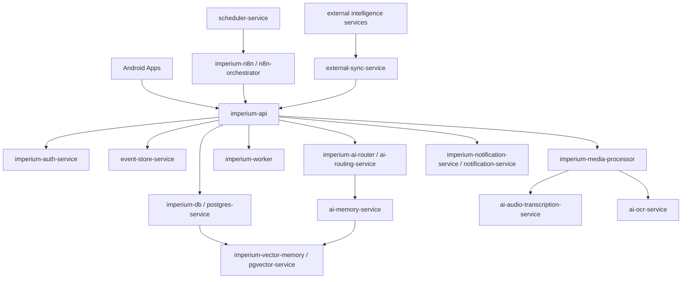

# 15 - Service Architecture Map

## Purpose

This document defines the canonical service architecture map for the ecosystem.

Core rule:

> Service names describe ownership and responsibility. They do not imply V1 microservices.

V1 must keep backend authority centralized.

For V1, most services are logical modules inside:
- `imperium-api`
- `imperium-worker`
- `imperium-media-processor`
- `imperium-ai-router`
- `imperium-notification-service`
- `imperium-auth-service`

n8n remains the workflow orchestrator.

PostgreSQL remains structured truth.

pgvector remains semantic memory only.

## Architecture Principle

Do not over-engineer V1.

The system is one-user, not SaaS.

V1 should be deployable as:
- one FastAPI backend application
- one PostgreSQL database with pgvector extension
- one n8n instance
- one worker process if needed
- optional media processor worker
- optional notification worker

The service map exists to prevent confused ownership, not to force distributed infrastructure.

## Deployment Interpretation

### V1 Meaning

In V1, a "service" usually means:
- Python package/module
- FastAPI router/service class
- background worker job
- n8n workflow group
- database-owned invariant

V1 services should not become separate deployable processes unless there is a concrete need.

### V2 Meaning

In V2, a service may become:
- a dedicated worker
- a separate queue consumer
- a separately monitored module
- a heavier integration boundary

### V3 Meaning

In V3, a service may become:
- a separate deployable service
- real-time intelligence component
- validated passive monitoring component
- external signal aggregation service

V3 requires explicit validation before implementation.

## MVP V1 Services

### Core Runtime

| service_name | phase | owner | deployment form | responsibilities | depends_on |
|---|---|---|---|---|---|
| `imperium-api` | V1 | backend | FastAPI app | Public/internal API, auth middleware, validation, event ingestion, health endpoint | `imperium-db`, `imperium-auth-service`, `event-store-service` |
| `imperium-db` | V1 | database | PostgreSQL | Structured canonical truth | none |
| `imperium-vector-memory` | V1 | database/backend | pgvector extension + backend access layer | Semantic memory storage and retrieval; never canonical truth | `imperium-db`, `ai-memory-service` |
| `imperium-auth-service` | V1 | backend | FastAPI module | One-user auth, trusted devices, access token, hashed refresh token, hashed master key | `imperium-db` |
| `event-store-service` | V1 | backend/database | backend module + `events` table | Canonical dotted events, append-only event storage, idempotency link | `imperium-db` |
| `imperium-worker` | V1 | backend | background worker process or module | Non-interactive backend jobs, scheduled backend tasks, deferred processing | `imperium-api`, `imperium-db`, `event-store-service` |
| `imperium-media-processor` | V1 | backend | worker module | File intake, extraction status, raw media retention enforcement | `imperium-db`, `ai-ocr-service`, `ai-audio-transcription-service` |
| `imperium-ai-router` | V1 | backend | backend module | Model/workflow routing decisions and logging | `ai-routing-service`, `imperium-db` |
| `imperium-notification-service` | V1 | backend | backend module or worker | Notification decision and delivery requests | `notification-service`, `imperium-db` |
| `imperium-n8n` | V1 | automation | n8n instance | Workflow orchestration only; canonical writes through backend APIs | `imperium-api`, `n8n-orchestrator` |
| `imperium-monitoring` | V1 | ops | simple logs/health checks | Health, logs, errors, basic performance visibility | `health-check-service`, `logs-service` |

### Imperium App Services

| service_name | phase | owner | deployment form | responsibilities | depends_on |
|---|---|---|---|---|---|
| `imperium-mission-service` | V1 | backend | module | Current mission, finish mission, failure reason storage | `event-store-service`, `imperium-db` |
| `imperium-planning-service` | V1 | backend | module | Daily planning snapshot, finish day request handling | `imperium-mission-service`, `vault-financial-pressure-service` |
| `imperium-priority-service` | V1 | backend | module | User-defined priority hierarchy; no silent AI rewrites | `imperium-db`, `event-store-service` |
| `imperium-review-service` | V1 | backend/n8n | module + workflow | Weekly review state and explicit validation | `imperium-db`, `n8n-orchestrator` |
| `imperium-recommendation-service` | V1 | backend/AI | module | Explainable recommendations using current truth + memory | `ai-strategy-service`, `ai-memory-service`, `imperium-db` |

### Vector App Services

| service_name | phase | owner | deployment form | responsibilities | depends_on |
|---|---|---|---|---|---|
| `vector-session-service` | V1 | backend | module | Start/end VTC session, objective reached request | `event-store-service`, `imperium-db`, `vault-transaction-service` |
| `vector-zone-service` | V1 | backend | module | Manual last drop zone, zone history lookup, return-to-Paris context | `imperium-db`, `ai-memory-service` |
| `vector-recommendation-service` | V1 | backend/AI | module | "Where should I go?" recommendation with explanation | `vector-zone-service`, `vault-financial-pressure-service`, `imperium-planning-service` |
| `vector-screenshot-analysis-service` | V1 | media/AI | media processor module | Manual screenshot upload analysis; OCR confidence | `imperium-media-processor`, `ai-ocr-service` |
| `vector-driving-tips-service` | V1 | backend | module | Practical driving tips from rules, objective, time, fatigue | `vector-recommendation-service`, `imperium-db` |

V1 excludes real-time Android automation.

### The Vault App Services

| service_name | phase | owner | deployment form | responsibilities | depends_on |
|---|---|---|---|---|---|
| `vault-transaction-service` | V1 | backend | module | Manual income/expense declarations and corrections | `event-store-service`, `imperium-db` |
| `vault-wallet-service` | V1 | backend/database | module | Derived wallet balances from wallets + transactions + adjustments | `vault-transaction-service`, `imperium-db` |
| `vault-financial-pressure-service` | V1 | backend | module | Deterministic financial pressure score and explanation | `vault-wallet-service`, `vault-weekly-summary-service` |
| `vault-weekly-summary-service` | V1 | backend | module | Weekly income/profit summary | `vault-transaction-service`, `imperium-db` |
| `vault-sadaqa-finance-link-service` | V1 | backend | module | Real profit feed for The Path sadaqa logic | `vault-weekly-summary-service`, `path-sadaqa-service` |

### Pulse App Services

| service_name | phase | owner | deployment form | responsibilities | depends_on |
|---|---|---|---|---|---|
| `pulse-body-service` | V1 | backend | module | Body tracking input and snapshots | `event-store-service`, `imperium-db` |
| `pulse-workout-service` | V1 | backend | module | Workout logging and simple recommendations | `pulse-health-adaptation-service` |
| `pulse-food-stock-service` | V1 | backend | module | Food stock logging | `imperium-db` |
| `pulse-meal-service` | V1 | backend | module | Meal logging | `imperium-db` |
| `pulse-health-adaptation-service` | V1 | backend/AI | module | Fatigue/sleep-aware workout adaptation; no medical authority | `ai-strategy-service`, `ai-memory-service` |

### The Path App Services

| service_name | phase | owner | deployment form | responsibilities | depends_on |
|---|---|---|---|---|---|
| `path-prayer-service` | V1 | backend | module | Prayer tracking by explicit user action; cached prayer time display support | `mawaqit-sync-service`, `imperium-db` |
| `path-fasting-service` | V1 | backend | module | Fasting tracking by explicit user action | `event-store-service`, `imperium-db` |
| `path-sadaqa-service` | V1 | backend | module | Sadaqa tracking by explicit user action | `vault-sadaqa-finance-link-service`, `imperium-db` |
| `path-reminder-service` | V1 | backend/notification | module | Worship reminders and alerts | `notification-service` |
| `path-spiritual-routine-service` | V1 | backend | module | Adhkar/spiritual routine tracking; no religious rulings | `event-store-service`, `imperium-db` |

### Transverse AI Services

| service_name | phase | owner | deployment form | responsibilities | depends_on |
|---|---|---|---|---|---|
| `ai-routing-service` | V1 | backend | module | Choose model/workflow using routing policy | `imperium-ai-router`, `imperium-db` |
| `ai-memory-service` | V1 | backend | module | Memory write approval/retrieval policy | `imperium-vector-memory`, `event-store-service` |
| `ai-audio-transcription-service` | V1 | backend/media | module/worker | Whisper/faster-whisper STT pipeline | `imperium-media-processor` |
| `ai-ocr-service` | V1 | backend/media | module/worker | Gemini OCR/image extraction after privacy gate | `imperium-media-processor` |
| `ai-strategy-service` | V1 | backend/AI | module | GPT/Claude complex reasoning when allowed | `ai-routing-service`, `ai-memory-service` |

### Data Services

| service_name | phase | owner | deployment form | responsibilities | depends_on |
|---|---|---|---|---|---|
| `postgres-service` | V1 | database | PostgreSQL | Structured canonical truth | none |
| `pgvector-service` | V1 | database | PostgreSQL extension | Semantic memory vectors | `postgres-service` |
| `event-store-service` | V1 | backend/database | module/table | Append-only events and idempotency protection | `postgres-service` |
| `audit-log-service` | V1 | backend/database | module/table/event log | Audit via event log and security logs | `event-store-service` |
| `backup-service` | V1 | ops | script/process | Encrypted backups | `postgres-service`, `pgvector-service` |

### Automation Services

| service_name | phase | owner | deployment form | responsibilities | depends_on |
|---|---|---|---|---|---|
| `n8n-orchestrator` | V1 | automation | n8n | Workflow orchestration | `imperium-api` |
| `scheduler-service` | V1 | backend/n8n | module/workflow | Daily/weekly scheduled triggers | `n8n-orchestrator`, `imperium-api` |
| `workflow-runner` | V1 | n8n/backend | workflow group | Run approved workflows and return outputs | `n8n-orchestrator`, `imperium-api` |

### User Interaction Services

| service_name | phase | owner | deployment form | responsibilities | depends_on |
|---|---|---|---|---|---|
| `notification-service` | V1 | backend | module | Notification decisions and records | `imperium-db` |
| `voice-command-service` | V1 | backend/media | module | Voice upload intake and transcription workflow trigger | `ai-audio-transcription-service` |
| `file-upload-service` | V1 | backend/media | module | File upload metadata and processing trigger | `imperium-media-processor` |
| `dashboard-state-service` | V1 | backend | module | Read-only app state summaries for Android apps | app domain services |

### Monitoring Services

| service_name | phase | owner | deployment form | responsibilities | depends_on |
|---|---|---|---|---|---|
| `health-check-service` | V1 | backend/ops | FastAPI endpoint | API and dependency health | `imperium-api`, `imperium-db` |
| `logs-service` | V1 | backend/ops | structured logs | Debug and operational logs | all backend services |
| `error-tracking-service` | V1 | backend/ops | simple error logs | Error visibility | `logs-service` |

## V2 Services

V2 services add richer behavior after V1 is stable.

They should still remain centralized modules/workers unless separate deployment becomes necessary.

| service_name | phase | owner | responsibilities | depends_on |
|---|---|---|---|---|
| `vector-event-intelligence-service` | V2 | backend/external intelligence | Concert, station, airport, disruption opportunity signals | `event-monitor-service`, `transport-monitor-service`, `traffic-monitor-service` |
| `external-sync-service` | V2 | automation/backend | External feed synchronization | external monitor services, `imperium-api` |
| `transport-monitor-service` | V2 | external intelligence | IDFM/transport disruptions | external APIs, `external-sync-service` |
| `event-monitor-service` | V2 | external intelligence | Concerts/events | external APIs, `external-sync-service` |
| `airport-monitor-service` | V2 | external intelligence | Flight and airport signals | external APIs, `external-sync-service` |
| `traffic-monitor-service` | V2 | external intelligence | Traffic and road disruption signals | external APIs, `external-sync-service` |
| `weather-monitor-service` | V2 | external intelligence | Weather context | external APIs, `external-sync-service` |
| `mawaqit-sync-service` | V2 | external intelligence | Prayer time source sync | external source, `path-prayer-service` |
| `push-service` | V2 | user interaction | Push provider integration | `notification-service` |
| `performance-monitoring-service` | V2 | monitoring | Latency/performance tracking | `logs-service`, `health-check-service` |

## V3 Services

V3 services require proof of feasibility, legality, reliability, and usefulness.

No V3 service may bypass backend authority.

| service_name | phase | owner | responsibilities | hard boundary |
|---|---|---|---|---|
| `vector-screenshot-analysis-service` advanced mode | V3 | media/AI | Possible safer passive detection if legal/stable | no auto-click, no tap simulation, no Bolt abuse |
| `vector-event-intelligence-service` real-time mode | V3 | external intelligence | More real-time VTC opportunity intelligence | recommendations only |
| `imperium-monitoring` advanced mode | V3 | ops | Full observability stack | must not expose private data |
| `external-sync-service` advanced mode | V3 | automation | Rich external integrations | canonical writes still through backend |

## Dependency Map



## Ownership Rules

### Backend Owns

The backend owns:
- auth checks
- device trust
- event acceptance
- idempotency
- validation
- canonical PostgreSQL writes
- privacy gates
- business constraints
- memory write approval
- final responses to apps

### n8n Owns

n8n owns:
- workflow orchestration
- long-running workflow coordination
- scheduled workflow triggers
- external API calls where appropriate
- AI workflow coordination

n8n does not own canonical writes.

### PostgreSQL Owns

PostgreSQL owns:
- structured truth
- constraints
- unique indexes
- event storage
- device/session/token records
- transaction/session/mission truth

### pgvector Owns

pgvector owns:
- semantic memory embeddings
- retrieval support

pgvector does not own canonical truth.

### Android Apps Own

Android apps own:
- display
- capture
- trigger
- explanation surfaces
- pending/synced/failed UI
- offline queue/cache behavior

Android apps do not own strategic truth.

## V1 Non-Goals

Do not create separate deployable microservices for every service name in V1.

Do not add:
- Kubernetes
- service mesh
- distributed tracing platform
- event streaming platform
- separate database per service
- microservice auth between every internal module
- real-time Vector automation
- bank sync
- enterprise multi-user infrastructure

V1 should be boring, centralized, and correct.

## Suggested V1 Backend Package Shape

This is a module ownership suggestion, not a requirement to implement everything immediately.

```text
backend/app/
  api/
  core/
  db/
  models/
  schemas/
  services/
    auth/
    devices/
    events/
    idempotency/
    imperium/
    vector/
    vault/
    pulse/
    path/
    ai/
    media/
    notifications/
    monitoring/
  workers/
  integrations/
```

Only create modules when needed by the current implementation task.

## Phase Gate

Before promoting any logical V1 service into a separate deployable service, answer:
- Is there a performance bottleneck?
- Is there a security boundary?
- Is there a reliability reason?
- Is there a deployment reason?
- Can the same outcome be achieved as a module or worker?

If the answer is not concrete, keep it inside the centralized backend.

