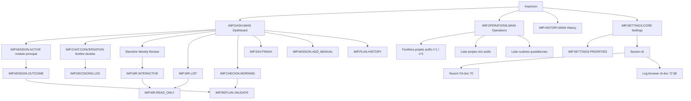
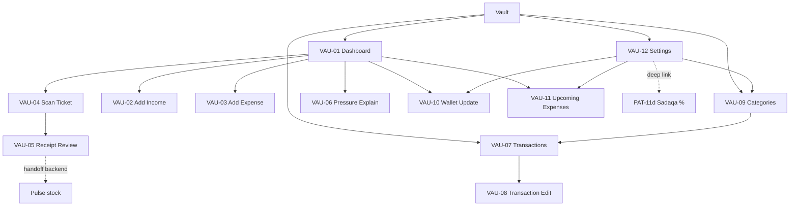
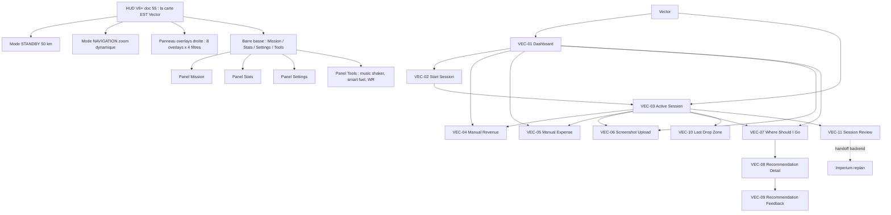
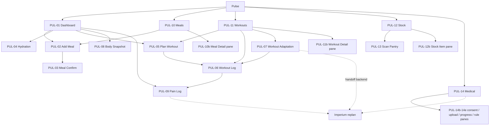
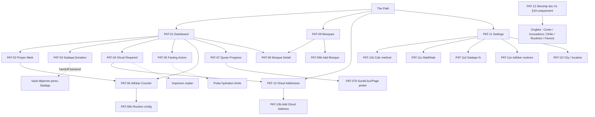

# 79 - Frontend Map (carte vivante des écrans)

**Version :** 1.0
**Sources de vérité :** `59_DESIGN_SYSTEM_V1_DRAFT.md` §12-16, `63_FRONTEND_ARCHITECTURE_V1.md`, `64_FRONTEND_GENERATION_PLAN_V1.md`, `65_IMPERIUM_FRONTEND_SCREEN_SPEC_V1.md`, `66`-`68`, `69_FRONTEND_API_MAPPING_V1.md`, `55_VECTOR_HUD_FINAL_INTERFACE.md`, `42_VAULT_LOGIC_DETAIL.md` §14/§17, `41_PATH_LOGIC_DETAIL.md` §19, `40_PULSE_LOGIC_DETAIL.md` §9/§20-21, `70`, `71`, `72`, `99_AUDIT_COHERENCE_FRONTEND.md`, couche de métadonnées frontend backend (`backend/app/services/imperium/frontend.py`, `home.py`, routeur `backend/app/api/v1/`).
**Statut :** DOCUMENT VIVANT — lecture seule, aucun écran inventé, aucun code touché. À mettre à jour à chaque écran ajouté, promu ou retiré.
**Last updated :** 2026-09-15

## 0. Légende

| Marque | Sens |
|---|---|
| **SPÉCIFIÉ** | Écran décrit dans une doc (59, 63, 71, 72, 55, 40, 41, 42) sans fixture mock ni métadonnée backend. |
| **MAQUETTÉ** | Écran avec fixture mock canonique (doc 65 §3-8, doc 68) et mapping API (doc 69), sans métadonnée backend. |
| **CODÉ** | Écran déclaré dans la couche de métadonnées backend (`navigation`, `module_cards`, `actions`, `empty_states`, `layout`). Aucun code frontend Kotlin n'existe dans le repo (doc 63 §15) : CODÉ = côté backend uniquement. |
| ✔ | Route réelle présente dans `backend/app/api/v1/routes/`. |
| ✖ | Endpoint cité comme réel par une doc mais absent du routeur actuel. |
| TBD | Endpoint annoncé futur par la doc (jamais branché). |
| HYP | Hypothèse de l'auteur de cette carte, non sourcée. |

Statut retenu par écran = le plus avancé des trois (CODÉ > MAQUETTÉ > SPÉCIFIÉ). Les identifiants `IMP-XX` sont abandonnés (doc 99 §A.2) ; seuls les Route ID parlants font autorité. Les numéros `VAU/VEC/PUL/PAT-XX` restent utilisés par les docs 59/63 et sont conservés ici.

Contrainte de 500 lignes : chaque fiche d'écran est rendue en une ligne de tableau à 5 champs (rôle ; features visibles ; endpoints ; statut ; références).

## 1. Plans de site par façade

### 1.1 Imperium (top-level = 4 onglets, doc 59 §12.0, doc 65 §9, doc 99 §B)

### 1.2 Vault (top-level = VAU-01, 07, 09, 12, doc 59 §13.0)

### 1.3 Vector (top-level = VEC-01 et VEC-03, doc 59 §14.0 ; HUD = V6+, doc 55)

### 1.4 Pulse (top-level = PUL-01, 10, 11, 12, 14, doc 59 §15.0)

### 1.5 The Path (top-level = PAT-01, 09, 10, 11, doc 59 §16.0 ; PAT-12 seulement doc 41 §19)

## 2. Fiches par écran

### 2.1 Imperium

| Écran | Rôle | Features visibles | Endpoints consommés | Statut | Références |
|---|---|---|---|---|---|
| `IMP.DASH.MAIN` Dashboard | Montrer ce qu'il faut faire maintenant : une seule mission active, priorités, actions rapides, état global. | Daily Focus Card ; Active Mission Card ; Priority Card ; Quick Actions (mission, chatbot, replan, finish day) ; Weekly Progress ; Imperium Status/SyncStateChip ; bannières WR/Ghusl/Critical ; Today's Plan ; widgets Next prayer countdown + Pressure score ; chatbot docké. | ✔ `GET /api/imperium/dashboard` ; ✔ `GET /api/imperium/missions/active` ; ✔ `GET /api/imperium/weekly-review/state` ; ✔ `POST /api/imperium/day/finish` ; TBD `POST /api/imperium/replans/request`. | CODÉ (nav `/dashboard`, module card, action `open_dashboard`, région layout `hero`) | 65 §3, 69 §3.1, 59 §12.2, 67 §3, 68 §2.1, 99 §D#7 |
| `IMP.MISSION.ACTIVE` Mission active | Comprendre et agir sur l'unique mission active sans en créer une seconde ; module principal du Dashboard + widget d'accès rapide. | Mission Header ; Mission Description ; Progress Block ; Decision Buttons Complete/Fail/Replan/Back ; Notes Area texte + voix. | ✔ `GET /api/imperium/missions/active` ; ✔ `GET /api/imperium/missions/{mission_id}` ; ✔ `POST …/missions/{id}/complete` ; ✔ `POST …/missions/{id}/fail` ; TBD `POST …/missions/{id}/notes` ; TBD `POST /api/imperium/replans/request`. | CODÉ (nav `/missions`, module card `mission`, empty state `no_active_mission`) — placement divergent, voir §4.1 | 65 §4, 69 §3.2, 99 §B, 63 §9.1 |
| `IMP.OPERATIONS.MAIN` Operations (nom provisoire) | Gérer la matière première du système : 2 projets actifs, projets non actifs, routines quotidiennes cochables. | Fenêtre projet actif n°1 ; fenêtre projet actif n°2 ; liste projets non actifs ; bouton Modifier (ajouter/supprimer/activer/désactiver/réordonner) ; liste routines avec coche du jour ; bannière « Attention requise ». | Aucun endpoint réel ni TBD nommé (doc 59 §12.17 : « Operations project/routine endpoints, per 71 »). | SPÉCIFIÉ | 71, 65 §6, 59 §12.0, 99 §C.1, F06 (hors V1) |
| `IMP.HISTORY.MAIN` History | Chronologie read-only des missions, plans, décisions et événements. | Timeline ; Search ; Filters All/Missions/Decisions/Weekly/Failed ; History Detail Card ; lien mission liée. | ✔ `GET /api/imperium/missions/history` ; ✔ `GET /api/imperium/daily-plan` ; ✔ `GET /api/imperium/day/plan` ; TBD `GET /api/imperium/history/events` ; TBD `GET …/history/events/{event_id}`. | MAQUETTÉ (`history_mock_v1`) | 65 §7, 69 §3.5, 67 §7, 68 §2.5 |
| `IMP.SETTINGS.CORE` Settings | Préférences frontend et liens de configuration, sans modifier une règle canonique sans backend. | Sections User ; Theme ; Notifications ; Integrations ; Security ; Advanced (lien priorités, cache, reset) ; sections doc 59 Morning popup, Replan policy, Chat retention, Discipline weights ; sous-section IA : Nourrir l'IA (doc 70), Logs (doc 72 §8). | ✔ `GET /api/imperium/frontend/app-manifest` ; ✔ `GET /api/imperium/decision-framework/priorities` ; TBD `GET/PATCH /api/imperium/settings` ; TBD endpoints doc 70 §11. | MAQUETTÉ (`settings_mock_v1` ; asset `nav_settings` déclaré mais aucun item navigation) | 65 §8, 69 §3.6, 59 §12.15, 70 §13, 72 §8 |
| `IMP.SETTINGS.PRIORITIES` Priority Rules | Ordonner les priorités canoniques du Decision Framework. | Liste draggable ; rank labels ; aide schéma read-only ; Enregistrer / Réinitialiser. | ✔ `GET/POST /api/imperium/decision-framework/priorities` ; ✔ `GET /api/imperium/decision-framework/schema` ; ✔ `GET/POST /api/imperium/priorities` (legacy). | SPÉCIFIÉ | 59 §12.14, 65 §9.6 deep link |
| `IMP.CHAT.CONVERSATION` Chatbot | Point d'entrée universel : tout ce qu'un bouton fait, le chatbot le fait, sous validation. | Liste messages ; provider chip read-only ; input texte ; bouton voix ; envoi ; croix de fermeture (déclenche extraction d'apprentissage en arrière-plan) ; bannière Decisions Log. | TBD `POST /api/imperium/chat/messages` ; TBD `GET /api/imperium/chat/conversation`. | SPÉCIFIÉ | 72, 59 §12.9, 65 §9.5, 99 §B |
| `IMP.DECISIONS.LOG` Decisions Log | Journal des décisions issues du chatbot. | Filtres source/statut ; decision cards ; lien conversation source ; chip mission créée ; compteur décisions semaine. | TBD `GET /api/imperium/decisions-log`. | SPÉCIFIÉ | 59 §12.10 |
| `IMP.CHECKIN.MORNING` Morning Check-In | Popup matinal : énergie, sommeil, douleur, humeur, notes. | Sliders énergie/sommeil ; pain selector ; mood set custom ; notes ; Continuer / Plus tard. | TBD `POST /api/imperium/morning-checkins`. | SPÉCIFIÉ (hors génération V1, doc 63 §9.1) | 59 §12.3, 99 §D#5 |
| `IMP.MISSION.OUTCOME` Mission Outcome | Bottom sheet Faite/Ratée/Annulée avec raison. | Sélecteur d'issue ; raison texte/voix ; signal ressenti ; Envoyer. | ✔ `POST …/missions/{id}/complete` ; ✔ `POST …/missions/{id}/fail` ; TBD `POST …/missions/{id}/cancel`. | SPÉCIFIÉ (hors génération V1) | 59 §12.4 |
| `IMP.DAY.FINISH` Day Finished | Bilan du jour (énergie, fatigue, sommeil, stress, humeur, win/problème). | Sliders ; mood ; TextFields ; Terminer la journée / Plus tard ; compteur complétion. | ✔ `POST /api/imperium/day/finish` ; ✔ `GET /api/imperium/day/latest`. | SPÉCIFIÉ (hors génération V1) | 59 §12.5 |
| `IMP.REPLAN.VALIDATE` Replan Validation | Comparer plan avant/après et accepter ou refuser une proposition backend. | Colonnes Before/After ; delta badges ; bannière raison modèle ; Accepter / Modifier / Annuler. | ✔ `POST /api/imperium/day/plan/{plan_id}/activate` ; TBD `GET/POST /api/imperium/replans/{id}[/accept]`. | SPÉCIFIÉ (hors génération V1) | 59 §12.6 |
| `IMP.MISSION.ADD_MANUAL` Add Manual Mission | Créer une mission backlog manuelle avec aperçu de score. | Titre ; description ; domaine ; priority stepper ; deadline ; catégorie ; preview score. | ✔ `POST /api/imperium/missions/backlog` ; ✔ `GET …/missions/backlog/decision-preview` ; ✔ `POST …/missions/backlog/{id}/promote` ; ✔ `POST /api/imperium/decision-framework/score-preview`. | SPÉCIFIÉ (hors génération V1) | 59 §12.7 |
| `IMP.PLAN.HISTORY` Plan History | Onglet read-only des plans journaliers passés. | Filter chips date/statut ; timeline ; daily plan cards ; mini tendance hebdo. | ✔ `GET /api/imperium/daily-plan` ; ✔ `GET /api/imperium/day/plan[/today]` ; ✔ `GET /api/imperium/missions/history` ; TBD lecture historique plans. | SPÉCIFIÉ | 59 §12.8, 65 §7.1 |
| `IMP.WR.LIST` Weekly Review List | Liste des rapports WR stockés + bannière readiness. | Bannière WR ; cards rapports ; status chips ; pagination. | ✔ `GET /api/imperium/weekly-review/history` ; ✔ `GET …/final-reports/stored` ; ✔ `GET …/weekly-review/state`. | SPÉCIFIÉ | 59 §12.11, 65 §5 |
| `IMP.WR.READ_ONLY` Weekly Review Read-only | Rapport final stocké, non mutable, export Markdown. | Titre/résumé ; sections déterministes ; metrics ; liens memory candidates ; export. | ✔ `GET …/{session_id}/final-report` ; ✔ `GET …/final-report/markdown` ; ✔ `GET …/final-reports/{report_id}` ; ✔ `GET …/{session_id}/memory-candidates`. | SPÉCIFIÉ | 59 §12.12, 65 §9.6 deep link |
| `IMP.WR.INTERACTIVE` Weekly Review Interactive | Fenêtre événementielle guidée, déclenchée par bannière Dashboard (mardi 20h configurable). | Timeline conversation ; prompt assistant ; réponse texte/voix ; boutons rendus par backend ; draft/final sheet ; indicateur d'étape. | ✔ `GET …/weekly-review/current` ; ✔ `POST …/weekly-review/launch` ; ✔ `GET …/{session_id}/conversation` ; ✔ `POST …/{session_id}/chat/messages` ; ✔ `POST …/chat/confirm-no-more-input` ; ✔ `POST …/{session_id}/draft/approve|reject|store` ; ✔ `POST …/{session_id}/approve|cancel`. | SPÉCIFIÉ (cycle bannière lancement → fait → cooldown non documenté, 99 §C.2) | 59 §12.13, 65 §5, 99 §C.2 |
| `IMP.INBOX.MAIN` Inbox (obsolète) | Faux écran : chatbot mal nommé, à supprimer du doc 65 (99 §B) ; encore présent dans 63 §4.2, 66 §8, 67 §2, 68 §2.3, 69 §3.3. | Search ; Filters ; Conversation List ; Message Preview ; Add voice note ; Convert to mission. | TBD `GET /api/imperium/inbox/items` et dérivés. | MAQUETTÉ (`inbox_mock_v1`) — obsolète | 69 §3.3, 99 §B, 70 §13 |
| `IMP.WR.SUMMARY` Weekly Review top-level (obsolète) | Ancien top-level WR remplacé par bannière + `IMP.WR.LIST/READ_ONLY/INTERACTIVE` (65 §5). | Weekly Summary ; Wins ; Failures ; Improvement Suggestions ; Statistics. | ✔ `GET /api/imperium/weekly-review/state`. | MAQUETTÉ (`weekly_review_mock_v1`) — obsolète | 69 §3.4, 63 §4.2, 66 §8, 67 §2 |

### 2.2 Vault

| Écran | Rôle | Features visibles | Endpoints consommés | Statut | Références |
|---|---|---|---|---|---|
| `VAU-01` Dashboard | Vérité financière du jour : wallet, balances, pression, échéances. | Wallet total cash/bank/crypto ; Wallet Allocation Display ; balances semaine/mois business/perso ; Pressure Gauge 0-100 + « Voir pourquoi » ; upcoming 7 jours ; bannière weekly profit ; action bar Primary `+ Dépense`, Secondary `+ Gain`, `Scan ticket`. | ✔ `GET /api/imperium/vault/summary` ; ✔ `GET …/summary/monthly` ; ✔ `GET /api/vault/pressure` ; ✔ `GET /api/vault/upcoming-expenses` ; ✔ `GET /api/vault/weekly-summaries`. | CODÉ (nav `/vault`, module card, empty state `no_vault_transactions`, région layout `vault`) | 59 §13.1, 42 §14/§17, 63 §9.2 |
| `VAU-02` Add Income | Bottom sheet de saisie d'un gain. | Money Input ; business/perso ; catégorie ; description voix ; date ; source wallet. | ✔ `POST /api/imperium/vault/transactions` ; ✖ `POST /api/vault/transactions`. | SPÉCIFIÉ | 59 §13.2, 42 §6.1 |
| `VAU-03` Add Expense | Bottom sheet de saisie d'une dépense (capture la plus urgente). | Money Input ; catégories par book ; « Autre » inline ; description voix ; date ; wallet. | ✔ `POST /api/imperium/vault/transactions` ; ✖ `POST /api/vault/transactions`. | SPÉCIFIÉ | 59 §13.3, 42 §6.2 |
| `VAU-04` Scan Ticket Capture | Capture caméra d'un ticket pour OCR. | Camera Capture Surface ; shutter ; fallback saisie manuelle ; helper qualité. | TBD `POST /api/vault/receipt-extractions`. | SPÉCIFIÉ | 59 §13.4, 42 §6.3 |
| `VAU-05` Receipt Review | Unique écran de validation d'un ticket OCR ; handoff Pulse pour les lignes food. | Thumbnail ; Draft Transaction Cards ; checkboxes lignes ; catégorie ; warnings confiance ; Valider / Re-scanner. | TBD `GET/POST /api/vault/receipt-extractions/{id}[/validate]` ; TBD `POST /api/pulse/food-stock/drafts/confirm`. | SPÉCIFIÉ | 59 §13.5, 42 §6.3 |
| `VAU-06` Pressure Explain | Popup « Voir pourquoi » : décomposition déterministe + conseil IA 3 phrases. | Pressure Gauge ; breakdown ; carte conseil ; cooldown ; Compris. | ✔ `GET /api/vault/pressure/explain` ; ✔ `GET /api/vault/pressure/history` ; TBD `POST /api/vault/advice/detail` (doc 42 §14). | SPÉCIFIÉ | 59 §13.6, 42 §14 |
| `VAU-07` Transactions | Onglet liste du ledger avec filtres. | Filter Chip Bar business/perso/all + dates + catégorie ; LazyColumn ; sync chips ; total filtré ; pull refresh. | ✔ `GET /api/imperium/vault/transactions` ; ✔ `GET …/summary/categories` ; ✖ `GET /api/vault/transactions/recent`. | SPÉCIFIÉ (endpoint réel, pas de métadonnée) | 59 §13.7, 42 §17 |
| `VAU-08` Transaction Edit | Correction ou annulation par écriture inverse, jamais de hard delete. | En-tête audit ; Money Input correction ; catégorie ; notes ; Enregistrer correction ; Annuler par écriture inverse + dialog. | ✔ `GET /api/imperium/vault/transactions/{id}` ; ✔ `POST …/transactions/{id}/reverse` ; TBD `PATCH …/transactions/{id}`. | SPÉCIFIÉ | 59 §13.8, 63 §4.5 deep link |
| `VAU-09` Categories | Catégories par défaut read-only, customs éditables, stats. | Filter par book ; cards défaut ; rows custom ; sparkline ; rename dialog. | ✔ `GET /api/imperium/vault/summary/categories` ; TBD `GET/PATCH /api/vault/categories[/{id}]`. | SPÉCIFIÉ | 59 §13.9, 42 §7 |
| `VAU-10` Wallet Update | Rafraîchir le snapshot wallet et comparer prédit vs réel. | Inputs cash/bank/crypto ; Wallet Allocation Display ; bannière delta >5 %. | TBD `GET/POST /api/vault/wallet/snapshots[/latest]`. | SPÉCIFIÉ | 59 §13.10, 42 §8 |
| `VAU-11` Upcoming Expenses | Gérer les échéances à venir. | Upcoming Expense Rows ; add/edit sheet ; récurrence ; rappel ; mark-paid ; dialog suppression. | ✔ `GET/POST /api/vault/upcoming-expenses` ; ✔ `PATCH/DELETE …/upcoming-expenses/{id}` ; TBD `POST …/{id}/mark-paid`. | SPÉCIFIÉ (doc 59 §13.14 les dit TBD : ils existent) | 59 §13.11, 42 §10 |
| `VAU-12` Settings | Réglages Vault ; sadaqa % en lecture seule avec deep link Path. | Row sadaqa % ; lien catégories ; lien wallet refresh ; lien upcoming ; sync chip. | ✔ `GET /api/imperium/frontend/app-manifest` ; TBD `GET/PATCH /api/vault/settings` ; TBD `GET /api/path/settings/sadaqa`. | SPÉCIFIÉ | 59 §13.12, 42 §17 |

### 2.3 Vector

| Écran | Rôle | Features visibles | Endpoints consommés | Statut | Références |
|---|---|---|---|---|---|
| `VEC-01` Dashboard | Point d'entrée VTC : session, dernière reco, halo, signaux opérationnels. | Vector Halo Emblem ; Session Active KPI Card ; Cached Recommendation Card ; Rail/Event/Traffic Banner ; Primary `Démarrer session` ; icônes revenue/expense/screenshot/where. | TBD `GET /api/vector/sessions/current` ; TBD `GET /api/vector/recommendations/latest` ; TBD `GET /api/vector/signals/operational`. | SPÉCIFIÉ (asset group `vector` + `nav_vector` déclarés, aucun item navigation) | 59 §14.1, 63 §9.3 |
| `VEC-02` Start Session | Bottom sheet de démarrage avec CA cible. | Money Input CA cible ; durée/intention ; direction stratégique ; permissions GPS/voix. | TBD `POST /api/vector/sessions` ; ✔ `GET /api/imperium/missions/active` (optionnel). | SPÉCIFIÉ | 59 §14.2 |
| `VEC-03` Active Session | Vue session en cours, driving-aware, une seule action principale `Où aller ?`. | Driving Mode Indicator ; halo 96dp ; KPI session ; timer ; progression CA ; quota destination ; bannière opérationnelle ; icônes revenue/expense/drop/end. | TBD `GET /api/vector/sessions/current` ; TBD `PATCH /api/vector/sessions/{id}` ; TBD reco latest ; TBD signals. | SPÉCIFIÉ | 59 §14.3, §14.14 |
| `VEC-04` Manual Revenue | Raccourci Vector vers une transaction Vault business. | Money Input ; catégorie VTC ; zone ; description voix ; date/heure. | ✖ `POST /api/vault/transactions` (équivalent réel ✔ `POST /api/imperium/vault/transactions`) ; TBD `POST /api/vector/sessions/{id}/manual-revenue`. | SPÉCIFIÉ | 59 §14.4 |
| `VEC-05` Manual Expense | Raccourci Vector vers une dépense Vault business. | Money Input ; catégories Carburant/Péage/Parking/… ; description voix ; wallet. | ✖ `POST /api/vault/transactions` (équivalent réel ✔ `POST /api/imperium/vault/transactions`) ; TBD `POST /api/vector/sessions/{id}/manual-expense`. | SPÉCIFIÉ | 59 §14.5 |
| `VEC-06` Screenshot Upload | Upload-only V1 d'une capture Bolt (OCR = V2). | File picker ; preview ; progression ; chip « OCR désactivé V1 » ; Envoyer / Remplacer. | TBD `POST /api/vector/screenshots`. | SPÉCIFIÉ | 59 §14.6 |
| `VEC-07` Where Should I Go | Demander une recommandation de zone. | Primary `Calculer` ; halo analyse ; Cached Recommendation Card ; raison courte ; quota ; retry. | TBD `POST /api/vector/recommendations` ; TBD `GET …/recommendations/latest`. | SPÉCIFIÉ | 59 §14.7 |
| `VEC-08` Recommendation Detail | Explication complète d'une recommandation. | Card étendue ; Confidence Breakdown (4 lignes) ; raisons ; chip timestamp/stale ; CTA feedback. | TBD `GET /api/vector/recommendations/{id}`. | SPÉCIFIÉ | 59 §14.8, 63 §4.5 deep link |
| `VEC-09` Recommendation Feedback | Bottom sheet thumbs + action réelle. | Thumbs up/down ; chips accepted/refused/missed/ignored ; raison voix. | TBD `POST …/recommendations/{id}/feedback`. | SPÉCIFIÉ | 59 §14.9 |
| `VEC-10` Last Drop Zone | Confirmer la zone de dépose (GPS préremplit, ne confirme jamais seul). | Zone détectée ; zone éditable ; confiance GPS ; Confirmer / Modifier. | TBD `POST /api/vector/sessions/{id}/drop-zone`. | SPÉCIFIÉ | 59 §14.10 |
| `VEC-11` Session Review | Bilan de session et handoff replan Imperium. | KPI cards ; objectif atteint ; note feedback voix ; résumé mauvaises recos ; Terminer ; toast `Imperium replanning…`. | ✖ `GET /api/vector/sessions/{id}/review` (cité réel par 59 §14.11) ; TBD `POST …/sessions/{id}/complete`. | SPÉCIFIÉ | 59 §14.11 |
| HUD Vector (V6+) | La carte devient l'interface : overlays contextuels et panneaux glissants. | Modes STANDBY 50 km / NAVIGATION zoom dynamique ; 8 overlays (zones chaudes, aviation, événements, stations, mosquées, raccourcis, position, voies) ; panneau droit accordéon 4 filtres × items ; top bar heure/prière/session/énergie ; barre basse Mission/Stats/Settings/Tools ; tap/long press/double tap. | Aucun endpoint ; sources par overlay doc 55 §9 ; schéma `vector_hud_preferences` doc 55 §14. | SPÉCIFIÉ (V6+, interdit avant V5 stable) | 55 §4-7, §10 |

### 2.4 Pulse

| Écran | Rôle | Features visibles | Endpoints consommés | Statut | Références |
|---|---|---|---|---|---|
| `PUL-01` Dashboard | Vue du jour : repas, hydratation, workout, health score expliqué, bannières. | Health Score Display ; Macros Estimation Card ; Hydration Progress Ring ; Workout Card ; Expiring Soon Banner ; Active Medical Rule Banner ; bannière jeûne Path ; Primary `Ajouter repas`. | TBD `GET /api/pulse/dashboard` ; TBD `GET /api/pulse/medical-rules/active`. Backend réel divergent : ✔ `GET /api/imperium/pulse/today`, `…/entries`, `…/stats/summary` (entrées sommeil/énergie/fatigue/poids/workout). | CODÉ (nav `/pulse`, module card, empty state `no_pulse_entry`, région `pulse`) — modèle divergent, voir §4.3 | 59 §15.1, 40 §9, 63 §9.4 |
| `PUL-02` Add Meal | Saisie repas texte/voix/photo → estimation macros backend. | Input texte ; voix ; photo ; heure ; Estimer ; warning jeûne. | TBD `POST /api/pulse/meals/estimate`. | SPÉCIFIÉ | 59 §15.2, 40 §10.1 |
| `PUL-03` Meal Confirm | Valider macros et décrément stock optionnel, user-confirmé. | Macros éditables ; Stock Decrement Draft Cards ; confiance ; warnings. | TBD `GET/POST /api/pulse/meals/{draft_id}[/confirm]`. | SPÉCIFIÉ | 59 §15.3, 40 §10.2-10.3 |
| `PUL-04` Hydration | Quick log +250/+500/+1L, bloqué en fenêtre de jeûne. | Ring ; quick buttons ; bannière contrainte Path. | TBD `GET/POST /api/pulse/hydration-logs[/today]`. | SPÉCIFIÉ | 59 §15.4, 40 §12 |
| `PUL-05` Plan Workout | Planifier une séance. | Titre ; durée ; intensité ; exercices ; équipement ; horaire. | TBD `POST /api/pulse/workouts` ; TBD `POST /api/pulse/recommendations`. | SPÉCIFIÉ | 59 §15.5, 40 §13.1 |
| `PUL-06` Workout Log | Suivi live d'une séance. | Workout Live Tracker ; sets/reps ; rest timer ; intensité perçue ; skip reason. | TBD `GET/POST /api/pulse/workouts/{id}[/complete]`. | SPÉCIFIÉ | 59 §15.6, 40 §13.2 |
| `PUL-07` Workout Adaptation | Proposition d'adaptation jamais forcée. | Adaptation Proposal Card ; before/after ; raison ; Accepter / Garder / Plus tard. | TBD `POST …/workouts/{id}/adaptation/accept|reject`. | SPÉCIFIÉ | 59 §15.7, 40 §13.3 |
| `PUL-08` Body Snapshot | Poids et mesures ; photo locale jamais uploadée en V1. | Inputs numériques ; grille mesures ; Body Snapshot Comparison ; bannière privacy. | TBD `POST /api/pulse/body-snapshots`. | SPÉCIFIÉ | 59 §15.8, 40 §14 |
| `PUL-09` Pain Log | Journal douleur ; sévérité 8-10 propose un replan Imperium. | Pain Body Diagram ; slider 0-10 ; limitation voix ; impact workout ; prompt replan. | TBD `POST /api/pulse/pain-logs` ; TBD `POST /api/imperium/replan-requests`. | SPÉCIFIÉ | 59 §15.9, 40 §16 |
| `PUL-10` Meals | Onglet historique repas et macros agrégées. | Filter Chip Bar ; liste ; macros hebdo ; facteurs nutrition ; Suggestion AI Card ; pane PUL-10b. | TBD `GET /api/pulse/meals` ; TBD `POST /api/pulse/recommendations`. | SPÉCIFIÉ | 59 §15.10 |
| `PUL-11` Workouts | Onglet séance du jour, historique, récupération. | Workout Card ; historique ; recovery widget ; bannière adaptation ; pane PUL-11b. | TBD `GET /api/pulse/workouts` ; TBD `GET /api/pulse/recovery-state`. | SPÉCIFIÉ | 59 §15.11, 40 §13.4 |
| `PUL-12` Stock | Onglet stock alimentaire, expirations, handoff Vault. | Stock Item Rows ; Expiring Soon Banner ; filtres ; badge handoff Vault ; add sheet ; scan CTA ; pane PUL-12b. | TBD `GET/POST/PATCH /api/pulse/food-stock[/{id}]` ; TBD `POST …/food-stock/drafts/confirm`. | SPÉCIFIÉ | 59 §15.12, 40 §11 |
| `PUL-13` Scan Pantry | Scanner frigo/placard et valider le diff stock. | Camera Capture Surface ; liste draft ; diff ; confiance ; Valider le stock. | TBD `POST /api/pulse/food-stock/scan` ; TBD `POST …/scans/{id}/validate`. | SPÉCIFIÉ | 59 §15.13, 40 §11.1 |
| `PUL-14` Medical | Documents médicaux sous consentement, règles actives validées. | Medical Document Rows ; consent gate ; extraction progress ; Active Medical Rule list ; checklist validation ; panes 14b-14e. | TBD `GET/POST /api/pulse/medical-documents` ; TBD `GET …/medical-rules/active` ; TBD `POST …/medical-rules/{id}/activate`. | SPÉCIFIÉ | 59 §15.14, §15.18, doc 34 |

### 2.5 The Path

| Écran | Rôle | Features visibles | Endpoints consommés | Statut | Références |
|---|---|---|---|---|---|
| `PAT-01` Dashboard | Prochaine prière, 5 statuts, sadaqa, jeûne, adhkar, Coran, hijri, qibla. | Next Prayer Countdown Card ; Prayer Times List ; Sadaqa Target Card ; bannière jeûne ; adhkar progress ; Quran Progress Card ; Hijri Date Display ; Qibla compact ; Path Handoff Toast. | TBD `GET /api/path/dashboard` ; TBD `…/prayer-times/today` ; TBD `…/sadaqa/summary` ; TBD `…/calendar/hijri` ; TBD `…/qibla`. Backend réel divergent : ✔ `GET /api/imperium/path/today`, `…/habits`, `…/check-ins`, `…/stats/summary` (habitudes/check-ins). | CODÉ (nav `/path`, module card, empty state `no_path_habits`, région `path`) — modèle divergent, voir §4.3 | 59 §16.1, 41 §19, 63 §9.5 |
| `PAT-02` Prayer Mark | Marquer une prière (Accomplie / Non marquée / Effacer), formulation non jugeante. | Segmented outcome ; source MAWAQIT/calcul ; correction horaire ; note ; suggestion adhkar. | TBD `POST /api/path/prayers/{slug}/mark`. | SPÉCIFIÉ | 59 §16.2, 41 §7 |
| `PAT-03` Sadaqa Donation | Déclarer un don ; handoff Vault dépense perso `Sadaqa`. | Money Input ; Sadaqa Target Card ; destination ; date ; note voix ; état handoff Vault. | TBD `GET/POST /api/path/sadaqa/donations` ; TBD `GET …/sadaqa/summary` ; ✖ `POST /api/vault/transactions` (équivalent réel ✔ `POST /api/imperium/vault/transactions`). | SPÉCIFIÉ | 59 §16.3, 41 §9.4 |
| `PAT-04` Ghusl Required | Activer/terminer l'état ghusl, handoff replan Imperium. | Toggle Card ; timestamp ; adresse la plus proche ; bannière mission créée ; Activer / Marquer terminé. | TBD `POST /api/path/ghusl/activate|complete` ; TBD `POST /api/imperium/replan-requests`. | SPÉCIFIÉ | 59 §16.4, 41 §10 |
| `PAT-05` Fasting Action | Démarrer/terminer/rompre un jeûne, jamais auto-démarré. | Type chips ; countdown suhoor/iftar ; intention ; dialog rupture ; toast Pulse. | TBD `POST /api/path/fasting/start|end|break`. | SPÉCIFIÉ | 59 §16.5, 41 §8 |
| `PAT-06` Adhkar Counter | Compteur +1 grand format, texte arabe, voix optionnelle. | Adhkar Counter Widget ; sélecteur routine ; texte AR/translit/trad ; progress ; reset ; drawer PAT-06b. | TBD `GET /api/path/adhkar/routines` ; TBD `POST …/{id}/increment|reset`. | SPÉCIFIÉ | 59 §16.6, 41 §11 |
| `PAT-07` Quran Progress | Mettre à jour le point de lecture (page 1-604) et l'objectif. | Page input ; picker PAT-07b ; objectif ; dialog régression ; bannière Khatm. | TBD `GET …/quran/continuation` ; TBD `POST …/quran/progress` ; TBD `PATCH …/quran/objective`. | SPÉCIFIÉ | 59 §16.7, 41 §12 |
| `PAT-08` Mosque Detail | Horaires MAWAQIT exacts d'une mosquée, qualité des données, qibla. | Mosque MAWAQIT Detail ; 5 horaires ; badge qualité ; refresh ; défaut ; Qibla. | TBD `GET/POST /api/path/mosques/{id}[/prayer-times|/sync]`. | SPÉCIFIÉ | 59 §16.8, 41 §6.3 |
| `PAT-09` Mosques | Gérer les mosquées enregistrées (recherche MAWAQIT). | Registered Mosque Rows ; sheet PAT-09b ; recherche nom/GPS ; suggestion proche ; défaut. | TBD `GET/POST/PATCH/DELETE /api/path/mosques[/{id}]` ; TBD `GET /api/path/mawaqit/search`. | SPÉCIFIÉ | 59 §16.9, 41 §6 |
| `PAT-10` Ghusl Addresses | Gérer les adresses ghusl (home/mosque/gym/work/other). | Ghusl Address Rows ; sheet PAT-10b ; GPS/manuel ; défaut ; privacy. | TBD `GET/POST/PATCH/DELETE /api/path/ghusl-addresses[/{id}]`. | SPÉCIFIÉ | 59 §16.10, 41 §10.4 |
| `PAT-11` Settings | Méthode de calcul, madhhab, ville, sadaqa %, routines adhkar, objectif Coran, privacy gate. | Rows PAT-11b/c/d/e/f ; liens PAT-09/10 ; rappels ; privacy. | TBD `GET/PATCH /api/path/settings[/sadaqa]` ; TBD `GET /api/path/privacy-gate`. | SPÉCIFIÉ | 59 §16.11, 41 §19 |
| `PAT-12` Worship | Parapluie structuré du contenu de culte (absent de 59 §16 et 63 §9.5). | Onglets Coran ; Invocations (du jour + par situation) ; Dhikr ; Routines ; Favoris. | Aucun endpoint nommé. | SPÉCIFIÉ (doc 41 §19 uniquement) | 41 §19, §11-bis, §12 |

## 3. Tableau global features × écrans

Une feature n'apparaît qu'une fois, à son écran d'origine. Les rappels ailleurs sont notés « aussi visible dans ».

| Feature | Écran d'origine | Aussi visible dans | Source |
|---|---|---|---|
| Mission active unique (MissionFocusCard) | `IMP.MISSION.ACTIVE` | `IMP.DASH.MAIN` (module + widget Android « Current mission ») | 65 §4, 63 §10 |
| Daily Focus / Priority / Quick Actions | `IMP.DASH.MAIN` | — | 65 §3.5 |
| Weekly Progress (KPI hebdo) | `IMP.DASH.MAIN` | `IMP.WR.READ_ONLY` (Statistics) | 65 §3.5, 69 §3.4 |
| Imperium Status / SyncStateChip | `IMP.DASH.MAIN` | tous écrans (chip par card/ligne, 63 §8.3) | 65 §3.5 |
| Bannière Weekly Review (lancement → fait → cooldown) | `IMP.DASH.MAIN` | `IMP.WR.LIST` (readiness banner) | 99 §C.2, 59 §12.11 |
| Chatbot conversation + voix + fermeture-extraction | `IMP.CHAT.CONVERSATION` | `IMP.DASH.MAIN` (dock 320dp) | 72, 59 §12.9 |
| Decisions Log | `IMP.DECISIONS.LOG` | `IMP.CHAT.CONVERSATION` (bannière) | 59 §12.10 |
| Projets actifs n°1/n°2 + non actifs + Modifier | `IMP.OPERATIONS.MAIN` | — | 71 §3 |
| Routines quotidiennes cochables | `IMP.OPERATIONS.MAIN` | — | 71 §4 |
| Timeline + Search + Filters historique | `IMP.HISTORY.MAIN` | `IMP.PLAN.HISTORY` (timeline plans) | 65 §7 |
| Sections Settings User/Theme/Notifications/Integrations/Security/Advanced | `IMP.SETTINGS.CORE` | — | 65 §8 |
| Priority Rules draggable | `IMP.SETTINGS.PRIORITIES` | `IMP.SETTINGS.CORE` (lien) | 59 §12.14 |
| Nourrir l'IA (ingestion documents) | `IMP.SETTINGS.CORE` › IA | Settings › IA de chaque app (Vault, Vector, Pulse, Path) | 70 §13 |
| Log browser IA sandboxé | `IMP.SETTINGS.CORE` › IA › Logs | — | 72 §8 |
| Morning Check-In (énergie/sommeil/douleur/humeur) | `IMP.CHECKIN.MORNING` | `IMP.DAY.FINISH` (même set mood) | 59 §12.3, 99 §D#5 |
| Replan Before/After | `IMP.REPLAN.VALIDATE` | — | 59 §12.6 |
| WR interactive (prompts, actions backend) | `IMP.WR.INTERACTIVE` | — | 59 §12.13 |
| WR rapport final + export Markdown | `IMP.WR.READ_ONLY` | `IMP.WR.LIST` (cards) | 59 §12.12 |
| Wallet total + Wallet Allocation Display | `VAU-01` | `VAU-10` | 59 §13.15 |
| Pressure Gauge 0-100 + « Voir pourquoi » | `VAU-01` | `VAU-06`, `IMP.DASH.MAIN` (widget Pressure score), HUD Stats panel | 42 §14, 59 §12.2 |
| Balances semaine/mois business/perso | `VAU-01` | — | 42 §17 |
| Upcoming Expense Rows | `VAU-11` | `VAU-01` (7 jours) | 59 §13.15 |
| Money Input | `VAU-02` | `VAU-03`, `VAU-08`, `VAU-10`, `VEC-02/04/05`, `PAT-03` | 59 §13.15 |
| Category Dropdown + suggestion local_executor | `VAU-03` | `VAU-02`, `VAU-05`, `VAU-09` | 59 §13.15 |
| Camera Capture Surface | `VAU-04` | `PUL-13` | 59 §13.15, §15.13 |
| Draft Transaction Card (OCR) | `VAU-05` | — | 59 §13.15 |
| Filter Chip Bar business/perso/all | `VAU-07` | `VAU-09`, `PUL-10` | 59 §13.15 |
| Écriture inverse (pas de hard delete) | `VAU-08` | — | 59 §13.0 |
| Stats Sparkline catégorie | `VAU-09` | — | 59 §13.15 |
| Sadaqa % (source Path) | `PAT-11d` | `VAU-12` (read-only + deep link) | 59 §13.0, §16.0 |
| Vector Halo Emblem (white/green/yellow/red) | `VEC-01` | `VEC-03`, `VEC-07`, `VEC-08`, `VEC-11`, HUD overlay Position | 59 §14.15, 55 §6.1 |
| Session Active KPI Card | `VEC-03` | `VEC-01`, `VEC-11`, HUD top bar | 59 §14.15, 55 §7.1 |
| Cached Recommendation Card (cached/stale/synced, TTL 15 min) | `VEC-07` | `VEC-01`, `VEC-08` | 59 §14.0 |
| Confidence Breakdown (4 lignes) | `VEC-08` | — | 59 §14.15 |
| Driving Mode Indicator | `VEC-03` | `VEC-07`, `VEC-08` | 59 §14.14 |
| Rail/Event/Traffic Banner | `VEC-01` | `VEC-03` ; HUD overlays Événements / Transports / Accidents | 59 §14.15, 55 §6.2 |
| Screenshot Upload Surface (upload-only) | `VEC-06` | — | 59 §14.0 |
| Overlays carte (8) + panneau 4 filtres | HUD V6+ | — | 55 §6 |
| Panneaux glissants Mission/Stats/Settings/Tools | HUD V6+ | reprennent VEC-01/03/11 et docs 46/48 | 55 §7.3 |
| Health Score Display (score + confiance + facteurs) | `PUL-01` | `PUL-10` | 59 §15.17, 40 §9 |
| Macros Estimation Card | `PUL-03` | `PUL-01`, `PUL-10` | 59 §15.17 |
| Hydration Progress Ring + quick buttons | `PUL-04` | `PUL-01`, widget Android « Hydration » | 59 §15.17, 63 §10 |
| Workout Card / Live Tracker | `PUL-06` | `PUL-01`, `PUL-07`, `PUL-11` (card) | 59 §15.17 |
| Adaptation Proposal Card | `PUL-07` | `PUL-11` (bannière) | 59 §15.17 |
| Stock Item Row + Expiring Soon Banner | `PUL-12` | `PUL-01`, `PUL-03`, `PUL-13` | 59 §15.17 |
| Pain Body Diagram | `PUL-09` | — | 59 §15.17 |
| Medical Document Row + Active Medical Rule Banner | `PUL-14` | `PUL-01` (bannière) | 59 §15.17 |
| Body Snapshot Comparison | `PUL-08` | — | 59 §15.17 |
| Next Prayer Countdown Card | `PAT-01` | widget Android « Prayer countdown », `IMP.DASH.MAIN` (widget), HUD top bar / overlay Mosquées | 59 §16.14, 63 §10, 55 §7.1 |
| Prayer Times List Row (5 prières) | `PAT-01` | `PAT-08` | 59 §16.14 |
| Prayer Mark Action Card | `PAT-02` | — | 59 §16.14 |
| Sadaqa Target Card (cible, carry) | `PAT-01` | `PAT-03` | 59 §16.14 |
| Ghusl Required Toggle Card / Address Row | `PAT-04` | `PAT-10` (rows) | 59 §16.14 |
| Fasting Start/End Card | `PAT-05` | `PAT-01` (bannière), `PUL-04` (contrainte) | 59 §16.14 |
| Adhkar Counter Widget / Routine Row | `PAT-06` | `PAT-11e`, `PAT-12` › Dhikr/Routines | 59 §16.14, 41 §19 |
| Quran Progress Card | `PAT-07` | `PAT-01`, `PAT-12` › Coran | 59 §16.14, 41 §19 |
| Invocations du jour + bibliothèque par situation + favoris | `PAT-12` | bannière rappel quotidien `PAT-01` (HYP : doc 41 §11-bis.2 ne nomme pas l'écran hôte) | 41 §11-bis |
| Mosque MAWAQIT Detail / Registered Mosque Row | `PAT-08` | `PAT-09` (rows) | 59 §16.14 |
| Hijri Date Display / Qibla Compass | `PAT-01` | `PAT-05` (hijri), `PAT-08` (qibla) | 59 §16.14 |
| Handoff Toast cross-app | `PAT-01` | `PAT-03/04/05`, `PUL-03/07/12/14`, `VEC-11` | 59 §15.17, §16.14 |

## 4. Écarts

### 4.1 Écrans décrits dans les docs mais absents de la couche de métadonnées backend

La couche backend (`frontend.py`, v6 selon `design-handoff`) ne déclare que 7 items de navigation : `/home`, `/dashboard`, `/daily-plan`, `/missions`, `/vault`, `/path`, `/pulse`. Sont absents :

- **`IMP.OPERATIONS.MAIN`, `IMP.HISTORY.MAIN`, `IMP.SETTINGS.CORE`** : 3 des 4 top-level Imperium (65 §9, 99 §B). L'asset `nav_settings.svg` est déclaré dans `asset-registry` sans item de navigation correspondant.
- **Toutes les surfaces liées Imperium** : `IMP.CHAT.CONVERSATION`, `IMP.WR.*`, `IMP.CHECKIN.MORNING`, `IMP.MISSION.OUTCOME`, `IMP.DAY.FINISH`, `IMP.REPLAN.VALIDATE`, `IMP.MISSION.ADD_MANUAL`, `IMP.PLAN.HISTORY`, `IMP.DECISIONS.LOG`, `IMP.SETTINGS.PRIORITIES`. Aucune action `navigate` ni empty state ne les cible. Le groupe d'assets `weekly_review` existe pourtant, et `weekly_review` figure dans `supported_modules` du design-handoff.
- **Façade Vector entière** (`VEC-01` … `VEC-11`, HUD) : `nav_vector.svg` et le groupe d'assets `vector` sont déclarés, `vector` est dans `supported_modules`, mais aucun item navigation, module card, action ni empty state.
- **Sous-écrans Vault, Pulse, Path** : seule la route racine de chaque façade existe (`/vault`, `/path`, `/pulse`). Aucun des 11 sous-écrans Vault, 13 Pulse, 11 Path (+ PAT-12) n'a de métadonnée. L'asset `vault_receipt_scan` (VAU-04) est le seul indice d'un sous-écran.
- **Placement de `IMP.MISSION.ACTIVE`** : les docs en font un module du Dashboard sans entrée top-level (65 §4.1, 99 §B) ; la métadonnée l'expose comme onglet `/missions` (ordre 40) avec module card et action `open_missions`.
- **Onglet « Nourrir l'IA » et log browser** (70 §13, 72 §8) : sous-surfaces Settings, aucune métadonnée.

### 4.2 Métadonnées backend sans écran correspondant dans les docs

- **`/home` (`GET /api/imperium/home/bootstrap`)** : item navigation ordre 10 et asset `nav_home`. Aucune doc 59-69 ne décrit un écran « Home » ; le point d'entrée documenté après auth est `IMP.DASH.MAIN` (59 §12.2, 66 §8). Le manifest fixe pourtant `default_route = /dashboard`, ce qui contredit l'ordre de navigation.
- **`/daily-plan` (`GET /api/imperium/daily-plan`)** : item navigation ordre 30, module card, action `open_daily_plan`, région layout `daily_plan`, asset `background_daily_plan_gradient`. Les docs ne connaissent pas d'écran Daily Plan top-level ; le plan du jour est une section du Dashboard (« Today's Plan », 59 §12.2) et l'historique des plans est `IMP.PLAN.HISTORY`.
- **Modèle de navigation mono-app** : la métadonnée place Vault, Path et Pulse comme onglets de bottom navigation d'Imperium (`navigation_position = bottom`, `primary_surface = dashboard`), alors que doc 63 §4.1 décrit cinq routes root (`imperium/`, `vault/`, `vector/`, `pulse/`, `path/`) avec sidebar tablette. HYP : la métadonnée v6 reflète l'état « Imperium V1 mono-app » antérieur à la doc 63.
- **Régions layout `hero`, `mission`, `daily_plan`, `path`, `pulse`, `vault`** : aucune doc ne définit ces six régions ; doc 65 §3.3 définit l'ordre Daily Focus → Active Mission → Priority/Weekly Progress → Quick Actions → Status.
- **Empty states** `no_active_mission` (message et CTA « Open missions » divergent de 65 §3.8 : CTA `Open Chatbot`), `no_vault_transactions`, `no_path_habits`, `no_pulse_entry` : les deux derniers décrivent un modèle habitudes/entrées absent des docs 41/40.

### 4.3 Écarts de modèle métier entre routes réelles et docs d'app

- **Path** : les routes réelles `/api/imperium/path/*` gèrent des **habitudes et check-ins** ; doc 41 et 59 §16 décrivent prières, sadaqa, jeûne, ghusl, adhkar, Coran, mosquées. Aucune route Path réelle ne correspond à un écran `PAT-XX`. Les routes `/api/imperium/path/items/{id}/*` et `/path/day` (routeur `imperium.py`) désignent des items de plan journalier Imperium, pas la façade Path.
- **Pulse** : les routes réelles `/api/imperium/pulse/*` gèrent des **entrées** (sommeil, énergie, fatigue, poids, workout) ; doc 40 et 59 §15 décrivent repas, hydratation, stock, médical. Aucune route réelle ne correspond à un `PUL-XX`.
- **Vault** : le ledger réel vit sous `/api/imperium/vault/*` (✔ `GET/POST transactions`, ✔ `POST …/{id}/reverse`, ✔ summaries). Les chemins `POST /api/vault/transactions` et `GET /api/vault/transactions/recent` cités réels par 59 §13 et repris par VEC-04/05 et PAT-03 n'existent pas sous le préfixe `/vault`. Inversement `GET/POST/PATCH/DELETE /api/vault/upcoming-expenses`, `GET /api/vault/pressure[/explain|/history]` et `GET /api/vault/weekly-summaries` existent alors que 59 §13.14 les marque TBD ou sous un autre chemin (`/pressure/current`).
- **Vector** : aucune route `/api/vector/*` n'existe ; `GET /api/vector/sessions/{id}/review` est cité réel par 59 §14.11 à tort.
- **Routes réelles sans écran documenté** : `POST /api/imperium/missions/start`, `GET …/missions/{id}/decision-score`, `GET/POST/DELETE …/calendar/events`, `GET …/memories[/{id}]` + archive/supersede, `POST …/weekly-review/{session_id}/answer|request-revision|final-draft|draft/request-changes`, `GET/POST …/final-reports/{report_id}/memory-candidates/*` (approve/reject/edit), `GET …/weekly-review/session`, `GET …/report/week`. Aucune fiche d'écran ne les consomme ; HYP : surfaces WR interactive et Plan/Calendar futures.

### 4.4 Incohérences entre docs frontend (à réconcilier, pas tranchées ici)

- Docs 63 §4.2/§9.1, 66 §8, 67 §2, 68 §2.3-2.4, 69 §3.3-3.4 listent encore Inbox et Weekly Review comme top-level (6 destinations) ; docs 65 §9, 59 §12.0 et 99 §B fixent 4 top-level (Dashboard, Operations, History, Settings). Le plan de correction 99 §E n'a été appliqué qu'aux docs 59 et 65.
- Doc 63 §4.2 nomme toujours les écrans par `IMP-01…06`, abandonnés par 99 §A.2.
- `PAT-12 Worship` existe dans 41 §19 mais pas dans 59 §16, 63 §9.5 ni le graphe Mermaid 59 §16.12.
- Doc 59 §16.0 déclare PAT-09 et PAT-10 top-level ; doc 41 §19 les range sous Settings (PAT-11). HYP : PAT-11 reste le point d'entrée fonctionnel, PAT-09/10 restent des tabs de navigation par commodité.
- Quick Stats Dashboard : doc 43 (Prayer/Pressure/Discipline) vs 65 (Weekly Progress) ; 99 §D#7 retient Prayer countdown + Pressure + Weekly Progress, non répercuté dans 65 §3.5.

## 5. Maintenance de la carte

- Ajouter une ligne de fiche et un nœud Mermaid pour tout nouvel écran ; ne jamais créer d'écran sans doc source.
- Passer un écran à CODÉ uniquement quand il apparaît dans `navigation`, `module_cards`, `actions`, `empty_states` ou `layout` de `backend/app/services/imperium/frontend.py`.
- Vérifier les marques ✔/✖ contre `backend/app/api/v1/routes/*.py` à chaque révision ; les routes changent plus vite que les docs.
- Le catalogue `_CATALOG.yaml` ne référence pas les docs 75-79 (dernière mise à jour 2026-06-11) : à compléter dans une passe dédiée.

**Document version :** 1.0
**Statut :** FRONTEND MAP — document vivant, lecture seule, aucun code touché.
